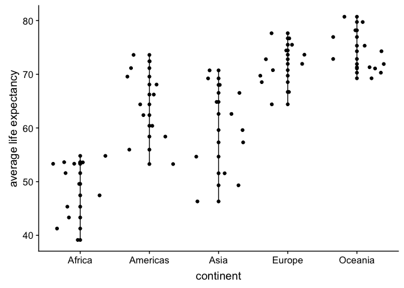

hw02.Rmd
================
Becky
2018-09-21

Data Exploration and Visualization using the **dplyr** and **ggplot2** R packages
=================================================================================

In this assignment, I will explore the Gapminder dataset. This dataset is distributed as an R package from CRAN. The exploratio of this dataset will involve the application of the dplyr package and its use in effective data wrangling. Among the data manaipulation tasks that dply handles includes: **select ()**, **mutate()**, **filter()**, **rename()**, **summarise()**, **arrange()**, and **group\_by()**. These and more will be exhibited in this assignment The output from these functions will then be used as input into the various visualizations that will be done using the ggplot2 package. The application of ggplot2 will involve the use ggplots, grammar of graphics, using features such as: **geoms**, **aesthetics**, **stats**, and **faceting**.

The work herein will also heavily use the pipe operator (%&gt;%) that tidyverse imports from the magrittr package. Piping makes code much easier to read and write as we don't need to use multi-operation commands by nesting them inside each other. Plus, its more fun using pipes!!!!

To kick off this assignment, I will begin by loading all required packages to support the required data analysis.

Loading the gapminder dataset and required packages for this assignment
-----------------------------------------------------------------------

``` r
# I use "message = FALSE"" to avoid having R package messages being thrown back as output expecially in my output files. Most of these messages are informative but not necessary for output. An example message that could be passed to markdown file is shown hereunder:
# package ‘dplyr’ was built under R version 3.5.1
library(tidyverse)
```

    ## Warning: package 'dplyr' was built under R version 3.5.1

``` r
library(dplyr)
library(ggplot2)
library(gapminder) # this call also loads the gapmidner dataset
library(cowplot)
library(ggridges)
df <- gapminder# Assigning and renaming the dataset to a shorter and more convenient name
```

Data Inspection - Part 1: Overview of Dataset
---------------------------------------------

### Applying the pipe operator

This section involves the use of the pipe operator in accomplishing the data inspection task.

##### 1. What type of object is the gapminder dataset?

``` r
df %>% class # in base R, this would be "class(df)"
```

    ## [1] "tbl_df"     "tbl"        "data.frame"

In R, datasets are regarded as objects. To work with most objects, it is ideal to know the class (type of object) to be able to work with it effectively and to avoid programming hitches. For example, the way we work with dataframes is different from the way matrixes are handled. From the output of the above snipped, the gapminder dataset is of type tbl\_df, inherited from both the tbl and data.frame data types. Data frames such as the gapminder dataset that are converted into tbl objects make it much easier to work with large datasets.

##### 2. Viewing the top (n) rows of the dataset

``` r
df %>% head(10) %>% 
  knitr::kable()# I have specified the number of rows to view (10 rows). The default is 6. In base R this would be "head(df, n=10)"
```

| country     | continent |  year|  lifeExp|       pop|  gdpPercap|
|:------------|:----------|-----:|--------:|---------:|----------:|
| Afghanistan | Asia      |  1952|   28.801|   8425333|   779.4453|
| Afghanistan | Asia      |  1957|   30.332|   9240934|   820.8530|
| Afghanistan | Asia      |  1962|   31.997|  10267083|   853.1007|
| Afghanistan | Asia      |  1967|   34.020|  11537966|   836.1971|
| Afghanistan | Asia      |  1972|   36.088|  13079460|   739.9811|
| Afghanistan | Asia      |  1977|   38.438|  14880372|   786.1134|
| Afghanistan | Asia      |  1982|   39.854|  12881816|   978.0114|
| Afghanistan | Asia      |  1987|   40.822|  13867957|   852.3959|
| Afghanistan | Asia      |  1992|   41.674|  16317921|   649.3414|
| Afghanistan | Asia      |  1997|   41.763|  22227415|   635.3414|

##### 3. Viewing bottom (n) rows of dataframe

``` r
df %>% tail(5)%>% 
  knitr::kable()
```

| country  | continent |  year|  lifeExp|       pop|  gdpPercap|
|:---------|:----------|-----:|--------:|---------:|----------:|
| Zimbabwe | Africa    |  1987|   62.351|   9216418|   706.1573|
| Zimbabwe | Africa    |  1992|   60.377|  10704340|   693.4208|
| Zimbabwe | Africa    |  1997|   46.809|  11404948|   792.4500|
| Zimbabwe | Africa    |  2002|   39.989|  11926563|   672.0386|
| Zimbabwe | Africa    |  2007|   43.487|  12311143|   469.7093|

##### 4. Extracting the summarized view of the dataset

``` r
df %>% summary%>% 
  knitr::kable()
```

|     |     country     |   continent  |     year     |    lifeExp    |        pop        |    gdpPercap    |
|-----|:---------------:|:------------:|:------------:|:-------------:|:-----------------:|:---------------:|
|     | Afghanistan: 12 |  Africa :624 |  Min. :1952  |  Min. :23.60  |  Min. :6.001e+04  |   Min. : 241.2  |
|     |   Albania : 12  | Americas:300 | 1st Qu.:1966 | 1st Qu.:48.20 | 1st Qu.:2.794e+06 | 1st Qu.: 1202.1 |
|     |   Algeria : 12  |   Asia :396  | Median :1980 | Median :60.71 | Median :7.024e+06 | Median : 3531.8 |
|     |   Angola : 12   |  Europe :360 |  Mean :1980  |  Mean :59.47  |  Mean :2.960e+07  |  Mean : 7215.3  |
|     |  Argentina : 12 | Oceania : 24 | 3rd Qu.:1993 | 3rd Qu.:70.85 | 3rd Qu.:1.959e+07 | 3rd Qu.: 9325.5 |
|     |  Australia : 12 |      NA      |  Max. :2007  |  Max. :82.60  |  Max. :1.319e+09  |  Max. :113523.1 |
|     |  (Other) :1632  |      NA      |      NA      |       NA      |         NA        |        NA       |

The summary function is used to produce summary statistics from the dataset. Some of these results can be obtained using alternative methods. For example, if we want to extract the minimum and maximum populations, we can apply the range(), we can also get the maximum gdpPercap using df*g**d**p**P**e**r**c**a**p*continent %&gt;% summary summary(df$continent=="Africa")\`

These and more examples that validate the results from the summary function above, will be shown below.

##### 5. Viewing the structure of the dataset

``` r
df %>% str%>% 
  knitr::kable()
```

    ## Classes 'tbl_df', 'tbl' and 'data.frame':    1704 obs. of  6 variables:
    ##  $ country  : Factor w/ 142 levels "Afghanistan",..: 1 1 1 1 1 1 1 1 1 1 ...
    ##  $ continent: Factor w/ 5 levels "Africa","Americas",..: 3 3 3 3 3 3 3 3 3 3 ...
    ##  $ year     : int  1952 1957 1962 1967 1972 1977 1982 1987 1992 1997 ...
    ##  $ lifeExp  : num  28.8 30.3 32 34 36.1 ...
    ##  $ pop      : int  8425333 9240934 10267083 11537966 13079460 14880372 12881816 13867957 16317921 22227415 ...
    ##  $ gdpPercap: num  779 821 853 836 740 ...

From output of the above code snippet, we can see and further confirm that the dataset is a tbl\_df with 1704 observations (countries) and 6 variables as described below: 1. **country** is a **factor** with **142 levels** (we could say that there are 142 unique countries) 2. **continent** is **factor** with **5 levels** (5 unique continents) 3. **year** is an **integer** ranging from 1952 to 2007 as seen by (df$year %&gt;% max) 4. **lifeExp** is as **numeric** variable denoting life expectancy 5. **pop** is an **integer** variable denoting population 6. **gdpPercap** is a **numeric** variable denoting GDP per capita

##### 6. Checking the dimensions of the dataframe (nrows x ncols)

Apart from using the str() function to view the dimensions of a dataset, we can also use the below:

``` r
df %>% dim
```

    ## [1] 1704    6

The dataframe has 1704 rows and 6 columns (1704 x 6)

##### 7. Alternative call for number of rows

``` r
df %>% nrow 
```

    ## [1] 1704

##### 8. Alternative call for number of columns

``` r
df %>% ncol
```

    ## [1] 6

##### 9. Extracting column names

``` r
df %>% names
```

    ## [1] "country"   "continent" "year"      "lifeExp"   "pop"       "gdpPercap"

#### Quality Control (QC)

``` r
sum(is.na(df)) 
```

    ## [1] 0

``` r
df %>% is.na %>% sum
```

    ## [1] 0

The output of the above code snippet is 0. This implies that we do not have any missing data in the dataset. In case we had some rows with missing data, we would then apply `df <- na.omit(df)` to remove NAs that would hinder data analysis.

------------------------------------------------------------------------

Data Inspection - Part 2: Variable Specific Exploration
-------------------------------------------------------

### Exploring a categorical variable from the data set (continent)

##### 1. Which continents exist in the gapminder dataset?

``` r
df %>% distinct(continent) %>% arrange(continent)%>% 
  knitr::kable()  # we have 5 continents
```

| continent |
|:----------|
| Africa    |
| Americas  |
| Asia      |
| Europe    |
| Oceania   |

``` r
# Alternatively:
df$continent %>%unique%>% 
  knitr::kable()
```

| x        |
|:---------|
| Asia     |
| Europe   |
| Africa   |
| Americas |
| Oceania  |

We have 5 distinct continents in the gapminder dataset: Asia, Europe, Africa, Americas and Oceania

##### 2. How many continents are there?

``` r
df$continent %>% nlevels
```

    ## [1] 5

1.  How many countries are in each continent?

``` r
df %>% 
  group_by(continent) %>%
  summarise(count = n())%>% 
  knitr::kable()
```

| continent |  count|
|:----------|------:|
| Africa    |    624|
| Americas  |    300|
| Asia      |    396|
| Europe    |    360|
| Oceania   |     24|

``` r
# We can alternatively use:
df$continent %>% summary%>% 
  knitr::kable()
```

|          |    x|
|----------|----:|
| Africa   |  624|
| Americas |  300|
| Asia     |  396|
| Europe   |  360|
| Oceania  |   24|

To see how many countries belong to Europe and how many do not, we can use the following

``` r
summary(df$continent=="Africa") 
```

    ##    Mode   FALSE    TRUE 
    ## logical    1080     624

### Exploring a quantitative variable from the dataset (population)

In my first assignmeent I explored the gdpPercap variable and I saw that an increase in gdp per capita increased life expectancy. Here I will also probe into the pop (population) variable to see whether it has a bearing on gdp per capita.

##### 1. What is the highest population in the entire dataset?

``` r
df$population %>% max
```

    ## Warning: Unknown or uninitialised column: 'population'.

    ## Warning in max(.): no non-missing arguments to max; returning -Inf

    ## [1] -Inf

##### 2. What is the lowest population in the entire dataset?

``` r
df$population %>% min
```

    ## Warning: Unknown or uninitialised column: 'population'.

    ## Warning in min(.): no non-missing arguments to min; returning Inf

    ## [1] Inf

##### 3. To achieve the above output, we can alterantively use the range() function to extract the lowest and highest population values. To do this, I will use the following:

``` r
range(df$population)
```

    ## Warning: Unknown or uninitialised column: 'population'.

    ## Warning in min(x, na.rm = na.rm): no non-missing arguments to min;
    ## returning Inf

    ## Warning in max(x, na.rm = na.rm): no non-missing arguments to max;
    ## returning -Inf

    ## [1]  Inf -Inf

As we can sees, 60011 is the lowest population reported in the entire dataset and 1318683096 is the highest. However, I woould like to know more!

##### 3. Which country reports the highest population?

``` r
high <- df$population %>% max
```

    ## Warning: Unknown or uninitialised column: 'population'.

    ## Warning in max(.): no non-missing arguments to max; returning -Inf

``` r
df[df$pop == high,] # I would like to extract the entire tuple in which the highest population was recorded
```

    ## # A tibble: 0 x 6
    ## # ... with 6 variables: country <fct>, continent <fct>, year <int>,
    ## #   lifeExp <dbl>, pop <int>, gdpPercap <dbl>

China, in Asia has the highest recorded population and this was in 2007.

##### 3. Which country reports the lowest population?

``` r
low <- df$population %>% min
```

    ## Warning: Unknown or uninitialised column: 'population'.

    ## Warning in min(.): no non-missing arguments to min; returning Inf

``` r
df[df$population == low,]
```

    ## Warning: Unknown or uninitialised column: 'population'.

    ## Warning: Length of logical index must be 1 or 1704, not 0

    ## # A tibble: 0 x 6
    ## # ... with 6 variables: country <fct>, continent <fct>, year <int>,
    ## #   lifeExp <dbl>, pop <int>, gdpPercap <dbl>

Sao Tome and Principe, in Africa has the lowest population reported for the year 1952.

------------------------------------------------------------------------

The application of dplyr for data wrangling and manipulation
------------------------------------------------------------

At this point, I would like to introduce dplyr's awesome functions. I will be exhibiting the usage of the following functions to answer questions I have on the gapminder dataset: 1. **rename()** 2. **filter()** 3. **select ()** 4. **arrange()** 5. **mutate()** 6. **summarise()** and 7. **group\_by()**

### The rename function: rename()

To start with, and to ease my work, I will rename some variables that have been giving me a bit of trouble (those with long names :smile: ). To do this, I will use the rename() function that is mainly used to rename variables in a dataset.

``` r
df <- df %>%
      rename(lex = lifeExp,
         gdppc = gdpPercap,
         cont = continent)
# to see the new names, I will run:
names(df)
```

    ## [1] "country" "cont"    "year"    "lex"     "pop"     "gdppc"

Some of my variable names have changed: lifeExp has been renamed to lex, gdpPercap has been renamed to gdppc and continent has been renamed to cont. The rest of the assignment will refer to these new names.

### The filter function: filter()

This function is used to select a desired set of rows, better said - to subset data row-wise. The filter() takes logical expressions and returns the rows for which all are TRUE. A few examples of the usage of filter have been given above and a few more will be given below.

Example 1. Filtering the dataset based on single and multiple criteria

``` r
df %>% filter(cont=="Asia") %>% 
  knitr::kable() # extract statistics from rows where the continent is Asia 
```

| country            | cont |  year|       lex|         pop|        gdppc|
|:-------------------|:-----|-----:|---------:|-----------:|------------:|
| Afghanistan        | Asia |  1952|  28.80100|     8425333|     779.4453|
| Afghanistan        | Asia |  1957|  30.33200|     9240934|     820.8530|
| Afghanistan        | Asia |  1962|  31.99700|    10267083|     853.1007|
| Afghanistan        | Asia |  1967|  34.02000|    11537966|     836.1971|
| Afghanistan        | Asia |  1972|  36.08800|    13079460|     739.9811|
| Afghanistan        | Asia |  1977|  38.43800|    14880372|     786.1134|
| Afghanistan        | Asia |  1982|  39.85400|    12881816|     978.0114|
| Afghanistan        | Asia |  1987|  40.82200|    13867957|     852.3959|
| Afghanistan        | Asia |  1992|  41.67400|    16317921|     649.3414|
| Afghanistan        | Asia |  1997|  41.76300|    22227415|     635.3414|
| Afghanistan        | Asia |  2002|  42.12900|    25268405|     726.7341|
| Afghanistan        | Asia |  2007|  43.82800|    31889923|     974.5803|
| Bahrain            | Asia |  1952|  50.93900|      120447|    9867.0848|
| Bahrain            | Asia |  1957|  53.83200|      138655|   11635.7995|
| Bahrain            | Asia |  1962|  56.92300|      171863|   12753.2751|
| Bahrain            | Asia |  1967|  59.92300|      202182|   14804.6727|
| Bahrain            | Asia |  1972|  63.30000|      230800|   18268.6584|
| Bahrain            | Asia |  1977|  65.59300|      297410|   19340.1020|
| Bahrain            | Asia |  1982|  69.05200|      377967|   19211.1473|
| Bahrain            | Asia |  1987|  70.75000|      454612|   18524.0241|
| Bahrain            | Asia |  1992|  72.60100|      529491|   19035.5792|
| Bahrain            | Asia |  1997|  73.92500|      598561|   20292.0168|
| Bahrain            | Asia |  2002|  74.79500|      656397|   23403.5593|
| Bahrain            | Asia |  2007|  75.63500|      708573|   29796.0483|
| Bangladesh         | Asia |  1952|  37.48400|    46886859|     684.2442|
| Bangladesh         | Asia |  1957|  39.34800|    51365468|     661.6375|
| Bangladesh         | Asia |  1962|  41.21600|    56839289|     686.3416|
| Bangladesh         | Asia |  1967|  43.45300|    62821884|     721.1861|
| Bangladesh         | Asia |  1972|  45.25200|    70759295|     630.2336|
| Bangladesh         | Asia |  1977|  46.92300|    80428306|     659.8772|
| Bangladesh         | Asia |  1982|  50.00900|    93074406|     676.9819|
| Bangladesh         | Asia |  1987|  52.81900|   103764241|     751.9794|
| Bangladesh         | Asia |  1992|  56.01800|   113704579|     837.8102|
| Bangladesh         | Asia |  1997|  59.41200|   123315288|     972.7700|
| Bangladesh         | Asia |  2002|  62.01300|   135656790|    1136.3904|
| Bangladesh         | Asia |  2007|  64.06200|   150448339|    1391.2538|
| Cambodia           | Asia |  1952|  39.41700|     4693836|     368.4693|
| Cambodia           | Asia |  1957|  41.36600|     5322536|     434.0383|
| Cambodia           | Asia |  1962|  43.41500|     6083619|     496.9136|
| Cambodia           | Asia |  1967|  45.41500|     6960067|     523.4323|
| Cambodia           | Asia |  1972|  40.31700|     7450606|     421.6240|
| Cambodia           | Asia |  1977|  31.22000|     6978607|     524.9722|
| Cambodia           | Asia |  1982|  50.95700|     7272485|     624.4755|
| Cambodia           | Asia |  1987|  53.91400|     8371791|     683.8956|
| Cambodia           | Asia |  1992|  55.80300|    10150094|     682.3032|
| Cambodia           | Asia |  1997|  56.53400|    11782962|     734.2852|
| Cambodia           | Asia |  2002|  56.75200|    12926707|     896.2260|
| Cambodia           | Asia |  2007|  59.72300|    14131858|    1713.7787|
| China              | Asia |  1952|  44.00000|   556263527|     400.4486|
| China              | Asia |  1957|  50.54896|   637408000|     575.9870|
| China              | Asia |  1962|  44.50136|   665770000|     487.6740|
| China              | Asia |  1967|  58.38112|   754550000|     612.7057|
| China              | Asia |  1972|  63.11888|   862030000|     676.9001|
| China              | Asia |  1977|  63.96736|   943455000|     741.2375|
| China              | Asia |  1982|  65.52500|  1000281000|     962.4214|
| China              | Asia |  1987|  67.27400|  1084035000|    1378.9040|
| China              | Asia |  1992|  68.69000|  1164970000|    1655.7842|
| China              | Asia |  1997|  70.42600|  1230075000|    2289.2341|
| China              | Asia |  2002|  72.02800|  1280400000|    3119.2809|
| China              | Asia |  2007|  72.96100|  1318683096|    4959.1149|
| Hong Kong, China   | Asia |  1952|  60.96000|     2125900|    3054.4212|
| Hong Kong, China   | Asia |  1957|  64.75000|     2736300|    3629.0765|
| Hong Kong, China   | Asia |  1962|  67.65000|     3305200|    4692.6483|
| Hong Kong, China   | Asia |  1967|  70.00000|     3722800|    6197.9628|
| Hong Kong, China   | Asia |  1972|  72.00000|     4115700|    8315.9281|
| Hong Kong, China   | Asia |  1977|  73.60000|     4583700|   11186.1413|
| Hong Kong, China   | Asia |  1982|  75.45000|     5264500|   14560.5305|
| Hong Kong, China   | Asia |  1987|  76.20000|     5584510|   20038.4727|
| Hong Kong, China   | Asia |  1992|  77.60100|     5829696|   24757.6030|
| Hong Kong, China   | Asia |  1997|  80.00000|     6495918|   28377.6322|
| Hong Kong, China   | Asia |  2002|  81.49500|     6762476|   30209.0152|
| Hong Kong, China   | Asia |  2007|  82.20800|     6980412|   39724.9787|
| India              | Asia |  1952|  37.37300|   372000000|     546.5657|
| India              | Asia |  1957|  40.24900|   409000000|     590.0620|
| India              | Asia |  1962|  43.60500|   454000000|     658.3472|
| India              | Asia |  1967|  47.19300|   506000000|     700.7706|
| India              | Asia |  1972|  50.65100|   567000000|     724.0325|
| India              | Asia |  1977|  54.20800|   634000000|     813.3373|
| India              | Asia |  1982|  56.59600|   708000000|     855.7235|
| India              | Asia |  1987|  58.55300|   788000000|     976.5127|
| India              | Asia |  1992|  60.22300|   872000000|    1164.4068|
| India              | Asia |  1997|  61.76500|   959000000|    1458.8174|
| India              | Asia |  2002|  62.87900|  1034172547|    1746.7695|
| India              | Asia |  2007|  64.69800|  1110396331|    2452.2104|
| Indonesia          | Asia |  1952|  37.46800|    82052000|     749.6817|
| Indonesia          | Asia |  1957|  39.91800|    90124000|     858.9003|
| Indonesia          | Asia |  1962|  42.51800|    99028000|     849.2898|
| Indonesia          | Asia |  1967|  45.96400|   109343000|     762.4318|
| Indonesia          | Asia |  1972|  49.20300|   121282000|    1111.1079|
| Indonesia          | Asia |  1977|  52.70200|   136725000|    1382.7021|
| Indonesia          | Asia |  1982|  56.15900|   153343000|    1516.8730|
| Indonesia          | Asia |  1987|  60.13700|   169276000|    1748.3570|
| Indonesia          | Asia |  1992|  62.68100|   184816000|    2383.1409|
| Indonesia          | Asia |  1997|  66.04100|   199278000|    3119.3356|
| Indonesia          | Asia |  2002|  68.58800|   211060000|    2873.9129|
| Indonesia          | Asia |  2007|  70.65000|   223547000|    3540.6516|
| Iran               | Asia |  1952|  44.86900|    17272000|    3035.3260|
| Iran               | Asia |  1957|  47.18100|    19792000|    3290.2576|
| Iran               | Asia |  1962|  49.32500|    22874000|    4187.3298|
| Iran               | Asia |  1967|  52.46900|    26538000|    5906.7318|
| Iran               | Asia |  1972|  55.23400|    30614000|    9613.8186|
| Iran               | Asia |  1977|  57.70200|    35480679|   11888.5951|
| Iran               | Asia |  1982|  59.62000|    43072751|    7608.3346|
| Iran               | Asia |  1987|  63.04000|    51889696|    6642.8814|
| Iran               | Asia |  1992|  65.74200|    60397973|    7235.6532|
| Iran               | Asia |  1997|  68.04200|    63327987|    8263.5903|
| Iran               | Asia |  2002|  69.45100|    66907826|    9240.7620|
| Iran               | Asia |  2007|  70.96400|    69453570|   11605.7145|
| Iraq               | Asia |  1952|  45.32000|     5441766|    4129.7661|
| Iraq               | Asia |  1957|  48.43700|     6248643|    6229.3336|
| Iraq               | Asia |  1962|  51.45700|     7240260|    8341.7378|
| Iraq               | Asia |  1967|  54.45900|     8519282|    8931.4598|
| Iraq               | Asia |  1972|  56.95000|    10061506|    9576.0376|
| Iraq               | Asia |  1977|  60.41300|    11882916|   14688.2351|
| Iraq               | Asia |  1982|  62.03800|    14173318|   14517.9071|
| Iraq               | Asia |  1987|  65.04400|    16543189|   11643.5727|
| Iraq               | Asia |  1992|  59.46100|    17861905|    3745.6407|
| Iraq               | Asia |  1997|  58.81100|    20775703|    3076.2398|
| Iraq               | Asia |  2002|  57.04600|    24001816|    4390.7173|
| Iraq               | Asia |  2007|  59.54500|    27499638|    4471.0619|
| Israel             | Asia |  1952|  65.39000|     1620914|    4086.5221|
| Israel             | Asia |  1957|  67.84000|     1944401|    5385.2785|
| Israel             | Asia |  1962|  69.39000|     2310904|    7105.6307|
| Israel             | Asia |  1967|  70.75000|     2693585|    8393.7414|
| Israel             | Asia |  1972|  71.63000|     3095893|   12786.9322|
| Israel             | Asia |  1977|  73.06000|     3495918|   13306.6192|
| Israel             | Asia |  1982|  74.45000|     3858421|   15367.0292|
| Israel             | Asia |  1987|  75.60000|     4203148|   17122.4799|
| Israel             | Asia |  1992|  76.93000|     4936550|   18051.5225|
| Israel             | Asia |  1997|  78.26900|     5531387|   20896.6092|
| Israel             | Asia |  2002|  79.69600|     6029529|   21905.5951|
| Israel             | Asia |  2007|  80.74500|     6426679|   25523.2771|
| Japan              | Asia |  1952|  63.03000|    86459025|    3216.9563|
| Japan              | Asia |  1957|  65.50000|    91563009|    4317.6944|
| Japan              | Asia |  1962|  68.73000|    95831757|    6576.6495|
| Japan              | Asia |  1967|  71.43000|   100825279|    9847.7886|
| Japan              | Asia |  1972|  73.42000|   107188273|   14778.7864|
| Japan              | Asia |  1977|  75.38000|   113872473|   16610.3770|
| Japan              | Asia |  1982|  77.11000|   118454974|   19384.1057|
| Japan              | Asia |  1987|  78.67000|   122091325|   22375.9419|
| Japan              | Asia |  1992|  79.36000|   124329269|   26824.8951|
| Japan              | Asia |  1997|  80.69000|   125956499|   28816.5850|
| Japan              | Asia |  2002|  82.00000|   127065841|   28604.5919|
| Japan              | Asia |  2007|  82.60300|   127467972|   31656.0681|
| Jordan             | Asia |  1952|  43.15800|      607914|    1546.9078|
| Jordan             | Asia |  1957|  45.66900|      746559|    1886.0806|
| Jordan             | Asia |  1962|  48.12600|      933559|    2348.0092|
| Jordan             | Asia |  1967|  51.62900|     1255058|    2741.7963|
| Jordan             | Asia |  1972|  56.52800|     1613551|    2110.8563|
| Jordan             | Asia |  1977|  61.13400|     1937652|    2852.3516|
| Jordan             | Asia |  1982|  63.73900|     2347031|    4161.4160|
| Jordan             | Asia |  1987|  65.86900|     2820042|    4448.6799|
| Jordan             | Asia |  1992|  68.01500|     3867409|    3431.5936|
| Jordan             | Asia |  1997|  69.77200|     4526235|    3645.3796|
| Jordan             | Asia |  2002|  71.26300|     5307470|    3844.9172|
| Jordan             | Asia |  2007|  72.53500|     6053193|    4519.4612|
| Korea, Dem. Rep.   | Asia |  1952|  50.05600|     8865488|    1088.2778|
| Korea, Dem. Rep.   | Asia |  1957|  54.08100|     9411381|    1571.1347|
| Korea, Dem. Rep.   | Asia |  1962|  56.65600|    10917494|    1621.6936|
| Korea, Dem. Rep.   | Asia |  1967|  59.94200|    12617009|    2143.5406|
| Korea, Dem. Rep.   | Asia |  1972|  63.98300|    14781241|    3701.6215|
| Korea, Dem. Rep.   | Asia |  1977|  67.15900|    16325320|    4106.3012|
| Korea, Dem. Rep.   | Asia |  1982|  69.10000|    17647518|    4106.5253|
| Korea, Dem. Rep.   | Asia |  1987|  70.64700|    19067554|    4106.4923|
| Korea, Dem. Rep.   | Asia |  1992|  69.97800|    20711375|    3726.0635|
| Korea, Dem. Rep.   | Asia |  1997|  67.72700|    21585105|    1690.7568|
| Korea, Dem. Rep.   | Asia |  2002|  66.66200|    22215365|    1646.7582|
| Korea, Dem. Rep.   | Asia |  2007|  67.29700|    23301725|    1593.0655|
| Korea, Rep.        | Asia |  1952|  47.45300|    20947571|    1030.5922|
| Korea, Rep.        | Asia |  1957|  52.68100|    22611552|    1487.5935|
| Korea, Rep.        | Asia |  1962|  55.29200|    26420307|    1536.3444|
| Korea, Rep.        | Asia |  1967|  57.71600|    30131000|    2029.2281|
| Korea, Rep.        | Asia |  1972|  62.61200|    33505000|    3030.8767|
| Korea, Rep.        | Asia |  1977|  64.76600|    36436000|    4657.2210|
| Korea, Rep.        | Asia |  1982|  67.12300|    39326000|    5622.9425|
| Korea, Rep.        | Asia |  1987|  69.81000|    41622000|    8533.0888|
| Korea, Rep.        | Asia |  1992|  72.24400|    43805450|   12104.2787|
| Korea, Rep.        | Asia |  1997|  74.64700|    46173816|   15993.5280|
| Korea, Rep.        | Asia |  2002|  77.04500|    47969150|   19233.9882|
| Korea, Rep.        | Asia |  2007|  78.62300|    49044790|   23348.1397|
| Kuwait             | Asia |  1952|  55.56500|      160000|  108382.3529|
| Kuwait             | Asia |  1957|  58.03300|      212846|  113523.1329|
| Kuwait             | Asia |  1962|  60.47000|      358266|   95458.1118|
| Kuwait             | Asia |  1967|  64.62400|      575003|   80894.8833|
| Kuwait             | Asia |  1972|  67.71200|      841934|  109347.8670|
| Kuwait             | Asia |  1977|  69.34300|     1140357|   59265.4771|
| Kuwait             | Asia |  1982|  71.30900|     1497494|   31354.0357|
| Kuwait             | Asia |  1987|  74.17400|     1891487|   28118.4300|
| Kuwait             | Asia |  1992|  75.19000|     1418095|   34932.9196|
| Kuwait             | Asia |  1997|  76.15600|     1765345|   40300.6200|
| Kuwait             | Asia |  2002|  76.90400|     2111561|   35110.1057|
| Kuwait             | Asia |  2007|  77.58800|     2505559|   47306.9898|
| Lebanon            | Asia |  1952|  55.92800|     1439529|    4834.8041|
| Lebanon            | Asia |  1957|  59.48900|     1647412|    6089.7869|
| Lebanon            | Asia |  1962|  62.09400|     1886848|    5714.5606|
| Lebanon            | Asia |  1967|  63.87000|     2186894|    6006.9830|
| Lebanon            | Asia |  1972|  65.42100|     2680018|    7486.3843|
| Lebanon            | Asia |  1977|  66.09900|     3115787|    8659.6968|
| Lebanon            | Asia |  1982|  66.98300|     3086876|    7640.5195|
| Lebanon            | Asia |  1987|  67.92600|     3089353|    5377.0913|
| Lebanon            | Asia |  1992|  69.29200|     3219994|    6890.8069|
| Lebanon            | Asia |  1997|  70.26500|     3430388|    8754.9639|
| Lebanon            | Asia |  2002|  71.02800|     3677780|    9313.9388|
| Lebanon            | Asia |  2007|  71.99300|     3921278|   10461.0587|
| Malaysia           | Asia |  1952|  48.46300|     6748378|    1831.1329|
| Malaysia           | Asia |  1957|  52.10200|     7739235|    1810.0670|
| Malaysia           | Asia |  1962|  55.73700|     8906385|    2036.8849|
| Malaysia           | Asia |  1967|  59.37100|    10154878|    2277.7424|
| Malaysia           | Asia |  1972|  63.01000|    11441462|    2849.0948|
| Malaysia           | Asia |  1977|  65.25600|    12845381|    3827.9216|
| Malaysia           | Asia |  1982|  68.00000|    14441916|    4920.3560|
| Malaysia           | Asia |  1987|  69.50000|    16331785|    5249.8027|
| Malaysia           | Asia |  1992|  70.69300|    18319502|    7277.9128|
| Malaysia           | Asia |  1997|  71.93800|    20476091|   10132.9096|
| Malaysia           | Asia |  2002|  73.04400|    22662365|   10206.9779|
| Malaysia           | Asia |  2007|  74.24100|    24821286|   12451.6558|
| Mongolia           | Asia |  1952|  42.24400|      800663|     786.5669|
| Mongolia           | Asia |  1957|  45.24800|      882134|     912.6626|
| Mongolia           | Asia |  1962|  48.25100|     1010280|    1056.3540|
| Mongolia           | Asia |  1967|  51.25300|     1149500|    1226.0411|
| Mongolia           | Asia |  1972|  53.75400|     1320500|    1421.7420|
| Mongolia           | Asia |  1977|  55.49100|     1528000|    1647.5117|
| Mongolia           | Asia |  1982|  57.48900|     1756032|    2000.6031|
| Mongolia           | Asia |  1987|  60.22200|     2015133|    2338.0083|
| Mongolia           | Asia |  1992|  61.27100|     2312802|    1785.4020|
| Mongolia           | Asia |  1997|  63.62500|     2494803|    1902.2521|
| Mongolia           | Asia |  2002|  65.03300|     2674234|    2140.7393|
| Mongolia           | Asia |  2007|  66.80300|     2874127|    3095.7723|
| Myanmar            | Asia |  1952|  36.31900|    20092996|     331.0000|
| Myanmar            | Asia |  1957|  41.90500|    21731844|     350.0000|
| Myanmar            | Asia |  1962|  45.10800|    23634436|     388.0000|
| Myanmar            | Asia |  1967|  49.37900|    25870271|     349.0000|
| Myanmar            | Asia |  1972|  53.07000|    28466390|     357.0000|
| Myanmar            | Asia |  1977|  56.05900|    31528087|     371.0000|
| Myanmar            | Asia |  1982|  58.05600|    34680442|     424.0000|
| Myanmar            | Asia |  1987|  58.33900|    38028578|     385.0000|
| Myanmar            | Asia |  1992|  59.32000|    40546538|     347.0000|
| Myanmar            | Asia |  1997|  60.32800|    43247867|     415.0000|
| Myanmar            | Asia |  2002|  59.90800|    45598081|     611.0000|
| Myanmar            | Asia |  2007|  62.06900|    47761980|     944.0000|
| Nepal              | Asia |  1952|  36.15700|     9182536|     545.8657|
| Nepal              | Asia |  1957|  37.68600|     9682338|     597.9364|
| Nepal              | Asia |  1962|  39.39300|    10332057|     652.3969|
| Nepal              | Asia |  1967|  41.47200|    11261690|     676.4422|
| Nepal              | Asia |  1972|  43.97100|    12412593|     674.7881|
| Nepal              | Asia |  1977|  46.74800|    13933198|     694.1124|
| Nepal              | Asia |  1982|  49.59400|    15796314|     718.3731|
| Nepal              | Asia |  1987|  52.53700|    17917180|     775.6325|
| Nepal              | Asia |  1992|  55.72700|    20326209|     897.7404|
| Nepal              | Asia |  1997|  59.42600|    23001113|    1010.8921|
| Nepal              | Asia |  2002|  61.34000|    25873917|    1057.2063|
| Nepal              | Asia |  2007|  63.78500|    28901790|    1091.3598|
| Oman               | Asia |  1952|  37.57800|      507833|    1828.2303|
| Oman               | Asia |  1957|  40.08000|      561977|    2242.7466|
| Oman               | Asia |  1962|  43.16500|      628164|    2924.6381|
| Oman               | Asia |  1967|  46.98800|      714775|    4720.9427|
| Oman               | Asia |  1972|  52.14300|      829050|   10618.0385|
| Oman               | Asia |  1977|  57.36700|     1004533|   11848.3439|
| Oman               | Asia |  1982|  62.72800|     1301048|   12954.7910|
| Oman               | Asia |  1987|  67.73400|     1593882|   18115.2231|
| Oman               | Asia |  1992|  71.19700|     1915208|   18616.7069|
| Oman               | Asia |  1997|  72.49900|     2283635|   19702.0558|
| Oman               | Asia |  2002|  74.19300|     2713462|   19774.8369|
| Oman               | Asia |  2007|  75.64000|     3204897|   22316.1929|
| Pakistan           | Asia |  1952|  43.43600|    41346560|     684.5971|
| Pakistan           | Asia |  1957|  45.55700|    46679944|     747.0835|
| Pakistan           | Asia |  1962|  47.67000|    53100671|     803.3427|
| Pakistan           | Asia |  1967|  49.80000|    60641899|     942.4083|
| Pakistan           | Asia |  1972|  51.92900|    69325921|    1049.9390|
| Pakistan           | Asia |  1977|  54.04300|    78152686|    1175.9212|
| Pakistan           | Asia |  1982|  56.15800|    91462088|    1443.4298|
| Pakistan           | Asia |  1987|  58.24500|   105186881|    1704.6866|
| Pakistan           | Asia |  1992|  60.83800|   120065004|    1971.8295|
| Pakistan           | Asia |  1997|  61.81800|   135564834|    2049.3505|
| Pakistan           | Asia |  2002|  63.61000|   153403524|    2092.7124|
| Pakistan           | Asia |  2007|  65.48300|   169270617|    2605.9476|
| Philippines        | Asia |  1952|  47.75200|    22438691|    1272.8810|
| Philippines        | Asia |  1957|  51.33400|    26072194|    1547.9448|
| Philippines        | Asia |  1962|  54.75700|    30325264|    1649.5522|
| Philippines        | Asia |  1967|  56.39300|    35356600|    1814.1274|
| Philippines        | Asia |  1972|  58.06500|    40850141|    1989.3741|
| Philippines        | Asia |  1977|  60.06000|    46850962|    2373.2043|
| Philippines        | Asia |  1982|  62.08200|    53456774|    2603.2738|
| Philippines        | Asia |  1987|  64.15100|    60017788|    2189.6350|
| Philippines        | Asia |  1992|  66.45800|    67185766|    2279.3240|
| Philippines        | Asia |  1997|  68.56400|    75012988|    2536.5349|
| Philippines        | Asia |  2002|  70.30300|    82995088|    2650.9211|
| Philippines        | Asia |  2007|  71.68800|    91077287|    3190.4810|
| Saudi Arabia       | Asia |  1952|  39.87500|     4005677|    6459.5548|
| Saudi Arabia       | Asia |  1957|  42.86800|     4419650|    8157.5912|
| Saudi Arabia       | Asia |  1962|  45.91400|     4943029|   11626.4197|
| Saudi Arabia       | Asia |  1967|  49.90100|     5618198|   16903.0489|
| Saudi Arabia       | Asia |  1972|  53.88600|     6472756|   24837.4287|
| Saudi Arabia       | Asia |  1977|  58.69000|     8128505|   34167.7626|
| Saudi Arabia       | Asia |  1982|  63.01200|    11254672|   33693.1753|
| Saudi Arabia       | Asia |  1987|  66.29500|    14619745|   21198.2614|
| Saudi Arabia       | Asia |  1992|  68.76800|    16945857|   24841.6178|
| Saudi Arabia       | Asia |  1997|  70.53300|    21229759|   20586.6902|
| Saudi Arabia       | Asia |  2002|  71.62600|    24501530|   19014.5412|
| Saudi Arabia       | Asia |  2007|  72.77700|    27601038|   21654.8319|
| Singapore          | Asia |  1952|  60.39600|     1127000|    2315.1382|
| Singapore          | Asia |  1957|  63.17900|     1445929|    2843.1044|
| Singapore          | Asia |  1962|  65.79800|     1750200|    3674.7356|
| Singapore          | Asia |  1967|  67.94600|     1977600|    4977.4185|
| Singapore          | Asia |  1972|  69.52100|     2152400|    8597.7562|
| Singapore          | Asia |  1977|  70.79500|     2325300|   11210.0895|
| Singapore          | Asia |  1982|  71.76000|     2651869|   15169.1611|
| Singapore          | Asia |  1987|  73.56000|     2794552|   18861.5308|
| Singapore          | Asia |  1992|  75.78800|     3235865|   24769.8912|
| Singapore          | Asia |  1997|  77.15800|     3802309|   33519.4766|
| Singapore          | Asia |  2002|  78.77000|     4197776|   36023.1054|
| Singapore          | Asia |  2007|  79.97200|     4553009|   47143.1796|
| Sri Lanka          | Asia |  1952|  57.59300|     7982342|    1083.5320|
| Sri Lanka          | Asia |  1957|  61.45600|     9128546|    1072.5466|
| Sri Lanka          | Asia |  1962|  62.19200|    10421936|    1074.4720|
| Sri Lanka          | Asia |  1967|  64.26600|    11737396|    1135.5143|
| Sri Lanka          | Asia |  1972|  65.04200|    13016733|    1213.3955|
| Sri Lanka          | Asia |  1977|  65.94900|    14116836|    1348.7757|
| Sri Lanka          | Asia |  1982|  68.75700|    15410151|    1648.0798|
| Sri Lanka          | Asia |  1987|  69.01100|    16495304|    1876.7668|
| Sri Lanka          | Asia |  1992|  70.37900|    17587060|    2153.7392|
| Sri Lanka          | Asia |  1997|  70.45700|    18698655|    2664.4773|
| Sri Lanka          | Asia |  2002|  70.81500|    19576783|    3015.3788|
| Sri Lanka          | Asia |  2007|  72.39600|    20378239|    3970.0954|
| Syria              | Asia |  1952|  45.88300|     3661549|    1643.4854|
| Syria              | Asia |  1957|  48.28400|     4149908|    2117.2349|
| Syria              | Asia |  1962|  50.30500|     4834621|    2193.0371|
| Syria              | Asia |  1967|  53.65500|     5680812|    1881.9236|
| Syria              | Asia |  1972|  57.29600|     6701172|    2571.4230|
| Syria              | Asia |  1977|  61.19500|     7932503|    3195.4846|
| Syria              | Asia |  1982|  64.59000|     9410494|    3761.8377|
| Syria              | Asia |  1987|  66.97400|    11242847|    3116.7743|
| Syria              | Asia |  1992|  69.24900|    13219062|    3340.5428|
| Syria              | Asia |  1997|  71.52700|    15081016|    4014.2390|
| Syria              | Asia |  2002|  73.05300|    17155814|    4090.9253|
| Syria              | Asia |  2007|  74.14300|    19314747|    4184.5481|
| Taiwan             | Asia |  1952|  58.50000|     8550362|    1206.9479|
| Taiwan             | Asia |  1957|  62.40000|    10164215|    1507.8613|
| Taiwan             | Asia |  1962|  65.20000|    11918938|    1822.8790|
| Taiwan             | Asia |  1967|  67.50000|    13648692|    2643.8587|
| Taiwan             | Asia |  1972|  69.39000|    15226039|    4062.5239|
| Taiwan             | Asia |  1977|  70.59000|    16785196|    5596.5198|
| Taiwan             | Asia |  1982|  72.16000|    18501390|    7426.3548|
| Taiwan             | Asia |  1987|  73.40000|    19757799|   11054.5618|
| Taiwan             | Asia |  1992|  74.26000|    20686918|   15215.6579|
| Taiwan             | Asia |  1997|  75.25000|    21628605|   20206.8210|
| Taiwan             | Asia |  2002|  76.99000|    22454239|   23235.4233|
| Taiwan             | Asia |  2007|  78.40000|    23174294|   28718.2768|
| Thailand           | Asia |  1952|  50.84800|    21289402|     757.7974|
| Thailand           | Asia |  1957|  53.63000|    25041917|     793.5774|
| Thailand           | Asia |  1962|  56.06100|    29263397|    1002.1992|
| Thailand           | Asia |  1967|  58.28500|    34024249|    1295.4607|
| Thailand           | Asia |  1972|  60.40500|    39276153|    1524.3589|
| Thailand           | Asia |  1977|  62.49400|    44148285|    1961.2246|
| Thailand           | Asia |  1982|  64.59700|    48827160|    2393.2198|
| Thailand           | Asia |  1987|  66.08400|    52910342|    2982.6538|
| Thailand           | Asia |  1992|  67.29800|    56667095|    4616.8965|
| Thailand           | Asia |  1997|  67.52100|    60216677|    5852.6255|
| Thailand           | Asia |  2002|  68.56400|    62806748|    5913.1875|
| Thailand           | Asia |  2007|  70.61600|    65068149|    7458.3963|
| Vietnam            | Asia |  1952|  40.41200|    26246839|     605.0665|
| Vietnam            | Asia |  1957|  42.88700|    28998543|     676.2854|
| Vietnam            | Asia |  1962|  45.36300|    33796140|     772.0492|
| Vietnam            | Asia |  1967|  47.83800|    39463910|     637.1233|
| Vietnam            | Asia |  1972|  50.25400|    44655014|     699.5016|
| Vietnam            | Asia |  1977|  55.76400|    50533506|     713.5371|
| Vietnam            | Asia |  1982|  58.81600|    56142181|     707.2358|
| Vietnam            | Asia |  1987|  62.82000|    62826491|     820.7994|
| Vietnam            | Asia |  1992|  67.66200|    69940728|     989.0231|
| Vietnam            | Asia |  1997|  70.67200|    76048996|    1385.8968|
| Vietnam            | Asia |  2002|  73.01700|    80908147|    1764.4567|
| Vietnam            | Asia |  2007|  74.24900|    85262356|    2441.5764|
| West Bank and Gaza | Asia |  1952|  43.16000|     1030585|    1515.5923|
| West Bank and Gaza | Asia |  1957|  45.67100|     1070439|    1827.0677|
| West Bank and Gaza | Asia |  1962|  48.12700|     1133134|    2198.9563|
| West Bank and Gaza | Asia |  1967|  51.63100|     1142636|    2649.7150|
| West Bank and Gaza | Asia |  1972|  56.53200|     1089572|    3133.4093|
| West Bank and Gaza | Asia |  1977|  60.76500|     1261091|    3682.8315|
| West Bank and Gaza | Asia |  1982|  64.40600|     1425876|    4336.0321|
| West Bank and Gaza | Asia |  1987|  67.04600|     1691210|    5107.1974|
| West Bank and Gaza | Asia |  1992|  69.71800|     2104779|    6017.6548|
| West Bank and Gaza | Asia |  1997|  71.09600|     2826046|    7110.6676|
| West Bank and Gaza | Asia |  2002|  72.37000|     3389578|    4515.4876|
| West Bank and Gaza | Asia |  2007|  73.42200|     4018332|    3025.3498|
| Yemen, Rep.        | Asia |  1952|  32.54800|     4963829|     781.7176|
| Yemen, Rep.        | Asia |  1957|  33.97000|     5498090|     804.8305|
| Yemen, Rep.        | Asia |  1962|  35.18000|     6120081|     825.6232|
| Yemen, Rep.        | Asia |  1967|  36.98400|     6740785|     862.4421|
| Yemen, Rep.        | Asia |  1972|  39.84800|     7407075|    1265.0470|
| Yemen, Rep.        | Asia |  1977|  44.17500|     8403990|    1829.7652|
| Yemen, Rep.        | Asia |  1982|  49.11300|     9657618|    1977.5570|
| Yemen, Rep.        | Asia |  1987|  52.92200|    11219340|    1971.7415|
| Yemen, Rep.        | Asia |  1992|  55.59900|    13367997|    1879.4967|
| Yemen, Rep.        | Asia |  1997|  58.02000|    15826497|    2117.4845|
| Yemen, Rep.        | Asia |  2002|  60.30800|    18701257|    2234.8208|
| Yemen, Rep.        | Asia |  2007|  62.69800|    22211743|    2280.7699|

``` r
df %>% filter(year==1977)%>% 
  knitr::kable()# extract statistics from rows where the year is 1977
```

| country                  | cont     |  year|       lex|        pop|       gdppc|
|:-------------------------|:---------|-----:|---------:|----------:|-----------:|
| Afghanistan              | Asia     |  1977|  38.43800|   14880372|    786.1134|
| Albania                  | Europe   |  1977|  68.93000|    2509048|   3533.0039|
| Algeria                  | Africa   |  1977|  58.01400|   17152804|   4910.4168|
| Angola                   | Africa   |  1977|  39.48300|    6162675|   3008.6474|
| Argentina                | Americas |  1977|  68.48100|   26983828|  10079.0267|
| Australia                | Oceania  |  1977|  73.49000|   14074100|  18334.1975|
| Austria                  | Europe   |  1977|  72.17000|    7568430|  19749.4223|
| Bahrain                  | Asia     |  1977|  65.59300|     297410|  19340.1020|
| Bangladesh               | Asia     |  1977|  46.92300|   80428306|    659.8772|
| Belgium                  | Europe   |  1977|  72.80000|    9821800|  19117.9745|
| Benin                    | Africa   |  1977|  49.19000|    3168267|   1029.1613|
| Bolivia                  | Americas |  1977|  50.02300|    5079716|   3548.0978|
| Bosnia and Herzegovina   | Europe   |  1977|  69.86000|    4086000|   3528.4813|
| Botswana                 | Africa   |  1977|  59.31900|     781472|   3214.8578|
| Brazil                   | Americas |  1977|  61.48900|  114313951|   6660.1187|
| Bulgaria                 | Europe   |  1977|  70.81000|    8797022|   7612.2404|
| Burkina Faso             | Africa   |  1977|  46.13700|    5889574|    743.3870|
| Burundi                  | Africa   |  1977|  45.91000|    3834415|    556.1033|
| Cambodia                 | Asia     |  1977|  31.22000|    6978607|    524.9722|
| Cameroon                 | Africa   |  1977|  49.35500|    7959865|   1783.4329|
| Canada                   | Americas |  1977|  74.21000|   23796400|  22090.8831|
| Central African Republic | Africa   |  1977|  46.77500|    2167533|   1109.3743|
| Chad                     | Africa   |  1977|  47.38300|    4388260|   1133.9850|
| Chile                    | Americas |  1977|  67.05200|   10599793|   4756.7638|
| China                    | Asia     |  1977|  63.96736|  943455000|    741.2375|
| Colombia                 | Americas |  1977|  63.83700|   25094412|   3815.8079|
| Comoros                  | Africa   |  1977|  50.93900|     304739|   1172.6030|
| Congo, Dem. Rep.         | Africa   |  1977|  47.80400|   26480870|    795.7573|
| Congo, Rep.              | Africa   |  1977|  55.62500|    1536769|   3259.1790|
| Costa Rica               | Americas |  1977|  70.75000|    2108457|   5926.8770|
| Cote d'Ivoire            | Africa   |  1977|  52.37400|    7459574|   2517.7365|
| Croatia                  | Europe   |  1977|  70.64000|    4318673|  11305.3852|
| Cuba                     | Americas |  1977|  72.64900|    9537988|   6380.4950|
| Czech Republic           | Europe   |  1977|  70.71000|   10161915|  14800.1606|
| Denmark                  | Europe   |  1977|  74.69000|    5088419|  20422.9015|
| Djibouti                 | Africa   |  1977|  46.51900|     228694|   3081.7610|
| Dominican Republic       | Americas |  1977|  61.78800|    5302800|   2681.9889|
| Ecuador                  | Americas |  1977|  61.31000|    7278866|   6679.6233|
| Egypt                    | Africa   |  1977|  53.31900|   38783863|   2785.4936|
| El Salvador              | Americas |  1977|  56.69600|    4282586|   5138.9224|
| Equatorial Guinea        | Africa   |  1977|  42.02400|     192675|    958.5668|
| Eritrea                  | Africa   |  1977|  44.53500|    2512642|    505.7538|
| Ethiopia                 | Africa   |  1977|  44.51000|   34617799|    556.8084|
| Finland                  | Europe   |  1977|  72.52000|    4738902|  15605.4228|
| France                   | Europe   |  1977|  73.83000|   53165019|  18292.6351|
| Gabon                    | Africa   |  1977|  52.79000|     706367|  21745.5733|
| Gambia                   | Africa   |  1977|  41.84200|     608274|    884.7553|
| Germany                  | Europe   |  1977|  72.50000|   78160773|  20512.9212|
| Ghana                    | Africa   |  1977|  51.75600|   10538093|    993.2240|
| Greece                   | Europe   |  1977|  73.68000|    9308479|  14195.5243|
| Guatemala                | Americas |  1977|  56.02900|    5703430|   4879.9927|
| Guinea                   | Africa   |  1977|  40.76200|    4227026|    874.6859|
| Guinea-Bissau            | Africa   |  1977|  37.46500|     745228|    764.7260|
| Haiti                    | Americas |  1977|  49.92300|    4908554|   1874.2989|
| Honduras                 | Americas |  1977|  57.40200|    3055235|   3203.2081|
| Hong Kong, China         | Asia     |  1977|  73.60000|    4583700|  11186.1413|
| Hungary                  | Europe   |  1977|  69.95000|   10637171|  11674.8374|
| Iceland                  | Europe   |  1977|  76.11000|     221823|  19654.9625|
| India                    | Asia     |  1977|  54.20800|  634000000|    813.3373|
| Indonesia                | Asia     |  1977|  52.70200|  136725000|   1382.7021|
| Iran                     | Asia     |  1977|  57.70200|   35480679|  11888.5951|
| Iraq                     | Asia     |  1977|  60.41300|   11882916|  14688.2351|
| Ireland                  | Europe   |  1977|  72.03000|    3271900|  11150.9811|
| Israel                   | Asia     |  1977|  73.06000|    3495918|  13306.6192|
| Italy                    | Europe   |  1977|  73.48000|   56059245|  14255.9847|
| Jamaica                  | Americas |  1977|  70.11000|    2156814|   6650.1956|
| Japan                    | Asia     |  1977|  75.38000|  113872473|  16610.3770|
| Jordan                   | Asia     |  1977|  61.13400|    1937652|   2852.3516|
| Kenya                    | Africa   |  1977|  56.15500|   14500404|   1267.6132|
| Korea, Dem. Rep.         | Asia     |  1977|  67.15900|   16325320|   4106.3012|
| Korea, Rep.              | Asia     |  1977|  64.76600|   36436000|   4657.2210|
| Kuwait                   | Asia     |  1977|  69.34300|    1140357|  59265.4771|
| Lebanon                  | Asia     |  1977|  66.09900|    3115787|   8659.6968|
| Lesotho                  | Africa   |  1977|  52.20800|    1251524|    745.3695|
| Liberia                  | Africa   |  1977|  43.76400|    1703617|    640.3224|
| Libya                    | Africa   |  1977|  57.44200|    2721783|  21951.2118|
| Madagascar               | Africa   |  1977|  46.88100|    8007166|   1544.2286|
| Malawi                   | Africa   |  1977|  43.76700|    5637246|    663.2237|
| Malaysia                 | Asia     |  1977|  65.25600|   12845381|   3827.9216|
| Mali                     | Africa   |  1977|  41.71400|    6491649|    686.3953|
| Mauritania               | Africa   |  1977|  50.85200|    1456688|   1497.4922|
| Mauritius                | Africa   |  1977|  64.93000|     913025|   3710.9830|
| Mexico                   | Americas |  1977|  65.03200|   63759976|   7674.9291|
| Mongolia                 | Asia     |  1977|  55.49100|    1528000|   1647.5117|
| Montenegro               | Europe   |  1977|  73.06600|     560073|   9595.9299|
| Morocco                  | Africa   |  1977|  55.73000|   18396941|   2370.6200|
| Mozambique               | Africa   |  1977|  42.49500|   11127868|    502.3197|
| Myanmar                  | Asia     |  1977|  56.05900|   31528087|    371.0000|
| Namibia                  | Africa   |  1977|  56.43700|     977026|   3876.4860|
| Nepal                    | Asia     |  1977|  46.74800|   13933198|    694.1124|
| Netherlands              | Europe   |  1977|  75.24000|   13852989|  21209.0592|
| New Zealand              | Oceania  |  1977|  72.22000|    3164900|  16233.7177|
| Nicaragua                | Americas |  1977|  57.47000|    2554598|   5486.3711|
| Niger                    | Africa   |  1977|  41.29100|    5682086|    808.8971|
| Nigeria                  | Africa   |  1977|  44.51400|   62209173|   1981.9518|
| Norway                   | Europe   |  1977|  75.37000|    4043205|  23311.3494|
| Oman                     | Asia     |  1977|  57.36700|    1004533|  11848.3439|
| Pakistan                 | Asia     |  1977|  54.04300|   78152686|   1175.9212|
| Panama                   | Americas |  1977|  68.68100|    1839782|   5351.9121|
| Paraguay                 | Americas |  1977|  66.35300|    2984494|   3248.3733|
| Peru                     | Americas |  1977|  58.44700|   15990099|   6281.2909|
| Philippines              | Asia     |  1977|  60.06000|   46850962|   2373.2043|
| Poland                   | Europe   |  1977|  70.67000|   34621254|   9508.1415|
| Portugal                 | Europe   |  1977|  70.41000|    9662600|  10172.4857|
| Puerto Rico              | Americas |  1977|  73.44000|    3080828|   9770.5249|
| Reunion                  | Africa   |  1977|  67.06400|     492095|   4319.8041|
| Romania                  | Europe   |  1977|  69.46000|   21658597|   9356.3972|
| Rwanda                   | Africa   |  1977|  45.00000|    4657072|    670.0806|
| Sao Tome and Principe    | Africa   |  1977|  58.55000|      86796|   1737.5617|
| Saudi Arabia             | Asia     |  1977|  58.69000|    8128505|  34167.7626|
| Senegal                  | Africa   |  1977|  48.87900|    5260855|   1561.7691|
| Serbia                   | Europe   |  1977|  70.30000|    8686367|  12980.6696|
| Sierra Leone             | Africa   |  1977|  36.78800|    3140897|   1348.2852|
| Singapore                | Asia     |  1977|  70.79500|    2325300|  11210.0895|
| Slovak Republic          | Europe   |  1977|  70.45000|    4827803|  10922.6640|
| Slovenia                 | Europe   |  1977|  70.97000|    1746919|  15277.0302|
| Somalia                  | Africa   |  1977|  41.97400|    4353666|   1450.9925|
| South Africa             | Africa   |  1977|  55.52700|   27129932|   8028.6514|
| Spain                    | Europe   |  1977|  74.39000|   36439000|  13236.9212|
| Sri Lanka                | Asia     |  1977|  65.94900|   14116836|   1348.7757|
| Sudan                    | Africa   |  1977|  47.80000|   17104986|   2202.9884|
| Swaziland                | Africa   |  1977|  52.53700|     551425|   3781.4106|
| Sweden                   | Europe   |  1977|  75.44000|    8251648|  18855.7252|
| Switzerland              | Europe   |  1977|  75.39000|    6316424|  26982.2905|
| Syria                    | Asia     |  1977|  61.19500|    7932503|   3195.4846|
| Taiwan                   | Asia     |  1977|  70.59000|   16785196|   5596.5198|
| Tanzania                 | Africa   |  1977|  49.91900|   17129565|    962.4923|
| Thailand                 | Asia     |  1977|  62.49400|   44148285|   1961.2246|
| Togo                     | Africa   |  1977|  52.88700|    2308582|   1532.7770|
| Trinidad and Tobago      | Americas |  1977|  68.30000|    1039009|   7899.5542|
| Tunisia                  | Africa   |  1977|  59.83700|    6005061|   3120.8768|
| Turkey                   | Europe   |  1977|  59.50700|   42404033|   4269.1223|
| Uganda                   | Africa   |  1977|  50.35000|   11457758|    843.7331|
| United Kingdom           | Europe   |  1977|  72.76000|   56179000|  17428.7485|
| United States            | Americas |  1977|  73.38000|  220239000|  24072.6321|
| Uruguay                  | Americas |  1977|  69.48100|    2873520|   6504.3397|
| Venezuela                | Americas |  1977|  67.45600|   13503563|  13143.9510|
| Vietnam                  | Asia     |  1977|  55.76400|   50533506|    713.5371|
| West Bank and Gaza       | Asia     |  1977|  60.76500|    1261091|   3682.8315|
| Yemen, Rep.              | Asia     |  1977|  44.17500|    8403990|   1829.7652|
| Zambia                   | Africa   |  1977|  51.38600|    5216550|   1588.6883|
| Zimbabwe                 | Africa   |  1977|  57.67400|    6642107|    685.5877|

Example 2. Filtering a dataset based on multiple criteria (to achieve this we can implement logical operators such as: **&**(and), **&lt;**(less than), **&lt;=**(less than or equal to), **&gt;**(greater than), **&gt;=**(greater than or equal to), **==**(equal to), **!=**(not equal to), **|**(or)) e.t.c

``` r
filter(df, cont=="Oceania" & year==2002) # Show only stats for Oceania in 2002
```

    ## # A tibble: 2 x 6
    ##   country     cont     year   lex      pop  gdppc
    ##   <fct>       <fct>   <int> <dbl>    <int>  <dbl>
    ## 1 Australia   Oceania  2002  80.4 19546792 30688.
    ## 2 New Zealand Oceania  2002  79.1  3908037 23190.

``` r
filter(df, gdppc<400 & lex>40 & year==2007 ) # filter for only stats for countries with gdp per capita less than 400 and life expecancy greater than 40 where the year is 2007  
```

    ## # A tibble: 1 x 6
    ##   country          cont    year   lex      pop gdppc
    ##   <fct>            <fct>  <int> <dbl>    <int> <dbl>
    ## 1 Congo, Dem. Rep. Africa  2007  46.5 64606759  278.

``` r
filter(df, country=="Angola", year >=1995) # filtering for all rows where the country is Angola and the year less than 1995
```

    ## # A tibble: 3 x 6
    ##   country cont    year   lex      pop gdppc
    ##   <fct>   <fct>  <int> <dbl>    <int> <dbl>
    ## 1 Angola  Africa  1997  41.0  9875024 2277.
    ## 2 Angola  Africa  2002  41.0 10866106 2773.
    ## 3 Angola  Africa  2007  42.7 12420476 4797.

``` r
filter(df, cont!="Americas", year <= 1995 | year ==2007) # filtering for rows where the continent is not Americas and the year is less than or equal to 1995 or  year is 2007
```

    ## # A tibble: 1,170 x 6
    ##    country     cont   year   lex      pop gdppc
    ##    <fct>       <fct> <int> <dbl>    <int> <dbl>
    ##  1 Afghanistan Asia   1952  28.8  8425333  779.
    ##  2 Afghanistan Asia   1957  30.3  9240934  821.
    ##  3 Afghanistan Asia   1962  32.0 10267083  853.
    ##  4 Afghanistan Asia   1967  34.0 11537966  836.
    ##  5 Afghanistan Asia   1972  36.1 13079460  740.
    ##  6 Afghanistan Asia   1977  38.4 14880372  786.
    ##  7 Afghanistan Asia   1982  39.9 12881816  978.
    ##  8 Afghanistan Asia   1987  40.8 13867957  852.
    ##  9 Afghanistan Asia   1992  41.7 16317921  649.
    ## 10 Afghanistan Asia   2007  43.8 31889923  975.
    ## # ... with 1,160 more rows

``` r
df %>% filter(country=="China" | country=="Sao Tome and Principe")#filter for rows where the country is either Chaina or Sao Tome and Principe
```

    ## # A tibble: 24 x 6
    ##    country cont   year   lex        pop gdppc
    ##    <fct>   <fct> <int> <dbl>      <int> <dbl>
    ##  1 China   Asia   1952  44    556263527  400.
    ##  2 China   Asia   1957  50.5  637408000  576.
    ##  3 China   Asia   1962  44.5  665770000  488.
    ##  4 China   Asia   1967  58.4  754550000  613.
    ##  5 China   Asia   1972  63.1  862030000  677.
    ##  6 China   Asia   1977  64.0  943455000  741.
    ##  7 China   Asia   1982  65.5 1000281000  962.
    ##  8 China   Asia   1987  67.3 1084035000 1379.
    ##  9 China   Asia   1992  68.7 1164970000 1656.
    ## 10 China   Asia   1997  70.4 1230075000 2289.
    ## # ... with 14 more rows

``` r
#Alternative for the above:
#filter(df, country %in% c("China", "Sao Tome and Principe")) 
```

### The select function: select()

The filter() function is applied when we want to return only certain rows that match a given condition. However, the select() function allows us to subset the data and restrict our selection to a number of columns. Below are some examples on how to use the select function.

``` r
# Example 1:
df %>% 
  select(country, year, pop) %>%
  head(8)%>% 
  knitr::kable() # here, I am using the select() function to subset the data by selecting only the country, year and population. I have also piped my output through head to extrac the top 8 rows.
```

| country     |  year|       pop|
|:------------|-----:|---------:|
| Afghanistan |  1952|   8425333|
| Afghanistan |  1957|   9240934|
| Afghanistan |  1962|  10267083|
| Afghanistan |  1967|  11537966|
| Afghanistan |  1972|  13079460|
| Afghanistan |  1977|  14880372|
| Afghanistan |  1982|  12881816|
| Afghanistan |  1987|  13867957|

``` r
# Example 2:
df %>%
  filter(country == "Tanzania") %>%
  select(year, pop)%>% 
  knitr::kable() # combining filter and select functions to select the year and population for the country Tanzania.
```

|  year|       pop|
|-----:|---------:|
|  1952|   8322925|
|  1957|   9452826|
|  1962|  10863958|
|  1967|  12607312|
|  1972|  14706593|
|  1977|  17129565|
|  1982|  19844382|
|  1987|  23040630|
|  1992|  26605473|
|  1997|  30686889|
|  2002|  34593779|
|  2007|  38139640|

### The arrange function: arrange()

The arrange function sorts a dataset by columns of interest. This can be done either in ascending or descending order, however, by default, the order is ascending.

``` r
# Example 1:
df %>% arrange(pop)%>% 
  knitr::kable()
```

| country                  | cont     |  year|       lex|         pop|        gdppc|
|:-------------------------|:---------|-----:|---------:|-----------:|------------:|
| Sao Tome and Principe    | Africa   |  1952|  46.47100|       60011|     879.5836|
| Sao Tome and Principe    | Africa   |  1957|  48.94500|       61325|     860.7369|
| Djibouti                 | Africa   |  1952|  34.81200|       63149|    2669.5295|
| Sao Tome and Principe    | Africa   |  1962|  51.89300|       65345|    1071.5511|
| Sao Tome and Principe    | Africa   |  1967|  54.42500|       70787|    1384.8406|
| Djibouti                 | Africa   |  1957|  37.32800|       71851|    2864.9691|
| Sao Tome and Principe    | Africa   |  1972|  56.48000|       76595|    1532.9853|
| Sao Tome and Principe    | Africa   |  1977|  58.55000|       86796|    1737.5617|
| Djibouti                 | Africa   |  1962|  39.69300|       89898|    3020.9893|
| Sao Tome and Principe    | Africa   |  1982|  60.35100|       98593|    1890.2181|
| Sao Tome and Principe    | Africa   |  1987|  61.72800|      110812|    1516.5255|
| Bahrain                  | Asia     |  1952|  50.93900|      120447|    9867.0848|
| Sao Tome and Principe    | Africa   |  1992|  62.74200|      125911|    1428.7778|
| Djibouti                 | Africa   |  1967|  42.07400|      127617|    3020.0505|
| Bahrain                  | Asia     |  1957|  53.83200|      138655|   11635.7995|
| Sao Tome and Principe    | Africa   |  1997|  63.30600|      145608|    1339.0760|
| Iceland                  | Europe   |  1952|  72.49000|      147962|    7267.6884|
| Comoros                  | Africa   |  1952|  40.71500|      153936|    1102.9909|
| Kuwait                   | Asia     |  1952|  55.56500|      160000|  108382.3529|
| Iceland                  | Europe   |  1957|  73.47000|      165110|    9244.0014|
| Sao Tome and Principe    | Africa   |  2002|  64.33700|      170372|    1353.0924|
| Comoros                  | Africa   |  1957|  42.46000|      170928|    1211.1485|
| Bahrain                  | Asia     |  1962|  56.92300|      171863|   12753.2751|
| Djibouti                 | Africa   |  1972|  44.36600|      178848|    3694.2124|
| Iceland                  | Europe   |  1962|  73.68000|      182053|   10350.1591|
| Comoros                  | Africa   |  1962|  44.46700|      191689|    1406.6483|
| Equatorial Guinea        | Africa   |  1977|  42.02400|      192675|     958.5668|
| Iceland                  | Europe   |  1967|  73.73000|      198676|   13319.8957|
| Sao Tome and Principe    | Africa   |  2007|  65.52800|      199579|    1598.4351|
| Bahrain                  | Asia     |  1967|  59.92300|      202182|   14804.6727|
| Iceland                  | Europe   |  1972|  74.46000|      209275|   15798.0636|
| Kuwait                   | Asia     |  1957|  58.03300|      212846|  113523.1329|
| Equatorial Guinea        | Africa   |  1952|  34.48200|      216964|     375.6431|
| Comoros                  | Africa   |  1967|  46.47200|      217378|    1876.0296|
| Iceland                  | Europe   |  1977|  76.11000|      221823|   19654.9625|
| Djibouti                 | Africa   |  1977|  46.51900|      228694|    3081.7610|
| Bahrain                  | Asia     |  1972|  63.30000|      230800|   18268.6584|
| Equatorial Guinea        | Africa   |  1957|  35.98300|      232922|     426.0964|
| Iceland                  | Europe   |  1982|  76.99000|      233997|   23269.6075|
| Iceland                  | Europe   |  1987|  77.23000|      244676|   26923.2063|
| Equatorial Guinea        | Africa   |  1962|  37.48500|      249220|     582.8420|
| Comoros                  | Africa   |  1972|  48.94400|      250027|    1937.5777|
| Reunion                  | Africa   |  1952|  52.72400|      257700|    2718.8853|
| Iceland                  | Europe   |  1992|  78.77000|      259012|   25144.3920|
| Equatorial Guinea        | Africa   |  1967|  38.98700|      259864|     915.5960|
| Iceland                  | Europe   |  1997|  78.95000|      271192|   28061.0997|
| Equatorial Guinea        | Africa   |  1972|  40.51600|      277603|     672.4123|
| Gambia                   | Africa   |  1952|  30.00000|      284320|     485.2307|
| Equatorial Guinea        | Africa   |  1982|  43.66200|      285483|     927.8253|
| Iceland                  | Europe   |  2002|  80.50000|      288030|   31163.2020|
| Swaziland                | Africa   |  1952|  41.40700|      290243|    1148.3766|
| Bahrain                  | Asia     |  1977|  65.59300|      297410|   19340.1020|
| Iceland                  | Europe   |  2007|  81.75700|      301931|   36180.7892|
| Comoros                  | Africa   |  1977|  50.93900|      304739|    1172.6030|
| Djibouti                 | Africa   |  1982|  48.81200|      305991|    2879.4681|
| Reunion                  | Africa   |  1957|  55.09000|      308700|    2769.4518|
| Djibouti                 | Africa   |  1987|  50.04000|      311025|    2880.1026|
| Gambia                   | Africa   |  1957|  32.06500|      323150|     520.9267|
| Swaziland                | Africa   |  1957|  43.42400|      326741|    1244.7084|
| Equatorial Guinea        | Africa   |  1987|  45.66400|      341244|     966.8968|
| Comoros                  | Africa   |  1982|  52.93300|      348643|    1267.1001|
| Kuwait                   | Asia     |  1962|  60.47000|      358266|   95458.1118|
| Reunion                  | Africa   |  1962|  57.66600|      358900|    3173.7233|
| Swaziland                | Africa   |  1962|  44.99200|      370006|    1856.1821|
| Gambia                   | Africa   |  1962|  33.89600|      374020|     599.6503|
| Bahrain                  | Asia     |  1982|  69.05200|      377967|   19211.1473|
| Djibouti                 | Africa   |  1992|  51.60400|      384156|    2377.1562|
| Equatorial Guinea        | Africa   |  1992|  47.54500|      387838|    1132.0550|
| Comoros                  | Africa   |  1987|  54.92600|      395114|    1315.9808|
| Montenegro               | Europe   |  1952|  59.16400|      413834|    2647.5856|
| Reunion                  | Africa   |  1967|  60.54200|      414024|    4021.1757|
| Djibouti                 | Africa   |  1997|  53.15700|      417908|    1895.0170|
| Swaziland                | Africa   |  1967|  46.63300|      420690|    2613.1017|
| Gabon                    | Africa   |  1952|  37.00300|      420702|    4293.4765|
| Gabon                    | Africa   |  1957|  38.99900|      434904|    4976.1981|
| Gambia                   | Africa   |  1967|  35.85700|      439593|     734.7829|
| Equatorial Guinea        | Africa   |  1997|  48.24500|      439971|    2814.4808|
| Botswana                 | Africa   |  1952|  47.62200|      442308|     851.2411|
| Montenegro               | Europe   |  1957|  61.44800|      442829|    3682.2599|
| Djibouti                 | Africa   |  2002|  53.37300|      447416|    1908.2609|
| Comoros                  | Africa   |  1992|  57.93900|      454429|    1246.9074|
| Bahrain                  | Asia     |  1987|  70.75000|      454612|   18524.0241|
| Gabon                    | Africa   |  1962|  40.48900|      455661|    6631.4592|
| Reunion                  | Africa   |  1972|  64.27400|      461633|    5047.6586|
| Montenegro               | Europe   |  1962|  63.72800|      474528|    4649.5938|
| Botswana                 | Africa   |  1957|  49.61800|      474639|     918.2325|
| Swaziland                | Africa   |  1972|  49.55200|      480105|    3364.8366|
| Namibia                  | Africa   |  1952|  41.72500|      485831|    2423.7804|
| Gabon                    | Africa   |  1967|  44.59800|      489004|    8358.7620|
| Reunion                  | Africa   |  1977|  67.06400|      492095|    4319.8041|
| Equatorial Guinea        | Africa   |  2002|  49.34800|      495627|    7703.4959|
| Djibouti                 | Africa   |  2007|  54.79100|      496374|    2082.4816|
| Montenegro               | Europe   |  1967|  67.17800|      501035|    5907.8509|
| Oman                     | Asia     |  1952|  37.57800|      507833|    1828.2303|
| Botswana                 | Africa   |  1962|  51.52000|      512764|     983.6540|
| Mauritius                | Africa   |  1952|  50.98600|      516556|    1967.9557|
| Gambia                   | Africa   |  1972|  38.30800|      517101|     756.0868|
| Reunion                  | Africa   |  1982|  69.88500|      517810|    5267.2194|
| Montenegro               | Europe   |  1972|  70.63600|      527678|    7778.4140|
| Comoros                  | Africa   |  1997|  60.66000|      527982|    1173.6182|
| Bahrain                  | Asia     |  1992|  72.60100|      529491|   19035.5792|
| Gabon                    | Africa   |  1972|  48.69000|      537977|   11401.9484|
| Namibia                  | Africa   |  1957|  45.22600|      548080|    2621.4481|
| Equatorial Guinea        | Africa   |  2007|  51.57900|      551201|   12154.0897|
| Swaziland                | Africa   |  1977|  52.53700|      551425|    3781.4106|
| Botswana                 | Africa   |  1967|  53.29800|      553541|    1214.7093|
| Montenegro               | Europe   |  1977|  73.06600|      560073|    9595.9299|
| Oman                     | Asia     |  1957|  40.08000|      561977|    2242.7466|
| Reunion                  | Africa   |  1987|  71.91300|      562035|    5303.3775|
| Montenegro               | Europe   |  1982|  74.10100|      562548|   11222.5876|
| Montenegro               | Europe   |  1987|  74.86500|      569473|   11732.5102|
| Kuwait                   | Asia     |  1967|  64.62400|      575003|   80894.8833|
| Guinea-Bissau            | Africa   |  1952|  32.50000|      580653|     299.8503|
| Bahrain                  | Asia     |  1997|  73.92500|      598561|   20292.0168|
| Guinea-Bissau            | Africa   |  1957|  33.48900|      601095|     431.7905|
| Guinea-Bissau            | Africa   |  1967|  35.49200|      601287|     715.5806|
| Jordan                   | Asia     |  1952|  43.15800|      607914|    1546.9078|
| Gambia                   | Africa   |  1977|  41.84200|      608274|     884.7553|
| Mauritius                | Africa   |  1957|  58.08900|      609816|    2034.0380|
| Comoros                  | Africa   |  2002|  62.97400|      614382|    1075.8116|
| Botswana                 | Africa   |  1972|  56.02400|      619351|    2263.6111|
| Namibia                  | Africa   |  1962|  48.38600|      621392|    3173.2156|
| Montenegro               | Europe   |  1992|  75.43500|      621621|    7003.3390|
| Reunion                  | Africa   |  1992|  73.61500|      622191|    6101.2558|
| Guinea-Bissau            | Africa   |  1972|  36.48600|      625361|     820.2246|
| Guinea-Bissau            | Africa   |  1962|  34.48800|      627820|     522.0344|
| Oman                     | Asia     |  1962|  43.16500|      628164|    2924.6381|
| Swaziland                | Africa   |  1982|  55.56100|      649901|    3895.3840|
| Bahrain                  | Asia     |  2002|  74.79500|      656397|   23403.5593|
| Trinidad and Tobago      | Americas |  1952|  59.10000|      662850|    3023.2719|
| Montenegro               | Europe   |  2007|  74.54300|      684736|    9253.8961|
| Reunion                  | Africa   |  1997|  74.77200|      684810|    6071.9414|
| Montenegro               | Europe   |  1997|  75.44500|      692651|    6465.6133|
| Mauritius                | Africa   |  1962|  60.24600|      701016|    2529.0675|
| Gabon                    | Africa   |  1977|  52.79000|      706367|   21745.5733|
| Namibia                  | Africa   |  1967|  51.15900|      706640|    3793.6948|
| Bahrain                  | Asia     |  2007|  75.63500|      708573|   29796.0483|
| Comoros                  | Africa   |  2007|  65.15200|      710960|     986.1479|
| Oman                     | Asia     |  1967|  46.98800|      714775|    4720.9427|
| Gambia                   | Africa   |  1982|  45.58000|      715523|     835.8096|
| Montenegro               | Europe   |  2002|  73.98100|      720230|    6557.1943|
| Reunion                  | Africa   |  2002|  75.74400|      743981|    6316.1652|
| Guinea-Bissau            | Africa   |  1977|  37.46500|      745228|     764.7260|
| Jordan                   | Asia     |  1957|  45.66900|      746559|    1886.0806|
| Lesotho                  | Africa   |  1952|  42.13800|      748747|     298.8462|
| Gabon                    | Africa   |  1982|  56.56400|      753874|   15113.3619|
| Trinidad and Tobago      | Americas |  1957|  61.80000|      764900|    4100.3934|
| Swaziland                | Africa   |  1987|  57.67800|      779348|    3984.8398|
| Botswana                 | Africa   |  1977|  59.31900|      781472|    3214.8578|
| Mauritius                | Africa   |  1967|  61.55700|      789309|    2475.3876|
| Reunion                  | Africa   |  2007|  76.44200|      798094|    7670.1226|
| Mongolia                 | Asia     |  1952|  42.24400|      800663|     786.5669|
| Lesotho                  | Africa   |  1957|  45.04700|      813338|     335.9971|
| Namibia                  | Africa   |  1972|  53.86700|      821782|    3746.0809|
| Guinea-Bissau            | Africa   |  1982|  39.32700|      825987|     838.1240|
| Oman                     | Asia     |  1972|  52.14300|      829050|   10618.0385|
| Kuwait                   | Asia     |  1972|  67.71200|      841934|  109347.8670|
| Gambia                   | Africa   |  1987|  49.26500|      848406|     611.6589|
| Mauritius                | Africa   |  1972|  62.94400|      851334|    2575.4842|
| Congo, Rep.              | Africa   |  1952|  42.11100|      854885|    2125.6214|
| Liberia                  | Africa   |  1952|  38.48000|      863308|     575.5730|
| Gabon                    | Africa   |  1987|  60.19000|      880397|   11864.4084|
| Mongolia                 | Asia     |  1957|  45.24800|      882134|     912.6626|
| Trinidad and Tobago      | Americas |  1962|  64.90000|      887498|    4997.5240|
| Lesotho                  | Africa   |  1962|  47.74700|      893143|     411.8006|
| Mauritius                | Africa   |  1977|  64.93000|      913025|    3710.9830|
| Costa Rica               | Americas |  1952|  57.20600|      926317|    2627.0095|
| Guinea-Bissau            | Africa   |  1987|  41.24500|      927524|     736.4154|
| Jordan                   | Asia     |  1962|  48.12600|      933559|    2348.0092|
| Panama                   | Americas |  1952|  55.19100|      940080|    2480.3803|
| Congo, Rep.              | Africa   |  1957|  45.05300|      940458|    2315.0566|
| Trinidad and Tobago      | Americas |  1967|  65.40000|      960155|    5621.3685|
| Swaziland                | Africa   |  1992|  58.47400|      962344|    3553.0224|
| Botswana                 | Africa   |  1982|  61.48400|      970347|    4551.1421|
| Trinidad and Tobago      | Americas |  1972|  65.90000|      975199|    6619.5514|
| Liberia                  | Africa   |  1957|  39.48600|      975950|     620.9700|
| Namibia                  | Africa   |  1977|  56.43700|      977026|    3876.4860|
| Gabon                    | Africa   |  1992|  61.36600|      985739|   13522.1575|
| Mauritius                | Africa   |  1982|  66.71100|      992040|    3688.0377|
| Lesotho                  | Africa   |  1967|  48.49200|      996380|     498.6390|
| Oman                     | Asia     |  1977|  57.36700|     1004533|   11848.3439|
| Mongolia                 | Asia     |  1962|  48.25100|     1010280|    1056.3540|
| Libya                    | Africa   |  1952|  42.72300|     1019729|    2387.5481|
| Mauritania               | Africa   |  1952|  40.54300|     1022556|     743.1159|
| Gambia                   | Africa   |  1992|  52.64400|     1025384|     665.6244|
| West Bank and Gaza       | Asia     |  1952|  43.16000|     1030585|    1515.5923|
| Trinidad and Tobago      | Americas |  1977|  68.30000|     1039009|    7899.5542|
| Mauritius                | Africa   |  1987|  68.74000|     1042663|    4783.5869|
| Congo, Rep.              | Africa   |  1962|  48.43500|     1047924|    2464.7832|
| Guinea-Bissau            | Africa   |  1992|  43.26600|     1050938|     745.5399|
| Swaziland                | Africa   |  1997|  54.28900|     1054486|    3876.7685|
| Trinidad and Tobago      | Americas |  2007|  69.81900|     1056608|   18008.5092|
| Panama                   | Americas |  1957|  59.20100|     1063506|    2961.8009|
| West Bank and Gaza       | Asia     |  1957|  45.67100|     1070439|    1827.0677|
| Mauritania               | Africa   |  1957|  42.33800|     1076852|     846.1203|
| West Bank and Gaza       | Asia     |  1972|  56.53200|     1089572|    3133.4093|
| Mauritius                | Africa   |  1992|  69.74500|     1096202|    6058.2538|
| Namibia                  | Africa   |  1982|  58.96800|     1099010|    4191.1005|
| Trinidad and Tobago      | Americas |  2002|  68.97600|     1101832|   11460.6002|
| Costa Rica               | Americas |  1957|  60.02600|     1112300|    2990.0108|
| Liberia                  | Africa   |  1962|  40.50200|     1112796|     634.1952|
| Trinidad and Tobago      | Americas |  1982|  68.83200|     1116479|    9119.5286|
| Lesotho                  | Africa   |  1972|  49.76700|     1116779|     496.5816|
| Gabon                    | Africa   |  1997|  60.46100|     1126189|   14722.8419|
| Singapore                | Asia     |  1952|  60.39600|     1127000|    2315.1382|
| Swaziland                | Africa   |  2002|  43.86900|     1130269|    4128.1169|
| Swaziland                | Africa   |  2007|  39.61300|     1133066|    4513.4806|
| West Bank and Gaza       | Asia     |  1962|  48.12700|     1133134|    2198.9563|
| Trinidad and Tobago      | Americas |  1997|  69.46500|     1138101|    8792.5731|
| Kuwait                   | Asia     |  1977|  69.34300|     1140357|   59265.4771|
| West Bank and Gaza       | Asia     |  1967|  51.63100|     1142636|    2649.7150|
| Mauritania               | Africa   |  1962|  44.24800|     1146757|    1055.8960|
| Mongolia                 | Asia     |  1967|  51.25300|     1149500|    1226.0411|
| Mauritius                | Africa   |  1997|  70.73600|     1149818|    7425.7053|
| Botswana                 | Africa   |  1987|  63.62200|     1151184|    6205.8839|
| Nicaragua                | Americas |  1952|  42.31400|     1165790|    3112.3639|
| Congo, Rep.              | Africa   |  1967|  52.04000|     1179760|    2677.9396|
| Trinidad and Tobago      | Americas |  1992|  69.86200|     1183669|    7370.9909|
| Trinidad and Tobago      | Americas |  1987|  69.58200|     1191336|    7388.5978|
| Guinea-Bissau            | Africa   |  1997|  44.87300|     1193708|     796.6645|
| Mauritius                | Africa   |  2002|  71.95400|     1200206|    9021.8159|
| Libya                    | Africa   |  1957|  45.28900|     1201578|    3448.2844|
| Panama                   | Americas |  1962|  61.81700|     1215725|    3536.5403|
| Togo                     | Africa   |  1952|  38.59600|     1219113|     859.8087|
| Mauritania               | Africa   |  1967|  46.28900|     1230542|    1421.1452|
| Gambia                   | Africa   |  1997|  55.86100|     1235767|     653.7302|
| Mauritius                | Africa   |  2007|  72.80100|     1250882|   10956.9911|
| Lesotho                  | Africa   |  1977|  52.20800|     1251524|     745.3695|
| Jordan                   | Asia     |  1967|  51.62900|     1255058|    2741.7963|
| West Bank and Gaza       | Asia     |  1977|  60.76500|     1261091|    3682.8315|
| Namibia                  | Africa   |  1987|  60.83500|     1278184|    3693.7313|
| Liberia                  | Africa   |  1967|  41.53600|     1279406|     713.6036|
| Albania                  | Europe   |  1952|  55.23000|     1282697|    1601.0561|
| Central African Republic | Africa   |  1952|  35.46300|     1291695|    1071.3107|
| Gabon                    | Africa   |  2002|  56.76100|     1299304|   12521.7139|
| Oman                     | Asia     |  1982|  62.72800|     1301048|   12954.7910|
| Mongolia                 | Asia     |  1972|  53.75400|     1320500|    1421.7420|
| Guinea-Bissau            | Africa   |  2002|  45.50400|     1332459|     575.7047|
| Mauritania               | Africa   |  1972|  48.43700|     1332786|    1586.8518|
| Congo, Rep.              | Africa   |  1972|  54.90700|     1340458|    3213.1527|
| Botswana                 | Africa   |  1992|  62.74500|     1342614|    7954.1116|
| Costa Rica               | Americas |  1962|  62.84200|     1345187|    3460.9370|
| Togo                     | Africa   |  1957|  41.20800|     1357445|     925.9083|
| Nicaragua                | Americas |  1957|  45.43200|     1358828|    3457.4159|
| Central African Republic | Africa   |  1957|  37.46400|     1392284|    1190.8443|
| Panama                   | Americas |  1967|  64.07100|     1405486|    4421.0091|
| Lesotho                  | Africa   |  1982|  55.07800|     1411807|     797.2631|
| Kuwait                   | Asia     |  1992|  75.19000|     1418095|   34932.9196|
| West Bank and Gaza       | Asia     |  1982|  64.40600|     1425876|    4336.0321|
| Jamaica                  | Americas |  1952|  58.53000|     1426095|    2898.5309|
| Eritrea                  | Africa   |  1952|  35.92800|     1438760|     328.9406|
| Lebanon                  | Asia     |  1952|  55.92800|     1439529|    4834.8041|
| Libya                    | Africa   |  1962|  47.80800|     1441863|    6757.0308|
| Singapore                | Asia     |  1957|  63.17900|     1445929|    2843.1044|
| Gabon                    | Africa   |  2007|  56.73500|     1454867|   13206.4845|
| Mauritania               | Africa   |  1977|  50.85200|     1456688|    1497.4922|
| Gambia                   | Africa   |  2002|  58.04100|     1457766|     660.5856|
| Guinea-Bissau            | Africa   |  2007|  46.38800|     1472041|     579.2317|
| Albania                  | Europe   |  1957|  59.28000|     1476505|    1942.2842|
| Liberia                  | Africa   |  1972|  42.61400|     1482628|     803.0055|
| Slovenia                 | Europe   |  1952|  65.57000|     1489518|    4215.0417|
| Kuwait                   | Asia     |  1982|  71.30900|     1497494|   31354.0357|
| Honduras                 | Americas |  1952|  41.91200|     1517453|    2194.9262|
| Central African Republic | Africa   |  1962|  39.47500|     1523478|    1193.0688|
| Mongolia                 | Asia     |  1977|  55.49100|     1528000|    1647.5117|
| Togo                     | Africa   |  1962|  43.92200|     1528098|    1067.5348|
| Slovenia                 | Europe   |  1957|  67.85000|     1533070|    5862.2766|
| Jamaica                  | Americas |  1957|  62.61000|     1535090|    4756.5258|
| Botswana                 | Africa   |  1997|  52.55600|     1536536|    8647.1423|
| Congo, Rep.              | Africa   |  1977|  55.62500|     1536769|    3259.1790|
| Eritrea                  | Africa   |  1957|  38.04700|     1542611|     344.1619|
| Namibia                  | Africa   |  1992|  61.99900|     1554253|    3804.5380|
| Paraguay                 | Americas |  1952|  62.64900|     1555876|    1952.3087|
| Slovenia                 | Europe   |  1962|  69.15000|     1582962|    7402.3034|
| Costa Rica               | Americas |  1967|  65.42400|     1588717|    4161.7278|
| Nicaragua                | Americas |  1962|  48.63200|     1590597|    3634.3644|
| Oman                     | Asia     |  1987|  67.73400|     1593882|   18115.2231|
| Lesotho                  | Africa   |  1987|  57.18000|     1599200|     773.9932|
| Jordan                   | Asia     |  1972|  56.52800|     1613551|    2110.8563|
| Panama                   | Americas |  1972|  66.21600|     1616384|    5364.2497|
| Israel                   | Asia     |  1952|  65.39000|     1620914|    4086.5221|
| Mauritania               | Africa   |  1982|  53.59900|     1622136|    1481.1502|
| Botswana                 | Africa   |  2002|  46.63400|     1630347|   11003.6051|
| Botswana                 | Africa   |  2007|  50.72800|     1639131|   12569.8518|
| Slovenia                 | Europe   |  1967|  69.18000|     1646912|    9405.4894|
| Lebanon                  | Asia     |  1957|  59.48900|     1647412|    6089.7869|
| Jamaica                  | Americas |  1962|  65.61000|     1665128|    5246.1075|
| Eritrea                  | Africa   |  1962|  40.15800|     1666618|     380.9958|
| Gambia                   | Africa   |  2007|  59.44800|     1688359|     752.7497|
| West Bank and Gaza       | Asia     |  1987|  67.04600|     1691210|    5107.1974|
| Slovenia                 | Europe   |  1972|  69.82000|     1694510|   12383.4862|
| Liberia                  | Africa   |  1977|  43.76400|     1703617|     640.3224|
| Albania                  | Europe   |  1962|  64.82000|     1728137|    2312.8890|
| Central African Republic | Africa   |  1967|  41.47800|     1733638|    1136.0566|
| Togo                     | Africa   |  1967|  46.76900|     1735550|    1477.5968|
| Benin                    | Africa   |  1952|  38.22300|     1738315|    1062.7522|
| Slovenia                 | Europe   |  1977|  70.97000|     1746919|   15277.0302|
| Singapore                | Asia     |  1962|  65.79800|     1750200|    3674.7356|
| Mongolia                 | Asia     |  1982|  57.48900|     1756032|    2000.6031|
| Libya                    | Africa   |  1967|  50.22700|     1759224|   18772.7517|
| Kuwait                   | Asia     |  1997|  76.15600|     1765345|   40300.6200|
| Honduras                 | Americas |  1957|  44.66500|     1770390|    2220.4877|
| Paraguay                 | Americas |  1957|  63.19600|     1770902|    2046.1547|
| Congo, Rep.              | Africa   |  1982|  56.69500|     1774735|    4879.5075|
| Namibia                  | Africa   |  1997|  58.90900|     1774766|    3899.5243|
| Lesotho                  | Africa   |  1992|  59.68500|     1803195|     977.4863|
| Eritrea                  | Africa   |  1967|  42.18900|     1820319|     468.7950|
| Costa Rica               | Americas |  1972|  67.84900|     1834796|    5118.1469|
| Panama                   | Americas |  1977|  68.68100|     1839782|    5351.9121|
| Mauritania               | Africa   |  1987|  56.14500|     1841240|    1421.6036|
| Jamaica                  | Americas |  1967|  67.51000|     1861096|    6124.7035|
| Slovenia                 | Europe   |  1982|  71.06300|     1861252|   17866.7218|
| Nicaragua                | Americas |  1967|  51.88400|     1865490|    4643.3935|
| Lebanon                  | Asia     |  1962|  62.09400|     1886848|    5714.5606|
| Kuwait                   | Asia     |  1987|  74.17400|     1891487|   28118.4300|
| Liberia                  | Africa   |  1992|  40.80200|     1912974|     636.6229|
| Oman                     | Asia     |  1992|  71.19700|     1915208|   18616.7069|
| Benin                    | Africa   |  1957|  40.35800|     1925173|     959.6011|
| Central African Republic | Africa   |  1972|  43.45700|     1927260|    1070.0133|
| Jordan                   | Asia     |  1977|  61.13400|     1937652|    2852.3516|
| Israel                   | Asia     |  1957|  67.84000|     1944401|    5385.2785|
| Slovenia                 | Europe   |  1987|  72.25000|     1945870|   18678.5349|
| Liberia                  | Africa   |  1982|  44.85200|     1956875|     572.1996|
| Namibia                  | Africa   |  2002|  51.47900|     1972153|    4072.3248|
| Singapore                | Asia     |  1967|  67.94600|     1977600|    4977.4185|
| Lesotho                  | Africa   |  1997|  55.55800|     1982823|    1186.1480|
| Albania                  | Europe   |  1967|  66.22000|     1984060|    2760.1969|
| New Zealand              | Oceania  |  1952|  69.39000|     1994794|   10556.5757|
| Jamaica                  | Americas |  1972|  69.00000|     1997616|    7433.8893|
| Slovenia                 | Europe   |  1992|  73.64000|     1999210|   14214.7168|
| Slovenia                 | Europe   |  2007|  77.92600|     2009245|   25768.2576|
| Paraguay                 | Americas |  1962|  64.36100|     2009813|    2148.0271|
| Slovenia                 | Europe   |  2002|  76.66000|     2011497|   20660.0194|
| Slovenia                 | Europe   |  1997|  75.13000|     2011612|   17161.1073|
| Lesotho                  | Africa   |  2007|  42.59200|     2012649|    1569.3314|
| Mongolia                 | Asia     |  1987|  60.22200|     2015133|    2338.0083|
| Panama                   | Americas |  1982|  70.47200|     2036305|    7009.6016|
| El Salvador              | Americas |  1952|  45.26200|     2042865|    3048.3029|
| Lesotho                  | Africa   |  2002|  44.59300|     2046772|    1275.1846|
| Namibia                  | Africa   |  2007|  52.90600|     2055080|    4811.0604|
| Togo                     | Africa   |  1972|  49.75900|     2056351|    1649.6602|
| Congo, Rep.              | Africa   |  1987|  57.47000|     2064095|    4201.1949|
| Honduras                 | Americas |  1962|  48.04100|     2090162|    2291.1568|
| West Bank and Gaza       | Asia     |  1992|  69.71800|     2104779|    6017.6548|
| Costa Rica               | Americas |  1977|  70.75000|     2108457|    5926.8770|
| Kuwait                   | Asia     |  2002|  76.90400|     2111561|   35110.1057|
| Mauritania               | Africa   |  1992|  58.33300|     2119465|    1361.3698|
| Hong Kong, China         | Asia     |  1952|  60.96000|     2125900|    3054.4212|
| Sierra Leone             | Africa   |  1952|  30.33100|     2143249|     879.7877|
| Benin                    | Africa   |  1962|  42.61800|     2151895|     949.4991|
| Singapore                | Asia     |  1972|  69.52100|     2152400|    8597.7562|
| Jamaica                  | Americas |  1977|  70.11000|     2156814|    6650.1956|
| Central African Republic | Africa   |  1977|  46.77500|     2167533|    1109.3743|
| Nicaragua                | Americas |  1972|  55.15100|     2182908|    4688.5933|
| Libya                    | Africa   |  1972|  52.77300|     2183877|   21011.4972|
| Lebanon                  | Asia     |  1967|  63.87000|     2186894|    6006.9830|
| Liberia                  | Africa   |  1997|  42.22100|     2200725|     609.1740|
| Puerto Rico              | Americas |  1952|  64.28000|     2227000|    3081.9598|
| New Zealand              | Oceania  |  1957|  70.26000|     2229407|   12247.3953|
| Uruguay                  | Americas |  1952|  66.07100|     2252965|    5716.7667|
| Panama                   | Americas |  1987|  71.52300|     2253639|    7034.7792|
| Puerto Rico              | Americas |  1957|  68.54000|     2260000|    3907.1562|
| Eritrea                  | Africa   |  1972|  44.14200|     2260187|     514.3242|
| Albania                  | Europe   |  1972|  67.69000|     2263554|    3313.4222|
| Liberia                  | Africa   |  1987|  46.02700|     2269414|     506.1139|
| Oman                     | Asia     |  1997|  72.49900|     2283635|   19702.0558|
| Paraguay                 | Americas |  1967|  64.95100|     2287985|    2299.3763|
| Sierra Leone             | Africa   |  1957|  31.57000|     2295678|    1004.4844|
| Jamaica                  | Americas |  1982|  71.21000|     2298309|    6068.0513|
| Togo                     | Africa   |  1977|  52.88700|     2308582|    1532.7770|
| Israel                   | Asia     |  1962|  69.39000|     2310904|    7105.6307|
| Mongolia                 | Asia     |  1992|  61.27100|     2312802|    1785.4020|
| Singapore                | Asia     |  1977|  70.79500|     2325300|   11210.0895|
| Jamaica                  | Americas |  1987|  71.77000|     2326606|    6351.2375|
| Jordan                   | Asia     |  1982|  63.73900|     2347031|    4161.4160|
| El Salvador              | Americas |  1957|  48.57000|     2355805|    3421.5232|
| Jamaica                  | Americas |  1992|  71.76600|     2378618|    7404.9237|
| Congo, Rep.              | Africa   |  1992|  56.43300|     2409073|    4016.2395|
| Costa Rica               | Americas |  1982|  73.45000|     2424367|    5262.7348|
| Uruguay                  | Americas |  1957|  67.04400|     2424959|    6150.7730|
| Benin                    | Africa   |  1967|  44.88500|     2427334|    1035.8314|
| Mauritania               | Africa   |  1997|  60.43000|     2444741|    1483.1361|
| Burundi                  | Africa   |  1952|  39.03100|     2445618|     339.2965|
| Puerto Rico              | Americas |  1962|  69.62000|     2448046|    5108.3446|
| Sierra Leone             | Africa   |  1962|  32.76700|     2467895|    1116.6399|
| Central African Republic | Africa   |  1982|  48.29500|     2476971|     956.7530|
| Panama                   | Americas |  1992|  72.46200|     2484997|    6618.7431|
| New Zealand              | Oceania  |  1962|  71.24000|     2488550|   13175.6780|
| Dominican Republic       | Americas |  1952|  45.92800|     2491346|    1397.7171|
| Mongolia                 | Asia     |  1997|  63.62500|     2494803|    1902.2521|
| Honduras                 | Americas |  1967|  50.92400|     2500689|    2538.2694|
| Kuwait                   | Asia     |  2007|  77.58800|     2505559|   47306.9898|
| Albania                  | Europe   |  1977|  68.93000|     2509048|    3533.0039|
| Eritrea                  | Africa   |  1977|  44.53500|     2512642|     505.7538|
| Somalia                  | Africa   |  1952|  32.97800|     2526994|    1135.7498|
| Jamaica                  | Americas |  1997|  72.26200|     2531311|    7121.9247|
| Rwanda                   | Africa   |  1952|  40.00000|     2534927|     493.3239|
| Nicaragua                | Americas |  1977|  57.47000|     2554598|    5486.3711|
| Uruguay                  | Americas |  1962|  68.25300|     2598466|    5603.3577|
| Paraguay                 | Americas |  1972|  65.81500|     2614104|    2523.3380|
| Eritrea                  | Africa   |  1982|  43.89000|     2637297|     524.8758|
| Togo                     | Africa   |  1982|  55.47100|     2644765|    1344.5780|
| Puerto Rico              | Americas |  1967|  71.10000|     2648961|    6929.2777|
| Singapore                | Asia     |  1982|  71.76000|     2651869|   15169.1611|
| Sierra Leone             | Africa   |  1967|  34.11300|     2662190|    1206.0435|
| Guinea                   | Africa   |  1952|  33.60900|     2664249|     510.1965|
| Jamaica                  | Americas |  2002|  72.04700|     2664659|    6994.7749|
| Burundi                  | Africa   |  1957|  40.53300|     2667518|     379.5646|
| Zambia                   | Africa   |  1952|  42.03800|     2672000|    1147.3888|
| Mongolia                 | Asia     |  2002|  65.03300|     2674234|    2140.7393|
| Lebanon                  | Asia     |  1972|  65.42100|     2680018|    7486.3843|
| Chad                     | Africa   |  1952|  38.09200|     2682462|    1178.6659|
| Israel                   | Asia     |  1967|  70.75000|     2693585|    8393.7414|
| Oman                     | Asia     |  2002|  74.19300|     2713462|   19774.8369|
| Libya                    | Africa   |  1977|  57.44200|     2721783|   21951.2118|
| New Zealand              | Oceania  |  1967|  71.52000|     2728150|   14463.9189|
| Panama                   | Americas |  1997|  73.73800|     2734531|    7113.6923|
| Hong Kong, China         | Asia     |  1957|  64.75000|     2736300|    3629.0765|
| El Salvador              | Americas |  1962|  52.30700|     2747687|    3776.8036|
| Uruguay                  | Americas |  1967|  68.46800|     2748579|    5444.6196|
| Senegal                  | Africa   |  1952|  37.27800|     2755589|    1450.3570|
| Benin                    | Africa   |  1972|  47.01400|     2761407|    1085.7969|
| Albania                  | Europe   |  1982|  70.42000|     2780097|    3630.8807|
| Jamaica                  | Americas |  2007|  72.56700|     2780132|    7320.8803|
| Somalia                  | Africa   |  1957|  34.97700|     2780415|    1258.1474|
| Bosnia and Herzegovina   | Europe   |  1952|  53.82000|     2791000|     973.5332|
| Singapore                | Asia     |  1987|  73.56000|     2794552|   18861.5308|
| Costa Rica               | Americas |  1987|  74.75200|     2799811|    5629.9153|
| Congo, Rep.              | Africa   |  1997|  52.96200|     2800947|    3484.1644|
| Liberia                  | Africa   |  2002|  43.75300|     2814651|     531.4824|
| Jordan                   | Asia     |  1987|  65.86900|     2820042|    4448.6799|
| Rwanda                   | Africa   |  1957|  41.50000|     2822082|     540.2894|
| West Bank and Gaza       | Asia     |  1997|  71.09600|     2826046|    7110.6676|
| Mauritania               | Africa   |  2002|  62.24700|     2828858|    1579.0195|
| Uruguay                  | Americas |  1972|  68.67300|     2829526|    5703.4089|
| Ireland                  | Europe   |  1962|  70.29000|     2830000|    6631.5973|
| Central African Republic | Africa   |  1987|  50.48500|     2840009|     844.8764|
| Puerto Rico              | Americas |  1972|  72.16000|     2847132|    9123.0417|
| Uruguay                  | Americas |  1977|  69.48100|     2873520|    6504.3397|
| Mongolia                 | Asia     |  2007|  66.80300|     2874127|    3095.7723|
| Guinea                   | Africa   |  1957|  34.55800|     2876726|     576.2670|
| Ireland                  | Europe   |  1957|  68.90000|     2878220|    5599.0779|
| Sierra Leone             | Africa   |  1972|  35.40000|     2879013|    1353.7598|
| Bolivia                  | Americas |  1952|  40.41400|     2883315|    2677.3263|
| Chad                     | Africa   |  1957|  39.88100|     2894855|    1308.4956|
| Ireland                  | Europe   |  1967|  71.08000|     2900100|    7655.5690|
| Eritrea                  | Africa   |  1987|  46.45300|     2915959|     521.1341|
| Malawi                   | Africa   |  1952|  36.25600|     2917802|     369.1651|
| Dominican Republic       | Americas |  1957|  49.82800|     2923186|    1544.4030|
| New Zealand              | Oceania  |  1972|  71.89000|     2929100|   16046.0373|
| Ireland                  | Europe   |  1952|  66.91000|     2952156|    5210.2803|
| Uruguay                  | Americas |  1982|  70.80500|     2953997|    6920.2231|
| Burundi                  | Africa   |  1962|  42.04500|     2961915|     355.2032|
| Honduras                 | Americas |  1972|  53.88400|     2965146|    2529.8423|
| Cote d'Ivoire            | Africa   |  1952|  40.47700|     2977019|    1388.5947|
| Nicaragua                | Americas |  1982|  59.29800|     2979423|    3470.3382|
| Paraguay                 | Americas |  1977|  66.35300|     2984494|    3248.3733|
| Panama                   | Americas |  2002|  74.71200|     2990875|    7356.0319|
| Zambia                   | Africa   |  1957|  44.07700|     3016000|    1311.9568|
| Ireland                  | Europe   |  1972|  71.28000|     3024400|    9530.7729|
| Uruguay                  | Americas |  1987|  71.91800|     3045153|    7452.3990|
| Rwanda                   | Africa   |  1962|  43.00000|     3051242|     597.4731|
| Senegal                  | Africa   |  1957|  39.32900|     3054547|    1567.6530|
| Honduras                 | Americas |  1977|  57.40200|     3055235|    3203.2081|
| Albania                  | Europe   |  1987|  72.00000|     3075321|    3738.9327|
| Bosnia and Herzegovina   | Europe   |  1957|  58.45000|     3076000|    1353.9892|
| Somalia                  | Africa   |  1962|  36.98100|     3080153|    1369.4883|
| Puerto Rico              | Americas |  1977|  73.44000|     3080828|    9770.5249|
| Zimbabwe                 | Africa   |  1952|  48.45100|     3080907|     406.8841|
| Lebanon                  | Asia     |  1982|  66.98300|     3086876|    7640.5195|
| Lebanon                  | Asia     |  1987|  67.92600|     3089353|    5377.0913|
| Israel                   | Asia     |  1972|  71.63000|     3095893|   12786.9322|
| Lebanon                  | Asia     |  1977|  66.09900|     3115787|    8659.6968|
| Guinea                   | Africa   |  1962|  35.75300|     3140003|     686.3737|
| Sierra Leone             | Africa   |  1977|  36.78800|     3140897|    1348.2852|
| Guatemala                | Americas |  1952|  42.02300|     3146381|    2428.2378|
| Uruguay                  | Americas |  1992|  72.75200|     3149262|    8137.0048|
| Chad                     | Africa   |  1962|  41.71600|     3150417|    1389.8176|
| Togo                     | Africa   |  1987|  56.94100|     3154264|    1202.2014|
| New Zealand              | Oceania  |  1977|  72.22000|     3164900|   16233.7177|
| Benin                    | Africa   |  1977|  49.19000|     3168267|    1029.1613|
| Costa Rica               | Americas |  1992|  75.71300|     3173216|    6160.4163|
| Liberia                  | Africa   |  2007|  45.67800|     3193942|     414.5073|
| Haiti                    | Americas |  1952|  37.57900|     3201488|    1840.3669|
| Oman                     | Asia     |  2007|  75.64000|     3204897|   22316.1929|
| New Zealand              | Oceania  |  1982|  73.84000|     3210650|   17632.4104|
| Bolivia                  | Americas |  1957|  41.89000|     3211738|    2127.6863|
| Lebanon                  | Asia     |  1992|  69.29200|     3219994|    6890.8069|
| Malawi                   | Africa   |  1957|  37.20700|     3221238|     416.3698|
| El Salvador              | Americas |  1967|  55.85500|     3232927|    4358.5954|
| Singapore                | Asia     |  1992|  75.78800|     3235865|   24769.8912|
| Panama                   | Americas |  2007|  75.53700|     3242173|    9809.1856|
| Uruguay                  | Americas |  1997|  74.22300|     3262838|    9230.2407|
| Central African Republic | Africa   |  1992|  49.39600|     3265124|     747.9055|
| Mauritania               | Africa   |  2007|  64.16400|     3270065|    1803.1515|
| Ireland                  | Europe   |  1977|  72.03000|     3271900|   11150.9811|
| Puerto Rico              | Americas |  1982|  73.75000|     3279001|   10330.9891|
| Cote d'Ivoire            | Africa   |  1957|  42.46900|     3300000|    1500.8959|
| Hong Kong, China         | Asia     |  1962|  67.65000|     3305200|    4692.6483|
| New Zealand              | Oceania  |  1987|  74.32000|     3317166|   19007.1913|
| Albania                  | Europe   |  1992|  71.58100|     3326498|    2497.4379|
| Norway                   | Europe   |  1952|  72.67000|     3327728|   10095.4217|
| Congo, Rep.              | Africa   |  2002|  52.97000|     3328795|    3484.0620|
| Burundi                  | Africa   |  1967|  43.54800|     3330989|     412.9775|
| Libya                    | Africa   |  1982|  62.15500|     3344074|   17364.2754|
| Nicaragua                | Americas |  1987|  62.00800|     3344353|    2955.9844|
| Bosnia and Herzegovina   | Europe   |  1962|  61.93000|     3349000|    1709.6837|
| Uruguay                  | Americas |  2002|  75.30700|     3363085|    7727.0020|
| Paraguay                 | Americas |  1982|  66.87400|     3366439|    4258.5036|
| Niger                    | Africa   |  1952|  37.44400|     3379468|     761.8794|
| West Bank and Gaza       | Asia     |  2002|  72.37000|     3389578|    4515.4876|
| Zambia                   | Africa   |  1962|  46.02300|     3421000|    1452.7258|
| Albania                  | Europe   |  1997|  72.95000|     3428038|    3193.0546|
| Somalia                  | Africa   |  1967|  38.97700|     3428839|    1284.7332|
| Senegal                  | Africa   |  1962|  41.45400|     3430243|    1654.9887|
| Lebanon                  | Asia     |  1997|  70.26500|     3430388|    8754.9639|
| New Zealand              | Oceania  |  1992|  76.33000|     3437674|   18363.3249|
| Puerto Rico              | Americas |  1987|  74.63000|     3444468|   12281.3419|
| Uruguay                  | Americas |  2007|  76.38400|     3447496|   10611.4630|
| Rwanda                   | Africa   |  1967|  44.10000|     3451079|     510.9637|
| Guinea                   | Africa   |  1967|  37.19700|     3451418|     708.7595|
| Dominican Republic       | Americas |  1962|  53.45900|     3453434|    1662.1374|
| Sierra Leone             | Africa   |  1982|  38.44500|     3464522|    1465.0108|
| Ireland                  | Europe   |  1982|  73.10000|     3480000|   12618.3214|
| Norway                   | Europe   |  1957|  73.44000|     3491938|   11653.9730|
| Israel                   | Asia     |  1977|  73.06000|     3495918|   13306.6192|
| Chad                     | Africa   |  1967|  43.60100|     3495967|    1196.8106|
| Haiti                    | Americas |  1957|  40.69600|     3507701|    1726.8879|
| Albania                  | Europe   |  2002|  75.65100|     3508512|    4604.2117|
| Costa Rica               | Americas |  1997|  77.26000|     3518107|    6677.0453|
| Burundi                  | Africa   |  1972|  44.05700|     3529983|     464.0995|
| Ireland                  | Europe   |  1987|  74.36000|     3539900|   13872.8665|
| Ecuador                  | Americas |  1952|  48.35700|     3548753|    3522.1107|
| Ireland                  | Europe   |  1992|  75.46700|     3557761|   17558.8155|
| Slovak Republic          | Europe   |  1952|  64.36000|     3558137|    5074.6591|
| Bosnia and Herzegovina   | Europe   |  1967|  64.79000|     3585000|    2172.3524|
| Puerto Rico              | Americas |  1992|  73.91100|     3585176|   14641.5871|
| Bolivia                  | Americas |  1962|  43.42800|     3593918|    2180.9725|
| Albania                  | Europe   |  2007|  76.42300|     3600523|    5937.0295|
| Bosnia and Herzegovina   | Europe   |  1997|  73.24400|     3607000|    4766.3559|
| Malawi                   | Africa   |  1962|  38.41000|     3628608|     427.9011|
| Norway                   | Europe   |  1962|  73.47000|     3638919|   13450.4015|
| Guatemala                | Americas |  1957|  44.14200|     3640876|    2617.1560|
| Benin                    | Africa   |  1982|  50.90400|     3641603|    1277.8976|
| Zimbabwe                 | Africa   |  1957|  50.46900|     3646340|     518.7643|
| Tunisia                  | Africa   |  1952|  44.60000|     3647735|    1468.4756|
| Syria                    | Asia     |  1952|  45.88300|     3661549|    1643.4854|
| Ireland                  | Europe   |  1997|  76.12200|     3667233|   24521.9471|
| Eritrea                  | Africa   |  1992|  49.99100|     3668440|     582.8585|
| Honduras                 | Americas |  1982|  60.90900|     3669448|    3121.7608|
| New Zealand              | Oceania  |  1997|  77.55000|     3676187|   21050.4138|
| Lebanon                  | Asia     |  2002|  71.02800|     3677780|    9313.9388|
| Niger                    | Africa   |  1957|  38.59800|     3692184|     835.5234|
| Central African Republic | Africa   |  1997|  46.06600|     3696513|     740.5063|
| Hong Kong, China         | Asia     |  1967|  70.00000|     3722800|    6197.9628|
| Togo                     | Africa   |  1992|  58.06100|     3747553|    1034.2989|
| Puerto Rico              | Americas |  1997|  74.91700|     3759430|   16999.4333|
| Norway                   | Europe   |  1967|  74.08000|     3786019|   16361.8765|
| El Salvador              | Americas |  1972|  58.20700|     3790903|    4520.2460|
| Libya                    | Africa   |  1987|  66.23400|     3799845|   11770.5898|
| Congo, Rep.              | Africa   |  2007|  55.32200|     3800610|    3632.5578|
| Singapore                | Asia     |  1997|  77.15800|     3802309|   33519.4766|
| Guinea                   | Africa   |  1972|  38.84200|     3811387|     741.6662|
| Bosnia and Herzegovina   | Europe   |  1972|  67.45000|     3819000|    2860.1698|
| Cote d'Ivoire            | Africa   |  1962|  44.93000|     3832408|    1728.8694|
| Burundi                  | Africa   |  1977|  45.91000|     3834415|     556.1033|
| Costa Rica               | Americas |  2002|  78.12300|     3834934|    7723.4472|
| Mali                     | Africa   |  1952|  33.68500|     3838168|     452.3370|
| Somalia                  | Africa   |  1972|  40.97300|     3840161|    1254.5761|
| Slovak Republic          | Europe   |  1957|  67.45000|     3844277|    6093.2630|
| Israel                   | Asia     |  1982|  74.45000|     3858421|   15367.0292|
| Puerto Rico              | Americas |  2002|  77.77800|     3859606|   18855.6062|
| Jordan                   | Asia     |  1992|  68.01500|     3867409|    3431.5936|
| Sierra Leone             | Africa   |  1987|  40.00600|     3868905|    1294.4478|
| Ireland                  | Europe   |  2002|  77.78300|     3879155|   34077.0494|
| Haiti                    | Americas |  1962|  43.59000|     3880130|    1796.5890|
| Croatia                  | Europe   |  1952|  61.21000|     3882229|    3119.2365|
| Paraguay                 | Americas |  1987|  67.37800|     3886512|    3998.8757|
| Chad                     | Africa   |  1972|  45.56900|     3899068|    1104.1040|
| Zambia                   | Africa   |  1967|  47.76800|     3900000|    1777.0773|
| New Zealand              | Oceania  |  2002|  79.11000|     3908037|   23189.8014|
| Lebanon                  | Asia     |  2007|  71.99300|     3921278|   10461.0587|
| Norway                   | Europe   |  1972|  74.34000|     3933004|   18965.0555|
| Puerto Rico              | Americas |  2007|  78.74600|     3942491|   19328.7090|
| Tunisia                  | Africa   |  1957|  47.10000|     3950849|    1395.2325|
| Senegal                  | Africa   |  1967|  43.56300|     3965841|    1612.4046|
| Croatia                  | Europe   |  1957|  64.77000|     3991242|    4338.2316|
| Rwanda                   | Africa   |  1972|  44.60000|     3992121|     590.5807|
| Saudi Arabia             | Asia     |  1952|  39.87500|     4005677|    6459.5548|
| Nicaragua                | Americas |  1992|  65.84300|     4017939|    2170.1517|
| West Bank and Gaza       | Asia     |  2007|  73.42200|     4018332|    3025.3498|
| Bolivia                  | Americas |  1967|  45.03200|     4040665|    2586.8861|
| Norway                   | Europe   |  1977|  75.37000|     4043205|   23311.3494|
| Central African Republic | Africa   |  2002|  43.30800|     4048013|     738.6906|
| Dominican Republic       | Americas |  1967|  56.75100|     4049146|    1653.7230|
| Eritrea                  | Africa   |  1997|  53.37800|     4058319|     913.4708|
| Ecuador                  | Americas |  1957|  51.35600|     4058385|    3780.5467|
| Niger                    | Africa   |  1962|  39.48700|     4076008|     997.7661|
| Croatia                  | Europe   |  1962|  67.13000|     4076557|    5477.8900|
| Bosnia and Herzegovina   | Europe   |  1977|  69.86000|     4086000|    3528.4813|
| Finland                  | Europe   |  1952|  66.55000|     4090500|    6424.5191|
| Ireland                  | Europe   |  2007|  78.88500|     4109086|   40675.9964|
| Norway                   | Europe   |  1982|  75.97000|     4114787|   26298.6353|
| Hong Kong, China         | Asia     |  1972|  72.00000|     4115700|    8315.9281|
| New Zealand              | Oceania  |  2007|  80.20400|     4115771|   25185.0091|
| Costa Rica               | Americas |  2007|  78.78200|     4133884|    9645.0614|
| Malawi                   | Africa   |  1967|  39.48700|     4147252|     495.5148|
| Syria                    | Asia     |  1957|  48.28400|     4149908|    2117.2349|
| Bosnia and Herzegovina   | Europe   |  2002|  74.09000|     4165416|    6018.9752|
| Bosnia and Herzegovina   | Europe   |  1982|  70.69000|     4172693|    4126.6132|
| Croatia                  | Europe   |  1967|  68.50000|     4174366|    6960.2979|
| Norway                   | Europe   |  1987|  75.89000|     4186147|   31540.9748|
| Singapore                | Asia     |  2002|  78.77000|     4197776|   36023.1054|
| Israel                   | Asia     |  1987|  75.60000|     4203148|   17122.4799|
| Guatemala                | Americas |  1962|  46.95400|     4208858|    2750.3644|
| Croatia                  | Europe   |  1972|  69.61000|     4225310|    9164.0901|
| Guinea                   | Africa   |  1977|  40.76200|     4227026|     874.6859|
| Angola                   | Africa   |  1952|  30.01500|     4232095|    3520.6103|
| Slovak Republic          | Europe   |  1962|  70.33000|     4237384|    7481.1076|
| Mali                     | Africa   |  1957|  35.30700|     4241884|     490.3822|
| Benin                    | Africa   |  1987|  52.33700|     4243788|    1225.8560|
| Bosnia and Herzegovina   | Europe   |  1992|  72.17800|     4256013|    2546.7814|
| Sierra Leone             | Africa   |  1992|  38.33300|     4260884|    1068.6963|
| Zimbabwe                 | Africa   |  1962|  52.35800|     4277736|     527.2722|
| El Salvador              | Americas |  1977|  56.69600|     4282586|    5138.9224|
| Norway                   | Europe   |  1992|  77.32000|     4286357|   33965.6611|
| Tunisia                  | Africa   |  1962|  49.57900|     4286552|    1660.3032|
| Haiti                    | Americas |  1967|  46.24300|     4318137|    1452.0577|
| Croatia                  | Europe   |  1977|  70.64000|     4318673|   11305.3852|
| Togo                     | Africa   |  1997|  58.39000|     4320890|     982.2869|
| Finland                  | Europe   |  1957|  67.49000|     4324000|    7545.4154|
| Denmark                  | Europe   |  1952|  70.78000|     4334000|    9692.3852|
| Bosnia and Herzegovina   | Europe   |  1987|  71.14000|     4338977|    4314.1148|
| Somalia                  | Africa   |  1977|  41.97400|     4353666|    1450.9925|
| Libya                    | Africa   |  1992|  68.75500|     4364501|    9640.1385|
| Central African Republic | Africa   |  2007|  44.74100|     4369038|     706.0165|
| Honduras                 | Americas |  1987|  64.49200|     4372203|    3023.0967|
| Chad                     | Africa   |  1977|  47.38300|     4388260|    1133.9850|
| Norway                   | Europe   |  1997|  78.32000|     4405672|   41283.1643|
| Croatia                  | Europe   |  1982|  70.46000|     4413368|   13221.8218|
| Eritrea                  | Africa   |  2002|  55.24000|     4414865|     765.3500|
| Saudi Arabia             | Asia     |  1957|  42.86800|     4419650|    8157.5912|
| Slovak Republic          | Europe   |  1967|  70.98000|     4442238|    8412.9024|
| Croatia                  | Europe   |  1997|  73.68000|     4444595|    9875.6045|
| Burkina Faso             | Africa   |  1952|  31.97500|     4469979|     543.2552|
| El Salvador              | Americas |  1982|  56.60400|     4474873|    4098.3442|
| Croatia                  | Europe   |  2002|  74.87600|     4481020|   11628.3890|
| Paraguay                 | Americas |  1992|  68.22500|     4483945|    4196.4111|
| Croatia                  | Europe   |  1987|  71.52000|     4484310|   13822.5839|
| Denmark                  | Europe   |  1957|  71.81000|     4487831|   11099.6593|
| Finland                  | Europe   |  1962|  68.75000|     4491443|    9371.8426|
| Croatia                  | Europe   |  2007|  75.74800|     4493312|   14619.2227|
| Croatia                  | Europe   |  1992|  72.52700|     4494013|    8447.7949|
| Zambia                   | Africa   |  1972|  50.10700|     4506497|    1773.4983|
| Jordan                   | Asia     |  1997|  69.77200|     4526235|    3645.3796|
| Niger                    | Africa   |  1967|  40.11800|     4534062|    1054.3849|
| Norway                   | Europe   |  2002|  79.05000|     4535591|   44683.9753|
| Bosnia and Herzegovina   | Europe   |  2007|  74.85200|     4552198|    7446.2988|
| Singapore                | Asia     |  2007|  79.97200|     4553009|   47143.1796|
| Angola                   | Africa   |  1957|  31.99900|     4561361|    3827.9405|
| Bolivia                  | Americas |  1972|  46.71400|     4565872|    2980.3313|
| Sierra Leone             | Africa   |  1997|  39.89700|     4578212|     574.6482|
| Burundi                  | Africa   |  1982|  47.47100|     4580410|     559.6032|
| Hong Kong, China         | Asia     |  1977|  73.60000|     4583700|   11186.1413|
| Senegal                  | Africa   |  1972|  45.81500|     4588696|    1597.7121|
| Slovak Republic          | Europe   |  1972|  70.35000|     4593433|    9674.1676|
| Finland                  | Europe   |  1967|  69.83000|     4605744|   10921.6363|
| Nicaragua                | Americas |  1997|  68.42600|     4609572|    2253.0230|
| Norway                   | Europe   |  2007|  80.19600|     4627926|   49357.1902|
| Finland                  | Europe   |  1972|  70.87000|     4639657|   14358.8759|
| Denmark                  | Europe   |  1962|  72.35000|     4646899|   13583.3135|
| Rwanda                   | Africa   |  1977|  45.00000|     4657072|     670.0806|
| Dominican Republic       | Americas |  1972|  59.63100|     4671329|    2189.8745|
| Ecuador                  | Americas |  1962|  54.64000|     4681707|    4086.1141|
| Mali                     | Africa   |  1962|  36.93600|     4690372|     496.1743|
| Guatemala                | Americas |  1967|  50.01600|     4690773|    3242.5311|
| Cambodia                 | Asia     |  1952|  39.41700|     4693836|     368.4693|
| Haiti                    | Americas |  1972|  48.04200|     4698301|    1654.4569|
| Guinea                   | Africa   |  1982|  42.89100|     4710497|     857.2504|
| Burkina Faso             | Africa   |  1957|  34.90600|     4713416|     617.1835|
| Malawi                   | Africa   |  1972|  41.76600|     4730997|     584.6220|
| Finland                  | Europe   |  1977|  72.52000|     4738902|   15605.4228|
| Cote d'Ivoire            | Africa   |  1967|  47.35000|     4744870|    2052.0505|
| Libya                    | Africa   |  1997|  71.55500|     4759670|    9467.4461|
| Madagascar               | Africa   |  1952|  36.68100|     4762912|    1443.0117|
| Tunisia                  | Africa   |  1967|  52.05300|     4786986|    1932.3602|
| Switzerland              | Europe   |  1952|  69.62000|     4815000|   14734.2327|
| Angola                   | Africa   |  1962|  34.00000|     4826015|    4269.2767|
| Finland                  | Europe   |  1982|  74.55000|     4826933|   18533.1576|
| Slovak Republic          | Europe   |  1977|  70.45000|     4827803|   10922.6640|
| Syria                    | Asia     |  1962|  50.30500|     4834621|    2193.0371|
| Denmark                  | Europe   |  1967|  72.96000|     4838800|   15937.2112|
| El Salvador              | Americas |  1987|  63.15400|     4842194|    4140.4421|
| Chad                     | Africa   |  1982|  49.51700|     4875118|     797.9081|
| Eritrea                  | Africa   |  2007|  58.04000|     4906585|     641.3695|
| Haiti                    | Americas |  1977|  49.92300|     4908554|    1874.2989|
| Burkina Faso             | Africa   |  1962|  37.81400|     4919632|     722.5120|
| Finland                  | Europe   |  1987|  74.83000|     4931729|   21141.0122|
| Israel                   | Asia     |  1992|  76.93000|     4936550|   18051.5225|
| Saudi Arabia             | Asia     |  1962|  45.91400|     4943029|   11626.4197|
| Yemen, Rep.              | Asia     |  1952|  32.54800|     4963829|     781.7176|
| Togo                     | Africa   |  2002|  57.56100|     4977378|     886.2206|
| Benin                    | Africa   |  1992|  53.91900|     4981671|    1191.2077|
| Denmark                  | Europe   |  1972|  73.47000|     4991596|   18866.2072|
| Zimbabwe                 | Africa   |  1967|  53.99500|     4995432|     569.7951|
| Cameroon                 | Africa   |  1952|  38.52300|     5009067|    1172.6677|
| Finland                  | Europe   |  1992|  75.70000|     5041039|   20647.1650|
| Slovak Republic          | Europe   |  1982|  70.80000|     5048043|   11348.5459|
| Niger                    | Africa   |  1972|  40.54600|     5060262|     954.2092|
| Honduras                 | Americas |  1992|  66.39900|     5077347|    3081.6946|
| Bolivia                  | Americas |  1977|  50.02300|     5079716|    3548.0978|
| Denmark                  | Europe   |  1977|  74.69000|     5088419|   20422.9015|
| Denmark                  | Europe   |  1982|  74.63000|     5117810|   21688.0405|
| Switzerland              | Europe   |  1957|  70.56000|     5126000|   17909.4897|
| Burundi                  | Africa   |  1987|  48.21100|     5126023|     621.8188|
| Denmark                  | Europe   |  1987|  74.80000|     5127024|   25116.1758|
| Burkina Faso             | Africa   |  1967|  40.69700|     5127935|     794.8266|
| Finland                  | Europe   |  1997|  77.13000|     5134406|   23723.9502|
| Nicaragua                | Americas |  2002|  70.83600|     5146848|    2474.5488|
| Guatemala                | Americas |  1972|  53.73800|     5149581|    4031.4083|
| Paraguay                 | Americas |  1997|  69.40000|     5154123|    4247.4003|
| Denmark                  | Europe   |  1992|  75.33000|     5171393|   26406.7399|
| Madagascar               | Africa   |  1957|  38.86500|     5181679|    1589.2027|
| Finland                  | Europe   |  2002|  78.37000|     5193039|   28204.5906|
| Haiti                    | Americas |  1982|  51.46100|     5198399|    2011.1595|
| Slovak Republic          | Europe   |  1987|  71.08000|     5199318|   12037.2676|
| Mali                     | Africa   |  1967|  38.48700|     5212416|     545.0099|
| Zambia                   | Africa   |  1977|  51.38600|     5216550|    1588.6883|
| Finland                  | Europe   |  2007|  79.31300|     5238460|   33207.0844|
| Angola                   | Africa   |  1967|  35.98500|     5247469|    5522.7764|
| Senegal                  | Africa   |  1977|  48.87900|     5260855|    1561.7691|
| Hong Kong, China         | Asia     |  1982|  75.45000|     5264500|   14560.5305|
| El Salvador              | Americas |  1992|  66.79800|     5274649|    4444.2317|
| Denmark                  | Europe   |  1997|  76.11000|     5283663|   29804.3457|
| Dominican Republic       | Americas |  1977|  61.78800|     5302800|    2681.9889|
| Slovak Republic          | Europe   |  1992|  71.38000|     5302888|    9498.4677|
| Tunisia                  | Africa   |  1972|  55.60200|     5303507|    2753.2860|
| Jordan                   | Asia     |  2002|  71.26300|     5307470|    3844.9172|
| Cambodia                 | Asia     |  1957|  41.36600|     5322536|     434.0383|
| Sierra Leone             | Africa   |  2002|  41.01200|     5359092|     699.4897|
| Cameroon                 | Africa   |  1957|  40.42800|     5359923|    1313.0481|
| Libya                    | Africa   |  2002|  72.73700|     5368585|    9534.6775|
| Denmark                  | Europe   |  2002|  77.18000|     5374693|   32166.5001|
| Slovak Republic          | Europe   |  1997|  72.71000|     5383010|   12126.2306|
| Slovak Republic          | Europe   |  2002|  73.80000|     5410052|   13638.7784|
| Ecuador                  | Americas |  1967|  56.67800|     5432424|    4579.0742|
| Burkina Faso             | Africa   |  1972|  43.59100|     5433886|     854.7360|
| Venezuela                | Americas |  1952|  55.08800|     5439568|    7689.7998|
| Iraq                     | Asia     |  1952|  45.32000|     5441766|    4129.7661|
| Slovak Republic          | Europe   |  2007|  74.66300|     5447502|   18678.3144|
| Denmark                  | Europe   |  2007|  78.33200|     5468120|   35278.4187|
| Yemen, Rep.              | Asia     |  1957|  33.97000|     5498090|     804.8305|
| Chad                     | Africa   |  1987|  51.05100|     5498955|     952.3861|
| Rwanda                   | Africa   |  1982|  46.21800|     5507565|     881.5706|
| Israel                   | Asia     |  1997|  78.26900|     5531387|   20896.6092|
| Ghana                    | Africa   |  1952|  43.14900|     5581001|     911.2989|
| Hong Kong, China         | Asia     |  1987|  76.20000|     5584510|   20038.4727|
| Saudi Arabia             | Asia     |  1967|  49.90100|     5618198|   16903.0489|
| Malawi                   | Africa   |  1977|  43.76700|     5637246|     663.2237|
| Bolivia                  | Americas |  1982|  53.85900|     5642224|    3156.5105|
| Guinea                   | Africa   |  1987|  45.55200|     5650262|     805.5725|
| Switzerland              | Europe   |  1962|  71.32000|     5666000|   20431.0927|
| Nicaragua                | Americas |  2007|  72.89900|     5675356|    2749.3210|
| Syria                    | Asia     |  1967|  53.65500|     5680812|    1881.9236|
| Niger                    | Africa   |  1977|  41.29100|     5682086|     808.8971|
| Togo                     | Africa   |  2007|  58.42000|     5701579|     882.9699|
| Madagascar               | Africa   |  1962|  40.84800|     5703324|    1643.3871|
| Guatemala                | Americas |  1977|  56.02900|     5703430|    4879.9927|
| Haiti                    | Americas |  1987|  53.63600|     5756203|    1823.0160|
| El Salvador              | Americas |  1997|  69.53500|     5783439|    5154.8255|
| Cameroon                 | Africa   |  1962|  42.64300|     5793633|    1399.6074|
| Burundi                  | Africa   |  1992|  44.73600|     5809236|     631.6999|
| Uganda                   | Africa   |  1952|  39.97800|     5824797|     734.7535|
| Mali                     | Africa   |  1972|  39.97700|     5828158|     581.3689|
| Somalia                  | Africa   |  1982|  42.95500|     5828892|    1176.8070|
| Hong Kong, China         | Asia     |  1992|  77.60100|     5829696|   24757.6030|
| Zimbabwe                 | Africa   |  1972|  55.63500|     5861135|     799.3622|
| Honduras                 | Americas |  1997|  67.65900|     5867957|    3160.4549|
| Paraguay                 | Americas |  2002|  70.75500|     5884491|    3783.6742|
| Burkina Faso             | Africa   |  1977|  46.13700|     5889574|     743.3870|
| Angola                   | Africa   |  1972|  37.92800|     5894858|    5473.2880|
| Dominican Republic       | Americas |  1982|  63.72700|     5968349|    2861.0924|
| Tunisia                  | Africa   |  1977|  59.83700|     6005061|    3120.8768|
| Cuba                     | Americas |  1952|  59.42100|     6007797|    5586.5388|
| Israel                   | Asia     |  2002|  79.69600|     6029529|   21905.5951|
| Libya                    | Africa   |  2007|  73.95200|     6036914|   12057.4993|
| Jordan                   | Asia     |  2007|  72.53500|     6053193|    4519.4612|
| Switzerland              | Europe   |  1967|  72.77000|     6063000|   22966.1443|
| Benin                    | Africa   |  1997|  54.77700|     6066080|    1232.9753|
| Cote d'Ivoire            | Africa   |  1972|  49.80100|     6071696|    2378.2011|
| Cambodia                 | Asia     |  1962|  43.41500|     6083619|     496.9136|
| Somalia                  | Africa   |  1992|  39.65800|     6099799|     926.9603|
| Zambia                   | Africa   |  1982|  51.82100|     6100407|    1408.6786|
| Yemen, Rep.              | Asia     |  1962|  35.18000|     6120081|     825.6232|
| Burundi                  | Africa   |  1997|  45.32600|     6121610|     463.1151|
| Sierra Leone             | Africa   |  2007|  42.56800|     6144562|     862.5408|
| Senegal                  | Africa   |  1982|  52.37900|     6147783|    1518.4800|
| Bolivia                  | Americas |  1987|  57.25100|     6156369|    2753.6915|
| Angola                   | Africa   |  1977|  39.48300|     6162675|    3008.6474|
| Iraq                     | Asia     |  1957|  48.43700|     6248643|    6229.3336|
| Ecuador                  | Americas |  1972|  58.79600|     6298651|    5280.9947|
| Switzerland              | Europe   |  1977|  75.39000|     6316424|   26982.2905|
| Haiti                    | Americas |  1992|  55.08900|     6326682|    1456.3095|
| Madagascar               | Africa   |  1967|  42.88100|     6334556|    1634.0473|
| Cameroon                 | Africa   |  1967|  44.79900|     6335506|    1508.4531|
| Rwanda                   | Africa   |  1987|  44.02000|     6349365|     847.9912|
| El Salvador              | Americas |  2002|  70.73400|     6353681|    5351.5687|
| Chile                    | Americas |  1952|  54.74500|     6377619|    3939.9788|
| Ghana                    | Africa   |  1957|  44.77900|     6391288|    1043.5615|
| Guatemala                | Americas |  1982|  58.13700|     6395630|    4820.4948|
| Switzerland              | Europe   |  1972|  73.78000|     6401400|   27195.1130|
| Israel                   | Asia     |  2007|  80.74500|     6426679|   25523.2771|
| Chad                     | Africa   |  1992|  51.72400|     6429417|    1058.0643|
| Niger                    | Africa   |  1982|  42.59800|     6437188|     909.7221|
| Mozambique               | Africa   |  1952|  31.28600|     6446316|     468.5260|
| Kenya                    | Africa   |  1952|  42.27000|     6464046|     853.5409|
| Switzerland              | Europe   |  1982|  76.21000|     6468126|   28397.7151|
| Saudi Arabia             | Asia     |  1972|  53.88600|     6472756|   24837.4287|
| Mali                     | Africa   |  1977|  41.71400|     6491649|     686.3953|
| Hong Kong, China         | Asia     |  1997|  80.00000|     6495918|   28377.6322|
| Malawi                   | Africa   |  1982|  45.64200|     6502825|     632.8039|
| Somalia                  | Africa   |  1997|  43.79500|     6633514|     930.5964|
| Burkina Faso             | Africa   |  1982|  48.12200|     6634596|     807.1986|
| Cuba                     | Americas |  1957|  62.32500|     6640752|    6092.1744|
| Zimbabwe                 | Africa   |  1977|  57.67400|     6642107|     685.5877|
| Switzerland              | Europe   |  1987|  77.41000|     6649942|   30281.7046|
| Dominican Republic       | Americas |  1987|  66.04600|     6655297|    2899.8422|
| Paraguay                 | Americas |  2007|  71.75200|     6667147|    4172.8385|
| Uganda                   | Africa   |  1957|  42.57100|     6675501|     774.3711|
| Honduras                 | Americas |  2002|  68.56500|     6677328|    3099.7287|
| Syria                    | Asia     |  1972|  57.29600|     6701172|    2571.4230|
| Venezuela                | Americas |  1957|  57.90700|     6702668|    9802.4665|
| Tunisia                  | Africa   |  1982|  64.04800|     6734098|    3560.2332|
| Yemen, Rep.              | Asia     |  1967|  36.98400|     6740785|     862.4421|
| Malaysia                 | Asia     |  1952|  48.46300|     6748378|    1831.1329|
| Hong Kong, China         | Asia     |  2002|  81.49500|     6762476|   30209.0152|
| Serbia                   | Europe   |  1952|  57.99600|     6860147|    3581.4594|
| Bolivia                  | Americas |  1992|  59.95700|     6893451|    2961.6997|
| Haiti                    | Americas |  1997|  56.67100|     6913545|    1341.7269|
| Somalia                  | Africa   |  1987|  44.50100|     6921858|    1093.2450|
| Austria                  | Europe   |  1952|  66.80000|     6927772|    6137.0765|
| El Salvador              | Americas |  2007|  71.87800|     6939688|    5728.3535|
| Cambodia                 | Asia     |  1967|  45.41500|     6960067|     523.4323|
| Austria                  | Europe   |  1957|  67.48000|     6965860|    8842.5980|
| Cambodia                 | Asia     |  1977|  31.22000|     6978607|     524.9722|
| Hong Kong, China         | Asia     |  2007|  82.20800|     6980412|   39724.9787|
| Guinea                   | Africa   |  1992|  48.57600|     6990574|     794.3484|
| Switzerland              | Europe   |  1992|  78.03000|     6995447|   31871.5303|
| Mali                     | Africa   |  1982|  43.91600|     6998256|     618.0141|
| Angola                   | Africa   |  1982|  39.94200|     7016384|    2756.9537|
| Cameroon                 | Africa   |  1972|  47.04900|     7021028|    1684.1465|
| Burundi                  | Africa   |  2002|  47.36000|     7021078|     446.4035|
| Benin                    | Africa   |  2002|  54.40600|     7026113|    1372.8779|
| Mozambique               | Africa   |  1957|  33.77900|     7038035|     495.5868|
| Chile                    | Americas |  1957|  56.07400|     7048426|    4315.6227|
| Madagascar               | Africa   |  1972|  44.85100|     7082430|    1748.5630|
| Sweden                   | Europe   |  1952|  71.86000|     7124673|    8527.8447|
| Austria                  | Europe   |  1962|  69.54000|     7129864|   10750.7211|
| Senegal                  | Africa   |  1987|  55.76900|     7171347|    1441.7207|
| Switzerland              | Europe   |  1997|  79.37000|     7193761|   32135.3230|
| Rwanda                   | Africa   |  1997|  36.08700|     7212583|     589.9445|
| Iraq                     | Asia     |  1962|  51.45700|     7240260|    8341.7378|
| Cuba                     | Americas |  1962|  65.24600|     7254373|    5180.7559|
| Serbia                   | Europe   |  1957|  61.68500|     7271135|    4981.0909|
| Zambia                   | Africa   |  1987|  50.82100|     7272406|    1213.3151|
| Cambodia                 | Asia     |  1982|  50.95700|     7272485|     624.4755|
| Bulgaria                 | Europe   |  1952|  59.60000|     7274900|    2444.2866|
| Ecuador                  | Americas |  1977|  61.31000|     7278866|    6679.6233|
| Rwanda                   | Africa   |  1992|  23.59900|     7290203|     737.0686|
| Bulgaria                 | Europe   |  2007|  73.00500|     7322858|   10680.7928|
| Guatemala                | Americas |  1987|  60.78200|     7326406|    4246.4860|
| Niger                    | Africa   |  1987|  44.55500|     7332638|     668.3000|
| Dominican Republic       | Americas |  1992|  68.45700|     7351181|    3044.2142|
| Ghana                    | Africa   |  1962|  46.45200|     7355248|    1190.0411|
| Switzerland              | Europe   |  2002|  80.62000|     7361757|   34480.9577|
| Sweden                   | Europe   |  1957|  72.49000|     7363802|    9911.8782|
| Austria                  | Europe   |  1967|  70.14000|     7376998|   12834.6024|
| Yemen, Rep.              | Asia     |  1972|  39.84800|     7407075|    1265.0470|
| Cambodia                 | Asia     |  1972|  40.31700|     7450606|     421.6240|
| Kenya                    | Africa   |  1957|  44.68600|     7454779|     944.4383|
| Cote d'Ivoire            | Africa   |  1977|  52.37400|     7459574|    2517.7365|
| Honduras                 | Americas |  2007|  70.19800|     7483763|    3548.3308|
| Austria                  | Europe   |  1972|  70.63000|     7544201|   16661.6256|
| Switzerland              | Europe   |  2007|  81.70100|     7554661|   37506.4191|
| Sweden                   | Europe   |  1962|  73.37000|     7561588|   12329.4419|
| Chad                     | Africa   |  1997|  51.57300|     7562011|    1004.9614|
| Austria                  | Europe   |  1977|  72.17000|     7568430|   19749.4223|
| Austria                  | Europe   |  1982|  73.18000|     7574613|   21597.0836|
| Austria                  | Europe   |  1987|  74.94000|     7578903|   23687.8261|
| Burkina Faso             | Africa   |  1987|  49.55700|     7586551|     912.0631|
| Haiti                    | Americas |  2002|  58.13700|     7607651|    1270.3649|
| Serbia                   | Europe   |  1962|  64.53100|     7616060|    6289.6292|
| Mali                     | Africa   |  1987|  46.36400|     7634008|     684.1716|
| Zimbabwe                 | Africa   |  1982|  60.36300|     7636524|     788.8550|
| Bulgaria                 | Europe   |  1957|  66.61000|     7651254|    3008.6707|
| Bulgaria                 | Europe   |  2002|  72.14000|     7661799|    7696.7777|
| Uganda                   | Africa   |  1962|  45.34400|     7688797|     767.2717|
| Bolivia                  | Americas |  1997|  62.05000|     7693188|    3326.1432|
| Tunisia                  | Africa   |  1987|  66.89400|     7724976|    3810.4193|
| Greece                   | Europe   |  1952|  65.86000|     7733250|    3530.6901|
| Malaysia                 | Asia     |  1957|  52.10200|     7739235|    1810.0670|
| Somalia                  | Africa   |  2002|  45.93600|     7753310|     882.0818|
| Mozambique               | Africa   |  1962|  36.16100|     7788944|     556.6864|
| Malawi                   | Africa   |  1987|  47.45700|     7824747|     635.5174|
| Rwanda                   | Africa   |  2002|  43.41300|     7852401|     785.6538|
| Sweden                   | Europe   |  1967|  74.16000|     7867931|   15258.2970|
| Angola                   | Africa   |  1987|  39.90600|     7874230|    2430.2083|
| Austria                  | Europe   |  1992|  76.04000|     7914969|   27042.0187|
| Syria                    | Asia     |  1977|  61.19500|     7932503|    3195.4846|
| Cameroon                 | Africa   |  1977|  49.35500|     7959865|    1783.4329|
| Chile                    | Americas |  1962|  57.92400|     7961258|    4519.0943|
| Serbia                   | Europe   |  1967|  66.91400|     7971222|    7991.7071|
| Sri Lanka                | Asia     |  1952|  57.59300|     7982342|    1083.5320|
| Dominican Republic       | Americas |  1997|  69.95700|     7992357|    3614.1013|
| Madagascar               | Africa   |  1977|  46.88100|     8007166|    1544.2286|
| Bulgaria                 | Europe   |  1962|  69.51000|     8012946|    4254.3378|
| Peru                     | Americas |  1952|  43.90200|     8025700|    3758.5234|
| Guinea                   | Africa   |  1997|  51.45500|     8048834|     869.4498|
| Bulgaria                 | Europe   |  1997|  70.32000|     8066057|    5970.3888|
| Austria                  | Europe   |  1997|  77.51000|     8069876|   29095.9207|
| Benin                    | Africa   |  2007|  56.72800|     8078314|    1441.2849|
| Greece                   | Europe   |  1957|  67.86000|     8096218|    4916.2999|
| Sweden                   | Europe   |  1972|  74.72000|     8122293|   17832.0246|
| Saudi Arabia             | Asia     |  1977|  58.69000|     8128505|   34167.7626|
| Cuba                     | Americas |  1967|  68.29000|     8139332|    5690.2680|
| Venezuela                | Americas |  1962|  60.77000|     8143375|    8422.9742|
| Austria                  | Europe   |  2002|  78.98000|     8148312|   32417.6077|
| Austria                  | Europe   |  2007|  79.82900|     8199783|   36126.4927|
| Sweden                   | Europe   |  1977|  75.44000|     8251648|   18855.7252|
| Senegal                  | Africa   |  1992|  58.19600|     8307920|    1367.8994|
| Bulgaria                 | Europe   |  1967|  70.42000|     8310226|    5577.0028|
| Serbia                   | Europe   |  1972|  68.70000|     8313288|   10522.0675|
| Tanzania                 | Africa   |  1952|  41.21500|     8322925|     716.6501|
| Sweden                   | Europe   |  1982|  76.42000|     8325260|   20667.3812|
| Ecuador                  | Americas |  1982|  64.34200|     8365850|    7213.7913|
| Cambodia                 | Asia     |  1987|  53.91400|     8371791|     683.8956|
| Zambia                   | Africa   |  1992|  46.10000|     8381163|    1210.8846|
| Burundi                  | Africa   |  2007|  49.58000|     8390505|     430.0707|
| Niger                    | Africa   |  1992|  47.39100|     8392818|     581.1827|
| Yemen, Rep.              | Asia     |  1977|  44.17500|     8403990|    1829.7652|
| Mali                     | Africa   |  1992|  48.38800|     8416215|     739.0144|
| Sweden                   | Europe   |  1987|  77.19000|     8421403|   23586.9293|
| Afghanistan              | Asia     |  1952|  28.80100|     8425333|     779.4453|
| Bolivia                  | Americas |  2002|  63.88300|     8445134|    3413.2627|
| Greece                   | Europe   |  1962|  69.51000|     8448233|    6017.1907|
| Guatemala                | Americas |  1992|  63.37300|     8486949|    4439.4508|
| Ghana                    | Africa   |  1967|  48.07200|     8490213|    1125.6972|
| Haiti                    | Americas |  2007|  60.91600|     8502814|    1201.6372|
| Sudan                    | Africa   |  1952|  38.63500|     8504667|    1615.9911|
| Iraq                     | Asia     |  1967|  54.45900|     8519282|    8931.4598|
| Tunisia                  | Africa   |  1992|  70.00100|     8523077|    4332.7202|
| Portugal                 | Europe   |  1952|  59.82000|     8526050|    3068.3199|
| Taiwan                   | Asia     |  1952|  58.50000|     8550362|    1206.9479|
| Bulgaria                 | Europe   |  1972|  70.90000|     8576200|    6597.4944|
| Dominican Republic       | Americas |  2002|  70.84700|     8650322|    4563.8082|
| Bulgaria                 | Europe   |  1992|  71.19000|     8658506|    6302.6234|
| Kenya                    | Africa   |  1962|  47.94900|     8678557|     896.9664|
| Mozambique               | Africa   |  1967|  38.11300|     8680909|     566.6692|
| Serbia                   | Europe   |  1977|  70.30000|     8686367|   12980.6696|
| Australia                | Oceania  |  1952|  69.12000|     8691212|   10039.5956|
| Greece                   | Europe   |  1967|  71.00000|     8716441|    8513.0970|
| Sweden                   | Europe   |  1992|  78.16000|     8718867|   23880.0168|
| Belgium                  | Europe   |  1952|  68.00000|     8730405|    8343.1051|
| Angola                   | Africa   |  1992|  40.64700|     8735988|    2627.8457|
| Bulgaria                 | Europe   |  1977|  70.81000|     8797022|    7612.2404|
| Guinea                   | Africa   |  2002|  53.67600|     8807818|     945.5836|
| Portugal                 | Europe   |  1957|  61.51000|     8817650|    3774.5717|
| Cuba                     | Americas |  1972|  70.72300|     8831348|    5305.4453|
| Chad                     | Africa   |  2002|  50.52500|     8835739|    1156.1819|
| Chile                    | Americas |  1967|  60.52300|     8858908|    5106.6543|
| Rwanda                   | Africa   |  2007|  46.24200|     8860588|     863.0885|
| Korea, Dem. Rep.         | Asia     |  1952|  50.05600|     8865488|    1088.2778|
| Burkina Faso             | Africa   |  1992|  50.26000|     8878303|     931.7528|
| Greece                   | Europe   |  1972|  72.34000|     8888628|   12724.8296|
| Bulgaria                 | Europe   |  1982|  71.08000|     8892098|    8224.1916|
| Sweden                   | Europe   |  1997|  79.39000|     8897619|   25266.5950|
| Uganda                   | Africa   |  1967|  48.05100|     8900294|     908.9185|
| Malaysia                 | Asia     |  1962|  55.73700|     8906385|    2036.8849|
| Sweden                   | Europe   |  2002|  80.04000|     8954175|   29341.6309|
| Portugal                 | Europe   |  1972|  69.26000|     8970450|    9022.2474|
| Bulgaria                 | Europe   |  1987|  71.34000|     8971958|    8239.8548|
| Belgium                  | Europe   |  1957|  69.24000|     8989111|    9714.9606|
| Portugal                 | Europe   |  1962|  64.39000|     9019800|    4727.9549|
| Cote d'Ivoire            | Africa   |  1982|  53.98300|     9025951|    2602.7102|
| Sweden                   | Europe   |  2007|  80.88400|     9031088|   33859.7484|
| Serbia                   | Europe   |  1982|  70.16200|     9032824|   15181.0927|
| Portugal                 | Europe   |  1967|  66.60000|     9103000|    6361.5180|
| Somalia                  | Africa   |  2007|  48.15900|     9118773|     926.1411|
| Bolivia                  | Americas |  2007|  65.55400|     9119152|    3822.1371|
| Czech Republic           | Europe   |  1952|  66.87000|     9125183|    6876.1403|
| Sri Lanka                | Asia     |  1957|  61.45600|     9128546|    1072.5466|
| Peru                     | Americas |  1957|  46.26300|     9146100|    4245.2567|
| Madagascar               | Africa   |  1982|  48.96900|     9171477|    1302.8787|
| Nepal                    | Asia     |  1952|  36.15700|     9182536|     545.8657|
| Zimbabwe                 | Africa   |  1987|  62.35100|     9216418|     706.1573|
| Belgium                  | Europe   |  1962|  70.25000|     9218400|   10991.2068|
| Serbia                   | Europe   |  1987|  71.21800|     9230783|   15870.8785|
| Tunisia                  | Africa   |  1997|  71.97300|     9231669|    4876.7986|
| Afghanistan              | Asia     |  1957|  30.33200|     9240934|     820.8530|
| Cameroon                 | Africa   |  1982|  52.96100|     9250831|    2367.9833|
| Algeria                  | Africa   |  1952|  43.07700|     9279525|    2449.0082|
| Greece                   | Europe   |  1977|  73.68000|     9308479|   14195.5243|
| Dominican Republic       | Americas |  2007|  72.23500|     9319622|    6025.3748|
| Ghana                    | Africa   |  1972|  49.87500|     9354120|    1178.2237|
| Mali                     | Africa   |  1997|  49.90300|     9384984|     790.2580|
| Syria                    | Asia     |  1982|  64.59000|     9410494|    3761.8377|
| Korea, Dem. Rep.         | Asia     |  1957|  54.08100|     9411381|    1571.1347|
| Zambia                   | Africa   |  1997|  40.23800|     9417789|    1071.3538|
| Tanzania                 | Africa   |  1957|  42.97400|     9452826|     698.5356|
| Hungary                  | Europe   |  1952|  64.03000|     9504000|    5263.6738|
| Czech Republic           | Europe   |  1957|  69.03000|     9513758|    8256.3439|
| Senegal                  | Africa   |  1997|  60.18700|     9535314|    1392.3683|
| Cuba                     | Americas |  1977|  72.64900|     9537988|    6380.4950|
| Ecuador                  | Americas |  1987|  67.23100|     9545158|    6481.7770|
| Belgium                  | Europe   |  1967|  70.94000|     9556500|   13149.0412|
| Czech Republic           | Europe   |  1962|  69.90000|     9620282|   10136.8671|
| Yemen, Rep.              | Asia     |  1982|  49.11300|     9657618|    1977.5570|
| Portugal                 | Europe   |  1977|  70.41000|     9662600|   10172.4857|
| Niger                    | Africa   |  1997|  51.31300|     9666252|     580.3052|
| Nepal                    | Asia     |  1957|  37.68600|     9682338|     597.9364|
| Belgium                  | Europe   |  1972|  71.44000|     9709100|   16672.1436|
| Venezuela                | Americas |  1967|  63.47900|     9709552|    9541.4742|
| Australia                | Oceania  |  1957|  70.33000|     9712569|   10949.6496|
| Chile                    | Americas |  1972|  63.44100|     9717524|    5494.0244|
| Sudan                    | Africa   |  1957|  39.62400|     9753392|    1770.3371|
| Tunisia                  | Africa   |  2002|  73.04200|     9770575|    5722.8957|
| Greece                   | Europe   |  1982|  75.24000|     9786480|   15268.4209|
| Cuba                     | Americas |  1982|  73.71700|     9789224|    7316.9181|
| Guatemala                | Americas |  1997|  66.32200|     9803875|    4684.3138|
| Mozambique               | Africa   |  1972|  40.32800|     9809596|     724.9178|
| Belgium                  | Europe   |  1977|  72.80000|     9821800|   19117.9745|
| Serbia                   | Europe   |  1992|  71.65900|     9826397|    9325.0682|
| Czech Republic           | Europe   |  1967|  70.38000|     9835109|   11399.4449|
| Hungary                  | Europe   |  1957|  66.41000|     9839000|    6040.1800|
| Belgium                  | Europe   |  1982|  73.93000|     9856303|   20979.8459|
| Portugal                 | Europe   |  1982|  72.77000|     9859650|   11753.8429|
| Czech Republic           | Europe   |  1972|  70.29000|     9862158|   13108.4536|
| Belgium                  | Europe   |  1987|  75.35000|     9870200|   22525.5631|
| Angola                   | Africa   |  1997|  40.96300|     9875024|    2277.1409|
| Portugal                 | Europe   |  1987|  74.06000|     9915289|   13039.3088|
| Portugal                 | Europe   |  1992|  74.86000|     9927680|   16207.2666|
| Morocco                  | Africa   |  1952|  42.87300|     9939217|    1688.2036|
| Guinea                   | Africa   |  2007|  56.00700|     9947814|     942.6542|
| Hungary                  | Europe   |  2007|  73.33800|     9956108|   18008.9444|
| Greece                   | Europe   |  1987|  76.67000|     9974490|   16120.5284|
| Malawi                   | Africa   |  1992|  49.42000|    10014249|     563.2000|
| Belgium                  | Europe   |  1992|  76.46000|    10045622|   25575.5707|
| Iraq                     | Asia     |  1972|  56.95000|    10061506|    9576.0376|
| Hungary                  | Europe   |  1962|  67.96000|    10063000|    7550.3599|
| Hungary                  | Europe   |  2002|  72.59000|    10083313|   14843.9356|
| Serbia                   | Europe   |  2002|  73.21300|    10111559|    7236.0753|
| Cambodia                 | Asia     |  1992|  55.80300|    10150094|     682.3032|
| Serbia                   | Europe   |  2007|  74.00200|    10150265|    9786.5347|
| Malaysia                 | Asia     |  1967|  59.37100|    10154878|    2277.7424|
| Portugal                 | Europe   |  1997|  75.97000|    10156415|   17641.0316|
| Czech Republic           | Europe   |  1977|  70.71000|    10161915|   14800.1606|
| Taiwan                   | Asia     |  1957|  62.40000|    10164215|    1507.8613|
| Uganda                   | Africa   |  1972|  51.01600|    10190285|     950.7359|
| Kenya                    | Africa   |  1967|  50.65400|    10191512|    1056.7365|
| Belgium                  | Europe   |  1997|  77.53000|    10199787|   27561.1966|
| Hungary                  | Europe   |  1967|  69.50000|    10223422|    9326.6447|
| Czech Republic           | Europe   |  2007|  76.48600|    10228744|   22833.3085|
| Chad                     | Africa   |  2007|  50.65100|    10238807|    1704.0637|
| Cuba                     | Americas |  1987|  74.17400|    10239839|    7532.9248|
| Hungary                  | Europe   |  1997|  71.04000|    10244684|   11712.7768|
| Czech Republic           | Europe   |  2002|  75.51000|    10256295|   17596.2102|
| Afghanistan              | Asia     |  1962|  31.99700|    10267083|     853.1007|
| Algeria                  | Africa   |  1957|  45.68500|    10270856|    3013.9760|
| Tunisia                  | Africa   |  2007|  73.92300|    10276158|    7092.9230|
| Czech Republic           | Europe   |  1997|  74.01000|    10300707|   16048.5142|
| Czech Republic           | Europe   |  1982|  70.96000|    10303704|   15377.2285|
| Czech Republic           | Europe   |  1987|  71.58000|    10311597|   16310.4434|
| Belgium                  | Europe   |  2002|  78.32000|    10311970|   30485.8838|
| Czech Republic           | Europe   |  1992|  72.40000|    10315702|   14297.0212|
| Greece                   | Europe   |  1992|  77.03000|    10325429|   17541.4963|
| Nepal                    | Asia     |  1962|  39.39300|    10332057|     652.3969|
| Serbia                   | Europe   |  1997|  72.23200|    10336594|    7914.3203|
| Hungary                  | Europe   |  1992|  69.17000|    10348684|   10535.6285|
| Burkina Faso             | Africa   |  1997|  50.32400|    10352843|     946.2950|
| Netherlands              | Europe   |  1952|  72.13000|    10381988|    8941.5719|
| Belgium                  | Europe   |  2007|  79.44100|    10392226|   33692.6051|
| Hungary                  | Europe   |  1972|  69.76000|    10394091|   10168.6561|
| Malawi                   | Africa   |  1997|  47.49500|    10419991|     692.2758|
| Sri Lanka                | Asia     |  1962|  62.19200|    10421936|    1074.4720|
| Portugal                 | Europe   |  2002|  77.29000|    10433867|   19970.9079|
| Greece                   | Europe   |  1997|  77.86900|    10502372|   18747.6981|
| Peru                     | Americas |  1962|  49.09600|    10516500|    4957.0380|
| Ghana                    | Africa   |  1977|  51.75600|    10538093|     993.2240|
| Madagascar               | Africa   |  1987|  49.35000|    10568642|    1155.4419|
| Mali                     | Africa   |  2002|  51.81800|    10580176|     951.4098|
| Zambia                   | Africa   |  2002|  39.19300|    10595811|    1071.6139|
| Chile                    | Americas |  1977|  67.05200|    10599793|    4756.7638|
| Greece                   | Europe   |  2002|  78.25600|    10603863|   22514.2548|
| Hungary                  | Europe   |  1987|  69.58000|    10612740|   12986.4800|
| Hungary                  | Europe   |  1977|  69.95000|    10637171|   11674.8374|
| Portugal                 | Europe   |  2007|  78.09800|    10642836|   20509.6478|
| Zimbabwe                 | Africa   |  1992|  60.37700|    10704340|     693.4208|
| Hungary                  | Europe   |  1982|  69.39000|    10705535|   12545.9907|
| Greece                   | Europe   |  2007|  79.48300|    10706290|   27538.4119|
| Cuba                     | Americas |  1992|  74.41400|    10723260|    5592.8440|
| Ecuador                  | Americas |  1992|  69.61300|    10748394|    7103.7026|
| Cote d'Ivoire            | Africa   |  1987|  54.65500|    10761098|    2156.9561|
| Cameroon                 | Africa   |  1987|  54.98500|    10780667|    2602.6642|
| Australia                | Oceania  |  1962|  70.93000|    10794968|   12217.2269|
| Tanzania                 | Africa   |  1962|  44.24600|    10863958|     722.0038|
| Angola                   | Africa   |  2002|  41.00300|    10866106|    2773.2873|
| Senegal                  | Africa   |  2002|  61.60000|    10870037|    1519.6353|
| Korea, Dem. Rep.         | Asia     |  1962|  56.65600|    10917494|    1621.6936|
| Cuba                     | Americas |  1997|  76.15100|    10983007|    5431.9904|
| Algeria                  | Africa   |  1962|  48.30300|    11000948|    2550.8169|
| Netherlands              | Europe   |  1957|  72.99000|    11026383|   11276.1934|
| Mozambique               | Africa   |  1977|  42.49500|    11127868|     502.3197|
| Niger                    | Africa   |  2002|  54.49600|    11140655|     601.0745|
| Guatemala                | Americas |  2002|  68.97800|    11178650|    4858.3475|
| Sudan                    | Africa   |  1962|  40.87000|    11183227|    1959.5938|
| Yemen, Rep.              | Asia     |  1987|  52.92200|    11219340|    1971.7415|
| Cuba                     | Americas |  2002|  77.15800|    11226999|    6340.6467|
| Syria                    | Asia     |  1987|  66.97400|    11242847|    3116.7743|
| Saudi Arabia             | Asia     |  1982|  63.01200|    11254672|   33693.1753|
| Nepal                    | Asia     |  1967|  41.47200|    11261690|     676.4422|
| Ghana                    | Africa   |  1982|  53.74400|    11400338|     876.0326|
| Zimbabwe                 | Africa   |  1997|  46.80900|    11404948|     792.4500|
| Morocco                  | Africa   |  1957|  45.42300|    11406350|    1642.0023|
| Cuba                     | Americas |  2007|  78.27300|    11416987|    8948.1029|
| Malaysia                 | Asia     |  1972|  63.01000|    11441462|    2849.0948|
| Uganda                   | Africa   |  1977|  50.35000|    11457758|     843.7331|
| Chile                    | Americas |  1982|  70.56500|    11487112|    5095.6657|
| Venezuela                | Americas |  1972|  65.71200|    11515649|   10505.2597|
| Afghanistan              | Asia     |  1967|  34.02000|    11537966|     836.1971|
| Sri Lanka                | Asia     |  1967|  64.26600|    11737396|    1135.5143|
| Zambia                   | Africa   |  2007|  42.38400|    11746035|    1271.2116|
| Cambodia                 | Asia     |  1997|  56.53400|    11782962|     734.2852|
| Netherlands              | Europe   |  1962|  73.23000|    11805689|   12790.8496|
| Malawi                   | Africa   |  2002|  45.00900|    11824495|     665.4231|
| Australia                | Oceania  |  1967|  71.10000|    11872264|   14526.1246|
| Iraq                     | Asia     |  1977|  60.41300|    11882916|   14688.2351|
| Ecuador                  | Americas |  1997|  72.31200|    11911819|    7429.4559|
| Taiwan                   | Asia     |  1962|  65.20000|    11918938|    1822.8790|
| Zimbabwe                 | Africa   |  2002|  39.98900|    11926563|     672.0386|
| Mali                     | Africa   |  2007|  54.46700|    12031795|    1042.5816|
| Kenya                    | Africa   |  1972|  53.55900|    12044785|    1222.3600|
| Peru                     | Americas |  1967|  51.44500|    12132200|    5788.0933|
| Madagascar               | Africa   |  1992|  52.21400|    12210395|    1040.6762|
| Burkina Faso             | Africa   |  2002|  50.65000|    12251209|    1037.6452|
| Senegal                  | Africa   |  2007|  63.06200|    12267493|    1712.4721|
| Zimbabwe                 | Africa   |  2007|  43.48700|    12311143|     469.7093|
| Colombia                 | Americas |  1952|  50.64300|    12350771|    2144.1151|
| Nepal                    | Asia     |  1972|  43.97100|    12412593|     674.7881|
| Angola                   | Africa   |  2007|  42.73100|    12420476|    4797.2313|
| Chile                    | Americas |  1987|  72.49200|    12463354|    5547.0638|
| Cameroon                 | Africa   |  1992|  54.31400|    12467171|    1793.1633|
| Guatemala                | Americas |  2007|  70.25900|    12572928|    5186.0500|
| Mozambique               | Africa   |  1982|  42.79500|    12587223|     462.2114|
| Netherlands              | Europe   |  1967|  73.82000|    12596822|   15363.2514|
| Tanzania                 | Africa   |  1967|  45.75700|    12607312|     848.2187|
| Korea, Dem. Rep.         | Asia     |  1967|  59.94200|    12617009|    2143.5406|
| Sudan                    | Africa   |  1967|  42.85800|    12716129|    1687.9976|
| Algeria                  | Africa   |  1967|  51.40700|    12760499|    3246.9918|
| Cote d'Ivoire            | Africa   |  1992|  52.04400|    12772596|    1648.0738|
| Malaysia                 | Asia     |  1977|  65.25600|    12845381|    3827.9216|
| Afghanistan              | Asia     |  1982|  39.85400|    12881816|     978.0114|
| Mozambique               | Africa   |  1987|  42.86100|    12891952|     389.8762|
| Niger                    | Africa   |  2007|  56.86700|    12894865|     619.6769|
| Ecuador                  | Americas |  2002|  74.17300|    12921234|    5773.0445|
| Cambodia                 | Asia     |  2002|  56.75200|    12926707|     896.2260|
| Uganda                   | Africa   |  1982|  49.84900|    12939400|     682.2662|
| Sri Lanka                | Asia     |  1972|  65.04200|    13016733|    1213.3955|
| Morocco                  | Africa   |  1962|  47.92400|    13056604|    1566.3535|
| Afghanistan              | Asia     |  1972|  36.08800|    13079460|     739.9811|
| Mozambique               | Africa   |  1992|  44.28400|    13160731|     410.8968|
| Australia                | Oceania  |  1972|  71.93000|    13177000|   16788.6295|
| Syria                    | Asia     |  1992|  69.24900|    13219062|    3340.5428|
| Malawi                   | Africa   |  2007|  48.30300|    13327079|     759.3499|
| Netherlands              | Europe   |  1972|  73.75000|    13329874|   18794.7457|
| Yemen, Rep.              | Asia     |  1992|  55.59900|    13367997|    1879.4967|
| Venezuela                | Americas |  1977|  67.45600|    13503563|   13143.9510|
| Chile                    | Americas |  1992|  74.12600|    13572994|    7596.1260|
| Taiwan                   | Asia     |  1967|  67.50000|    13648692|    2643.8587|
| Ecuador                  | Americas |  2007|  74.99400|    13755680|    6873.2623|
| Netherlands              | Europe   |  1977|  75.24000|    13852989|   21209.0592|
| Afghanistan              | Asia     |  1987|  40.82200|    13867957|     852.3959|
| Nepal                    | Asia     |  1977|  46.74800|    13933198|     694.1124|
| Peru                     | Americas |  1972|  55.44800|    13954700|    5937.8273|
| Australia                | Oceania  |  1977|  73.49000|    14074100|   18334.1975|
| Congo, Dem. Rep.         | Africa   |  1952|  39.14300|    14100005|     780.5423|
| Sri Lanka                | Asia     |  1977|  65.94900|    14116836|    1348.7757|
| Cambodia                 | Asia     |  2007|  59.72300|    14131858|    1713.7787|
| Madagascar               | Africa   |  1997|  54.97800|    14165114|     986.2959|
| Ghana                    | Africa   |  1987|  55.72900|    14168101|     847.0061|
| Iraq                     | Asia     |  1982|  62.03800|    14173318|   14517.9071|
| Cameroon                 | Africa   |  1997|  52.19900|    14195809|    1694.3375|
| South Africa             | Africa   |  1952|  45.00900|    14264935|    4725.2955|
| Netherlands              | Europe   |  1982|  76.05000|    14310401|   21399.4605|
| Burkina Faso             | Africa   |  2007|  52.29500|    14326203|    1217.0330|
| Malaysia                 | Asia     |  1982|  68.00000|    14441916|    4920.3560|
| Colombia                 | Americas |  1957|  55.11800|    14485993|    2323.8056|
| Kenya                    | Africa   |  1977|  56.15500|    14500404|    1267.6132|
| Sudan                    | Africa   |  1972|  45.08300|    14597019|    1659.6528|
| Chile                    | Americas |  1997|  75.81600|    14599929|   10118.0532|
| Saudi Arabia             | Asia     |  1987|  66.29500|    14619745|   21198.2614|
| Cote d'Ivoire            | Africa   |  1997|  47.99100|    14625967|    1786.2654|
| Netherlands              | Europe   |  1987|  76.83000|    14665278|   23651.3236|
| Tanzania                 | Africa   |  1972|  47.62000|    14706593|     915.9851|
| Algeria                  | Africa   |  1972|  54.51800|    14760787|    4182.6638|
| Morocco                  | Africa   |  1967|  50.33500|    14770296|    1711.0448|
| Korea, Dem. Rep.         | Asia     |  1972|  63.98300|    14781241|    3701.6215|
| Canada                   | Americas |  1952|  68.75000|    14785584|   11367.1611|
| Afghanistan              | Asia     |  1977|  38.43800|    14880372|     786.1134|
| Syria                    | Asia     |  1997|  71.52700|    15081016|    4014.2390|
| Netherlands              | Europe   |  1992|  77.42000|    15174244|   26790.9496|
| Australia                | Oceania  |  1982|  74.74000|    15184200|   19477.0093|
| Taiwan                   | Asia     |  1972|  69.39000|    15226039|    4062.5239|
| Uganda                   | Africa   |  1987|  51.50900|    15283050|     617.7244|
| Sri Lanka                | Asia     |  1982|  68.75700|    15410151|    1648.0798|
| Chile                    | Americas |  2002|  77.86000|    15497046|   10778.7838|
| Congo, Dem. Rep.         | Africa   |  1957|  40.65200|    15577932|     905.8602|
| Netherlands              | Europe   |  1997|  78.03000|    15604464|   30246.1306|
| Venezuela                | Americas |  1982|  68.55700|    15620766|   11152.4101|
| Nepal                    | Asia     |  1982|  49.59400|    15796314|     718.3731|
| Yemen, Rep.              | Asia     |  1997|  58.02000|    15826497|    2117.4845|
| Cameroon                 | Africa   |  2002|  49.85600|    15929988|    1934.0114|
| Peru                     | Americas |  1977|  58.44700|    15990099|    6281.2909|
| Netherlands              | Europe   |  2002|  78.53000|    16122830|   33724.7578|
| South Africa             | Africa   |  1957|  47.98500|    16151549|    5487.1042|
| Cote d'Ivoire            | Africa   |  2002|  46.83200|    16252726|    1648.8008|
| Australia                | Oceania  |  1987|  76.32000|    16257249|   21888.8890|
| Ghana                    | Africa   |  1992|  57.50100|    16278738|     925.0602|
| Chile                    | Americas |  2007|  78.55300|    16284741|   13171.6388|
| Afghanistan              | Asia     |  1992|  41.67400|    16317921|     649.3414|
| Korea, Dem. Rep.         | Asia     |  1977|  67.15900|    16325320|    4106.3012|
| Malaysia                 | Asia     |  1987|  69.50000|    16331785|    5249.8027|
| Madagascar               | Africa   |  2002|  57.28600|    16473477|     894.6371|
| Sri Lanka                | Asia     |  1987|  69.01100|    16495304|    1876.7668|
| Iraq                     | Asia     |  1987|  65.04400|    16543189|   11643.5727|
| Netherlands              | Europe   |  2007|  79.76200|    16570613|   36797.9333|
| Mozambique               | Africa   |  1997|  46.34400|    16603334|     472.3461|
| Romania                  | Europe   |  1952|  61.05000|    16630000|    3144.6132|
| Morocco                  | Africa   |  1972|  52.86200|    16660670|    1930.1950|
| Taiwan                   | Asia     |  1977|  70.59000|    16785196|    5596.5198|
| Saudi Arabia             | Asia     |  1992|  68.76800|    16945857|   24841.6178|
| Colombia                 | Americas |  1962|  57.86300|    17009885|    2492.3511|
| Canada                   | Americas |  1957|  69.96000|    17010154|   12489.9501|
| Sudan                    | Africa   |  1977|  47.80000|    17104986|    2202.9884|
| Tanzania                 | Africa   |  1977|  49.91900|    17129565|     962.4923|
| Algeria                  | Africa   |  1977|  58.01400|    17152804|    4910.4168|
| Syria                    | Asia     |  2002|  73.05300|    17155814|    4090.9253|
| Iran                     | Asia     |  1952|  44.86900|    17272000|    3035.3260|
| Australia                | Oceania  |  1992|  77.56000|    17481977|   23424.7668|
| Congo, Dem. Rep.         | Africa   |  1962|  42.12200|    17486434|     896.3146|
| Sri Lanka                | Asia     |  1992|  70.37900|    17587060|    2153.7392|
| Korea, Dem. Rep.         | Asia     |  1982|  69.10000|    17647518|    4106.5253|
| Kenya                    | Africa   |  1982|  58.76600|    17661452|    1348.2258|
| Cameroon                 | Africa   |  2007|  50.43000|    17696293|    2042.0952|
| Romania                  | Europe   |  1957|  64.10000|    17829327|    3943.3702|
| Iraq                     | Asia     |  1992|  59.46100|    17861905|    3745.6407|
| Argentina                | Americas |  1952|  62.48500|    17876956|    5911.3151|
| Venezuela                | Americas |  1987|  70.19000|    17910182|    9883.5846|
| Nepal                    | Asia     |  1987|  52.53700|    17917180|     775.6325|
| Cote d'Ivoire            | Africa   |  2007|  48.32800|    18013409|    1544.7501|
| Peru                     | Americas |  1982|  61.40600|    18125129|    6434.5018|
| Uganda                   | Africa   |  1992|  48.82500|    18252190|     644.1708|
| Malaysia                 | Asia     |  1992|  70.69300|    18319502|    7277.9128|
| South Africa             | Africa   |  1962|  49.95100|    18356657|    5768.7297|
| Morocco                  | Africa   |  1977|  55.73000|    18396941|    2370.6200|
| Ghana                    | Africa   |  1997|  58.55600|    18418288|    1005.2458|
| Mozambique               | Africa   |  2002|  44.02600|    18473780|     633.6179|
| Taiwan                   | Asia     |  1982|  72.16000|    18501390|    7426.3548|
| Australia                | Oceania  |  1997|  78.83000|    18565243|   26997.9366|
| Romania                  | Europe   |  1962|  66.80000|    18680721|    4734.9976|
| Sri Lanka                | Asia     |  1997|  70.45700|    18698655|    2664.4773|
| Yemen, Rep.              | Asia     |  2002|  60.30800|    18701257|    2234.8208|
| Canada                   | Americas |  1962|  71.30000|    18985849|   13462.4855|
| Korea, Dem. Rep.         | Asia     |  1987|  70.64700|    19067554|    4106.4923|
| Madagascar               | Africa   |  2007|  59.44300|    19167654|    1044.7701|
| Romania                  | Europe   |  1967|  66.80000|    19284814|    6470.8665|
| Syria                    | Asia     |  2007|  74.14300|    19314747|    4184.5481|
| Australia                | Oceania  |  2002|  80.37000|    19546792|   30687.7547|
| Sri Lanka                | Asia     |  2002|  70.81500|    19576783|    3015.3788|
| Argentina                | Americas |  1957|  64.39900|    19610538|    6856.8562|
| Taiwan                   | Asia     |  1987|  73.40000|    19757799|   11054.5618|
| Colombia                 | Americas |  1967|  59.96300|    19764027|    2678.7298|
| Iran                     | Asia     |  1957|  47.18100|    19792000|    3290.2576|
| Tanzania                 | Africa   |  1982|  50.60800|    19844382|     874.2426|
| Congo, Dem. Rep.         | Africa   |  1967|  44.05600|    19941073|     861.5932|
| Mozambique               | Africa   |  2007|  42.08200|    19951656|     823.6856|
| Algeria                  | Africa   |  1982|  61.36800|    20033753|    5745.1602|
| Myanmar                  | Asia     |  1952|  36.31900|    20092996|     331.0000|
| Peru                     | Americas |  1987|  64.13400|    20195924|    6360.9434|
| Morocco                  | Africa   |  1982|  59.65000|    20198730|    2702.6204|
| Venezuela                | Americas |  1992|  71.15000|    20265563|   10733.9263|
| Nepal                    | Asia     |  1992|  55.72700|    20326209|     897.7404|
| Sudan                    | Africa   |  1982|  50.33800|    20367053|    1895.5441|
| Sri Lanka                | Asia     |  2007|  72.39600|    20378239|    3970.0954|
| Australia                | Oceania  |  2007|  81.23500|    20434176|   34435.3674|
| Malaysia                 | Asia     |  1997|  71.93800|    20476091|   10132.9096|
| Ghana                    | Africa   |  2002|  58.45300|    20550751|    1111.9846|
| Romania                  | Europe   |  1972|  69.21000|    20662648|    8011.4144|
| Taiwan                   | Asia     |  1992|  74.26000|    20686918|   15215.6579|
| Korea, Dem. Rep.         | Asia     |  1992|  69.97800|    20711375|    3726.0635|
| Iraq                     | Asia     |  1997|  58.81100|    20775703|    3076.2398|
| Canada                   | Americas |  1967|  72.13000|    20819767|   16076.5880|
| Ethiopia                 | Africa   |  1952|  34.07800|    20860941|     362.1463|
| Korea, Rep.              | Asia     |  1952|  47.45300|    20947571|    1030.5922|
| South Africa             | Africa   |  1967|  51.92700|    20997321|    7114.4780|
| Kenya                    | Africa   |  1987|  59.33900|    21198082|    1361.9369|
| Uganda                   | Africa   |  1997|  44.57800|    21210254|     816.5591|
| Saudi Arabia             | Asia     |  1997|  70.53300|    21229759|   20586.6902|
| Argentina                | Americas |  1962|  65.14200|    21283783|    7133.1660|
| Thailand                 | Asia     |  1952|  50.84800|    21289402|     757.7974|
| Korea, Dem. Rep.         | Asia     |  1997|  67.72700|    21585105|    1690.7568|
| Taiwan                   | Asia     |  1997|  75.25000|    21628605|   20206.8210|
| Romania                  | Europe   |  1977|  69.46000|    21658597|    9356.3972|
| Myanmar                  | Asia     |  1957|  41.90500|    21731844|     350.0000|
| Yemen, Rep.              | Asia     |  2007|  62.69800|    22211743|    2280.7699|
| Korea, Dem. Rep.         | Asia     |  2002|  66.66200|    22215365|    1646.7582|
| Egypt                    | Africa   |  1952|  41.89300|    22223309|    1418.8224|
| Afghanistan              | Asia     |  1997|  41.76300|    22227415|     635.3414|
| Turkey                   | Europe   |  1952|  43.58500|    22235677|    1969.1010|
| Romania                  | Europe   |  2007|  72.47600|    22276056|   10808.4756|
| Canada                   | Americas |  1972|  72.88000|    22284500|   18970.5709|
| Romania                  | Europe   |  1982|  69.66000|    22356726|    9605.3141|
| Venezuela                | Americas |  1997|  72.14600|    22374398|   10165.4952|
| Romania                  | Europe   |  2002|  71.32200|    22404337|    7885.3601|
| Peru                     | Americas |  1992|  66.45800|    22430449|    4446.3809|
| Philippines              | Asia     |  1952|  47.75200|    22438691|    1272.8810|
| Taiwan                   | Asia     |  2002|  76.99000|    22454239|   23235.4233|
| Colombia                 | Americas |  1972|  61.62300|    22542890|    3264.6600|
| Romania                  | Europe   |  1997|  69.72000|    22562458|    7346.5476|
| Korea, Rep.              | Asia     |  1957|  52.68100|    22611552|    1487.5935|
| Malaysia                 | Asia     |  2002|  73.04400|    22662365|   10206.9779|
| Romania                  | Europe   |  1987|  69.53000|    22686371|    9696.2733|
| Romania                  | Europe   |  1992|  69.36000|    22797027|    6598.4099|
| Ethiopia                 | Africa   |  1957|  36.66700|    22815614|     378.9042|
| Ghana                    | Africa   |  2007|  60.02200|    22873338|    1327.6089|
| Iran                     | Asia     |  1962|  49.32500|    22874000|    4187.3298|
| Argentina                | Americas |  1967|  65.63400|    22934225|    8052.9530|
| Morocco                  | Africa   |  1987|  62.67700|    22987397|    2755.0470|
| Nepal                    | Asia     |  1997|  59.42600|    23001113|    1010.8921|
| Congo, Dem. Rep.         | Africa   |  1972|  45.98900|    23007669|     904.8961|
| Tanzania                 | Africa   |  1987|  51.53500|    23040630|     831.8221|
| Taiwan                   | Asia     |  2007|  78.40000|    23174294|   28718.2768|
| Algeria                  | Africa   |  1987|  65.79900|    23254956|    5681.3585|
| Korea, Dem. Rep.         | Asia     |  2007|  67.29700|    23301725|    1593.0655|
| Myanmar                  | Asia     |  1962|  45.10800|    23634436|     388.0000|
| Canada                   | Americas |  1977|  74.21000|    23796400|   22090.8831|
| South Africa             | Africa   |  1972|  53.69600|    23935810|    7765.9626|
| Iraq                     | Asia     |  2002|  57.04600|    24001816|    4390.7173|
| Venezuela                | Americas |  2002|  72.76600|    24287670|    8605.0478|
| Saudi Arabia             | Asia     |  2002|  71.62600|    24501530|   19014.5412|
| Sudan                    | Africa   |  1987|  51.74400|    24725960|    1507.8192|
| Uganda                   | Africa   |  2002|  47.81300|    24739869|     927.7210|
| Peru                     | Americas |  1997|  68.38600|    24748122|    5838.3477|
| Argentina                | Americas |  1972|  67.06500|    24779799|    9443.0385|
| Malaysia                 | Asia     |  2007|  74.24100|    24821286|   12451.6558|
| Egypt                    | Africa   |  1957|  44.44400|    25009741|    1458.9153|
| Kenya                    | Africa   |  1992|  59.28500|    25020539|    1341.9217|
| Thailand                 | Asia     |  1957|  53.63000|    25041917|     793.5774|
| Colombia                 | Americas |  1977|  63.83700|    25094412|    3815.8079|
| Ethiopia                 | Africa   |  1962|  40.05900|    25145372|     419.4564|
| Canada                   | Americas |  1982|  75.76000|    25201900|   22898.7921|
| Afghanistan              | Asia     |  2002|  42.12900|    25268405|     726.7341|
| Turkey                   | Europe   |  1957|  48.07900|    25670939|    2218.7543|
| Poland                   | Europe   |  1952|  61.31000|    25730551|    4029.3297|
| Morocco                  | Africa   |  1992|  65.39300|    25798239|    2948.0473|
| Myanmar                  | Asia     |  1967|  49.37900|    25870271|     349.0000|
| Nepal                    | Asia     |  2002|  61.34000|    25873917|    1057.2063|
| Philippines              | Asia     |  1957|  51.33400|    26072194|    1547.9448|
| Venezuela                | Americas |  2007|  73.74700|    26084662|   11415.8057|
| Vietnam                  | Asia     |  1952|  40.41200|    26246839|     605.0665|
| Algeria                  | Africa   |  1992|  67.74400|    26298373|    5023.2166|
| Korea, Rep.              | Asia     |  1962|  55.29200|    26420307|    1536.3444|
| Congo, Dem. Rep.         | Africa   |  1977|  47.80400|    26480870|     795.7573|
| Iran                     | Asia     |  1967|  52.46900|    26538000|    5906.7318|
| Canada                   | Americas |  1987|  76.86000|    26549700|   26626.5150|
| Tanzania                 | Africa   |  1992|  50.44000|    26605473|     825.6825|
| Peru                     | Americas |  2002|  69.90600|    26769436|    5909.0201|
| Argentina                | Americas |  1977|  68.48100|    26983828|   10079.0267|
| South Africa             | Africa   |  1977|  55.52700|    27129932|    8028.6514|
| Iraq                     | Asia     |  2007|  59.54500|    27499638|    4471.0619|
| Saudi Arabia             | Asia     |  2007|  72.77700|    27601038|   21654.8319|
| Colombia                 | Americas |  1982|  66.65300|    27764644|    4397.5757|
| Ethiopia                 | Africa   |  1967|  42.11500|    27860297|     516.1186|
| Egypt                    | Africa   |  1962|  46.99200|    28173309|    1693.3359|
| Sudan                    | Africa   |  1992|  53.55600|    28227588|    1492.1970|
| Poland                   | Europe   |  1957|  65.77000|    28235346|    4734.2530|
| Kenya                    | Africa   |  1997|  54.40700|    28263827|    1360.4850|
| Myanmar                  | Asia     |  1972|  53.07000|    28466390|     357.0000|
| Canada                   | Americas |  1992|  77.95000|    28523502|   26342.8843|
| Morocco                  | Africa   |  1997|  67.66000|    28529501|    2982.1019|
| Spain                    | Europe   |  1952|  64.94000|    28549870|    3834.0347|
| Peru                     | Americas |  2007|  71.42100|    28674757|    7408.9056|
| Nepal                    | Asia     |  2007|  63.78500|    28901790|    1091.3598|
| Vietnam                  | Asia     |  1957|  42.88700|    28998543|     676.2854|
| Algeria                  | Africa   |  1997|  69.15200|    29072015|    4797.2951|
| Uganda                   | Africa   |  2007|  51.54200|    29170398|    1056.3801|
| Thailand                 | Asia     |  1962|  56.06100|    29263397|    1002.1992|
| Argentina                | Americas |  1982|  69.94200|    29341374|    8997.8974|
| Turkey                   | Europe   |  1962|  52.09800|    29788695|    2322.8699|
| Spain                    | Europe   |  1957|  66.66000|    29841614|    4564.8024|
| Korea, Rep.              | Asia     |  1967|  57.71600|    30131000|    2029.2281|
| Mexico                   | Americas |  1952|  50.78900|    30144317|    3478.1255|
| Canada                   | Americas |  1997|  78.61000|    30305843|   28954.9259|
| Philippines              | Asia     |  1962|  54.75700|    30325264|    1649.5522|
| Poland                   | Europe   |  1962|  67.64000|    30329617|    5338.7521|
| Iran                     | Asia     |  1972|  55.23400|    30614000|    9613.8186|
| Congo, Dem. Rep.         | Africa   |  1982|  47.78400|    30646495|     673.7478|
| Tanzania                 | Africa   |  1997|  48.46600|    30686889|     789.1862|
| Ethiopia                 | Africa   |  1972|  43.51500|    30770372|     566.2439|
| Colombia                 | Americas |  1987|  67.76800|    30964245|    4903.2191|
| South Africa             | Africa   |  1982|  58.16100|    31140029|    8568.2662|
| Spain                    | Europe   |  1962|  69.69000|    31158061|    5693.8439|
| Morocco                  | Africa   |  2002|  69.61500|    31167783|    3258.4956|
| Algeria                  | Africa   |  2002|  70.99400|    31287142|    5288.0404|
| Kenya                    | Africa   |  2002|  50.99200|    31386842|    1287.5147|
| Myanmar                  | Asia     |  1977|  56.05900|    31528087|     371.0000|
| Argentina                | Americas |  1987|  70.77400|    31620918|    9139.6714|
| Egypt                    | Africa   |  1967|  49.29300|    31681188|    1814.8807|
| Poland                   | Europe   |  1967|  69.61000|    31785378|    6557.1528|
| Afghanistan              | Asia     |  2007|  43.82800|    31889923|     974.5803|
| Canada                   | Americas |  2002|  79.77000|    31902268|   33328.9651|
| Sudan                    | Africa   |  1997|  55.37300|    32160729|    1632.2108|
| Spain                    | Europe   |  1967|  71.44000|    32850275|    7993.5123|
| Poland                   | Europe   |  1972|  70.85000|    33039545|    8006.5070|
| Nigeria                  | Africa   |  1952|  36.32400|    33119096|    1077.2819|
| Algeria                  | Africa   |  2007|  72.30100|    33333216|    6223.3675|
| Canada                   | Americas |  2007|  80.65300|    33390141|   36319.2350|
| Turkey                   | Europe   |  1967|  54.33600|    33411317|    2826.3564|
| Korea, Rep.              | Asia     |  1972|  62.61200|    33505000|    3030.8767|
| Morocco                  | Africa   |  2007|  71.16400|    33757175|    3820.1752|
| Vietnam                  | Asia     |  1962|  45.36300|    33796140|     772.0492|
| Argentina                | Americas |  1992|  71.86800|    33958947|    9308.4187|
| Thailand                 | Asia     |  1967|  58.28500|    34024249|    1295.4607|
| Colombia                 | Americas |  1992|  68.42100|    34202721|    5444.6486|
| Spain                    | Europe   |  1972|  73.06000|    34513161|   10638.7513|
| Tanzania                 | Africa   |  2002|  49.65100|    34593779|     899.0742|
| Ethiopia                 | Africa   |  1977|  44.51000|    34617799|     556.8084|
| Poland                   | Europe   |  1977|  70.67000|    34621254|    9508.1415|
| Myanmar                  | Asia     |  1982|  58.05600|    34680442|     424.0000|
| Egypt                    | Africa   |  1972|  51.13700|    34807417|    2024.0081|
| Mexico                   | Americas |  1957|  55.19000|    35015548|    4131.5466|
| Philippines              | Asia     |  1967|  56.39300|    35356600|    1814.1274|
| Iran                     | Asia     |  1977|  57.70200|    35480679|   11888.5951|
| Congo, Dem. Rep.         | Africa   |  1987|  47.41200|    35481645|     672.7748|
| Kenya                    | Africa   |  2007|  54.11000|    35610177|    1463.2493|
| South Africa             | Africa   |  1987|  60.83400|    35933379|    7825.8234|
| Argentina                | Americas |  1997|  73.27500|    36203463|   10967.2820|
| Poland                   | Europe   |  1982|  71.32000|    36227381|    8451.5310|
| Korea, Rep.              | Asia     |  1977|  64.76600|    36436000|    4657.2210|
| Spain                    | Europe   |  1977|  74.39000|    36439000|   13236.9212|
| Sudan                    | Africa   |  2002|  56.36900|    37090298|    1993.3983|
| Nigeria                  | Africa   |  1957|  37.80200|    37173340|    1100.5926|
| Turkey                   | Europe   |  1972|  57.00500|    37492953|    3450.6964|
| Colombia                 | Americas |  1997|  70.31300|    37657830|    6117.3617|
| Poland                   | Europe   |  1987|  70.98000|    37740710|    9082.3512|
| Spain                    | Europe   |  1982|  76.30000|    37983310|   13926.1700|
| Myanmar                  | Asia     |  1987|  58.33900|    38028578|     385.0000|
| Ethiopia                 | Africa   |  1982|  44.91600|    38111756|     577.8607|
| Tanzania                 | Africa   |  2007|  52.51700|    38139640|    1107.4822|
| Argentina                | Americas |  2002|  74.34000|    38331121|    8797.6407|
| Poland                   | Europe   |  1992|  70.99000|    38370697|    7738.8812|
| Poland                   | Europe   |  2007|  75.56300|    38518241|   15389.9247|
| Poland                   | Europe   |  2002|  74.67000|    38625976|   12002.2391|
| Poland                   | Europe   |  1997|  72.75000|    38654957|   10159.5837|
| Egypt                    | Africa   |  1977|  53.31900|    38783863|    2785.4936|
| Spain                    | Europe   |  1987|  76.90000|    38880702|   15764.9831|
| Thailand                 | Asia     |  1972|  60.40500|    39276153|    1524.3589|
| Korea, Rep.              | Asia     |  1982|  67.12300|    39326000|    5622.9425|
| Vietnam                  | Asia     |  1967|  47.83800|    39463910|     637.1233|
| Spain                    | Europe   |  1992|  77.57000|    39549438|   18603.0645|
| Spain                    | Europe   |  1997|  78.77000|    39855442|   20445.2990|
| South Africa             | Africa   |  1992|  61.88800|    39964159|    7225.0693|
| Spain                    | Europe   |  2002|  79.78000|    40152517|   24835.4717|
| Argentina                | Americas |  2007|  75.32000|    40301927|   12779.3796|
| Spain                    | Europe   |  2007|  80.94100|    40448191|   28821.0637|
| Myanmar                  | Asia     |  1992|  59.32000|    40546538|     347.0000|
| Philippines              | Asia     |  1972|  58.06500|    40850141|    1989.3741|
| Colombia                 | Americas |  2002|  71.68200|    41008227|    5755.2600|
| Mexico                   | Americas |  1962|  58.29900|    41121485|    4581.6094|
| Pakistan                 | Asia     |  1952|  43.43600|    41346560|     684.5971|
| Korea, Rep.              | Asia     |  1987|  69.81000|    41622000|    8533.0888|
| Congo, Dem. Rep.         | Africa   |  1992|  45.54800|    41672143|     457.7192|
| Nigeria                  | Africa   |  1962|  39.36000|    41871351|    1150.9275|
| Sudan                    | Africa   |  2007|  58.55600|    42292929|    2602.3950|
| Turkey                   | Europe   |  1977|  59.50700|    42404033|    4269.1223|
| France                   | Europe   |  1952|  67.41000|    42459667|    7029.8093|
| South Africa             | Africa   |  1997|  60.23600|    42835005|    7479.1882|
| Ethiopia                 | Africa   |  1987|  46.68400|    42999530|     573.7413|
| Iran                     | Asia     |  1982|  59.62000|    43072751|    7608.3346|
| Myanmar                  | Asia     |  1997|  60.32800|    43247867|     415.0000|
| Korea, Rep.              | Asia     |  1992|  72.24400|    43805450|   12104.2787|
| South Africa             | Africa   |  2007|  49.33900|    43997828|    9269.6578|
| Thailand                 | Asia     |  1977|  62.49400|    44148285|    1961.2246|
| Colombia                 | Americas |  2007|  72.88900|    44227550|    7006.5804|
| France                   | Europe   |  1957|  68.93000|    44310863|    8662.8349|
| South Africa             | Africa   |  2002|  53.36500|    44433622|    7710.9464|
| Vietnam                  | Asia     |  1972|  50.25400|    44655014|     699.5016|
| Myanmar                  | Asia     |  2002|  59.90800|    45598081|     611.0000|
| Egypt                    | Africa   |  1982|  56.00600|    45681811|    3503.7296|
| Korea, Rep.              | Asia     |  1997|  74.64700|    46173816|   15993.5280|
| Pakistan                 | Asia     |  1957|  45.55700|    46679944|     747.0835|
| Philippines              | Asia     |  1977|  60.06000|    46850962|    2373.2043|
| Bangladesh               | Asia     |  1952|  37.48400|    46886859|     684.2442|
| France                   | Europe   |  1962|  70.51000|    47124000|   10560.4855|
| Nigeria                  | Africa   |  1967|  41.04000|    47287752|    1014.5141|
| Turkey                   | Europe   |  1982|  61.03600|    47328791|    4241.3563|
| Italy                    | Europe   |  1952|  65.94000|    47666000|    4931.4042|
| Myanmar                  | Asia     |  2007|  62.06900|    47761980|     944.0000|
| Congo, Dem. Rep.         | Africa   |  1997|  42.58700|    47798986|     312.1884|
| Korea, Rep.              | Asia     |  2002|  77.04500|    47969150|   19233.9882|
| Mexico                   | Americas |  1967|  60.11000|    47995559|    5754.7339|
| Thailand                 | Asia     |  1982|  64.59700|    48827160|    2393.2198|
| Korea, Rep.              | Asia     |  2007|  78.62300|    49044790|   23348.1397|
| Italy                    | Europe   |  1957|  67.81000|    49182000|    6248.6562|
| France                   | Europe   |  1967|  71.55000|    49569000|   12999.9177|
| United Kingdom           | Europe   |  1952|  69.18000|    50430000|    9979.5085|
| Vietnam                  | Asia     |  1977|  55.76400|    50533506|     713.5371|
| Italy                    | Europe   |  1962|  69.24000|    50843200|    8243.5823|
| Bangladesh               | Asia     |  1957|  39.34800|    51365468|     661.6375|
| United Kingdom           | Europe   |  1957|  70.42000|    51430000|   11283.1779|
| France                   | Europe   |  1972|  72.38000|    51732000|   16107.1917|
| Iran                     | Asia     |  1987|  63.04000|    51889696|    6642.8814|
| Ethiopia                 | Africa   |  1992|  48.09100|    52088559|     421.3535|
| Italy                    | Europe   |  1967|  71.06000|    52667100|   10022.4013|
| Egypt                    | Africa   |  1987|  59.79700|    52799062|    3885.4607|
| Turkey                   | Europe   |  1987|  63.10800|    52881328|    5089.0437|
| Thailand                 | Asia     |  1987|  66.08400|    52910342|    2982.6538|
| Pakistan                 | Asia     |  1962|  47.67000|    53100671|     803.3427|
| France                   | Europe   |  1977|  73.83000|    53165019|   18292.6351|
| United Kingdom           | Europe   |  1962|  70.76000|    53292000|   12477.1771|
| Philippines              | Asia     |  1982|  62.08200|    53456774|    2603.2738|
| Nigeria                  | Africa   |  1972|  42.82100|    53740085|    1698.3888|
| Italy                    | Europe   |  1972|  72.19000|    54365564|   12269.2738|
| France                   | Europe   |  1982|  74.89000|    54433565|   20293.8975|
| United Kingdom           | Europe   |  1967|  71.36000|    54959000|   14142.8509|
| Congo, Dem. Rep.         | Africa   |  2002|  44.96600|    55379852|     241.1659|
| France                   | Europe   |  1987|  76.34000|    55630100|   22066.4421|
| Mexico                   | Americas |  1972|  62.36100|    55984294|    6809.4067|
| Italy                    | Europe   |  1977|  73.48000|    56059245|   14255.9847|
| United Kingdom           | Europe   |  1972|  72.01000|    56079000|   15895.1164|
| Vietnam                  | Asia     |  1982|  58.81600|    56142181|     707.2358|
| United Kingdom           | Europe   |  1977|  72.76000|    56179000|   17428.7485|
| United Kingdom           | Europe   |  1982|  74.04000|    56339704|   18232.4245|
| Italy                    | Europe   |  1982|  74.98000|    56535636|   16537.4835|
| Brazil                   | Americas |  1952|  50.91700|    56602560|    2108.9444|
| Thailand                 | Asia     |  1992|  67.29800|    56667095|    4616.8965|
| Italy                    | Europe   |  1987|  76.42000|    56729703|   19207.2348|
| Bangladesh               | Asia     |  1962|  41.21600|    56839289|     686.3416|
| Italy                    | Europe   |  1992|  77.44000|    56840847|   22013.6449|
| United Kingdom           | Europe   |  1987|  75.00700|    56981620|   21664.7877|
| France                   | Europe   |  1992|  77.46000|    57374179|   24703.7961|
| Italy                    | Europe   |  1997|  78.82000|    57479469|   24675.0245|
| United Kingdom           | Europe   |  1992|  76.42000|    57866349|   22705.0925|
| Italy                    | Europe   |  2002|  80.24000|    57926999|   27968.0982|
| Italy                    | Europe   |  2007|  80.54600|    58147733|   28569.7197|
| Turkey                   | Europe   |  1992|  66.14600|    58179144|    5678.3483|
| France                   | Europe   |  1997|  78.64000|    58623428|   25889.7849|
| United Kingdom           | Europe   |  1997|  77.21800|    58808266|   26074.5314|
| Egypt                    | Africa   |  1992|  63.67400|    59402198|    3794.7552|
| Ethiopia                 | Africa   |  1997|  49.40200|    59861301|     515.8894|
| United Kingdom           | Europe   |  2002|  78.47100|    59912431|   29478.9992|
| France                   | Europe   |  2002|  79.59000|    59925035|   28926.0323|
| Philippines              | Asia     |  1987|  64.15100|    60017788|    2189.6350|
| Thailand                 | Asia     |  1997|  67.52100|    60216677|    5852.6255|
| Iran                     | Asia     |  1992|  65.74200|    60397973|    7235.6532|
| Pakistan                 | Asia     |  1967|  49.80000|    60641899|     942.4083|
| United Kingdom           | Europe   |  2007|  79.42500|    60776238|   33203.2613|
| France                   | Europe   |  2007|  80.65700|    61083916|   30470.0167|
| Nigeria                  | Africa   |  1977|  44.51400|    62209173|    1981.9518|
| Thailand                 | Asia     |  2002|  68.56400|    62806748|    5913.1875|
| Bangladesh               | Asia     |  1967|  43.45300|    62821884|     721.1861|
| Vietnam                  | Asia     |  1987|  62.82000|    62826491|     820.7994|
| Turkey                   | Europe   |  1997|  68.83500|    63047647|    6601.4299|
| Iran                     | Asia     |  1997|  68.04200|    63327987|    8263.5903|
| Mexico                   | Americas |  1977|  65.03200|    63759976|    7674.9291|
| Congo, Dem. Rep.         | Africa   |  2007|  46.46200|    64606759|     277.5519|
| Thailand                 | Asia     |  2007|  70.61600|    65068149|    7458.3963|
| Brazil                   | Americas |  1957|  53.28500|    65551171|    2487.3660|
| Egypt                    | Africa   |  1997|  67.21700|    66134291|    4173.1818|
| Iran                     | Asia     |  2002|  69.45100|    66907826|    9240.7620|
| Philippines              | Asia     |  1992|  66.45800|    67185766|    2279.3240|
| Turkey                   | Europe   |  2002|  70.84500|    67308928|    6508.0857|
| Ethiopia                 | Africa   |  2002|  50.72500|    67946797|     530.0535|
| Germany                  | Europe   |  1952|  67.50000|    69145952|    7144.1144|
| Pakistan                 | Asia     |  1972|  51.92900|    69325921|    1049.9390|
| Iran                     | Asia     |  2007|  70.96400|    69453570|   11605.7145|
| Vietnam                  | Asia     |  1992|  67.66200|    69940728|     989.0231|
| Bangladesh               | Asia     |  1972|  45.25200|    70759295|     630.2336|
| Germany                  | Europe   |  1957|  69.10000|    71019069|   10187.8267|
| Turkey                   | Europe   |  2007|  71.77700|    71158647|    8458.2764|
| Mexico                   | Americas |  1982|  67.40500|    71640904|    9611.1475|
| Nigeria                  | Africa   |  1982|  45.82600|    73039376|    1576.9738|
| Egypt                    | Africa   |  2002|  69.80600|    73312559|    4754.6044|
| Germany                  | Europe   |  1962|  70.30000|    73739117|   12902.4629|
| Philippines              | Asia     |  1997|  68.56400|    75012988|    2536.5349|
| Brazil                   | Americas |  1962|  55.66500|    76039390|    3336.5858|
| Vietnam                  | Asia     |  1997|  70.67200|    76048996|    1385.8968|
| Germany                  | Europe   |  1967|  70.80000|    76368453|   14745.6256|
| Ethiopia                 | Africa   |  2007|  52.94700|    76511887|     690.8056|
| Germany                  | Europe   |  1987|  74.84700|    77718298|   24639.1857|
| Pakistan                 | Asia     |  1977|  54.04300|    78152686|    1175.9212|
| Germany                  | Europe   |  1977|  72.50000|    78160773|   20512.9212|
| Germany                  | Europe   |  1982|  73.80000|    78335266|   22031.5327|
| Germany                  | Europe   |  1972|  71.00000|    78717088|   18016.1803|
| Mexico                   | Americas |  1987|  69.49800|    80122492|    8688.1560|
| Egypt                    | Africa   |  2007|  71.33800|    80264543|    5581.1810|
| Bangladesh               | Asia     |  1977|  46.92300|    80428306|     659.8772|
| Germany                  | Europe   |  1992|  76.07000|    80597764|   26505.3032|
| Vietnam                  | Asia     |  2002|  73.01700|    80908147|    1764.4567|
| Nigeria                  | Africa   |  1987|  46.88600|    81551520|    1385.0296|
| Germany                  | Europe   |  1997|  77.34000|    82011073|   27788.8842|
| Indonesia                | Asia     |  1952|  37.46800|    82052000|     749.6817|
| Germany                  | Europe   |  2002|  78.67000|    82350671|   30035.8020|
| Germany                  | Europe   |  2007|  79.40600|    82400996|   32170.3744|
| Philippines              | Asia     |  2002|  70.30300|    82995088|    2650.9211|
| Vietnam                  | Asia     |  2007|  74.24900|    85262356|    2441.5764|
| Japan                    | Asia     |  1952|  63.03000|    86459025|    3216.9563|
| Brazil                   | Americas |  1967|  57.63200|    88049823|    3429.8644|
| Mexico                   | Americas |  1992|  71.45500|    88111030|    9472.3843|
| Indonesia                | Asia     |  1957|  39.91800|    90124000|     858.9003|
| Philippines              | Asia     |  2007|  71.68800|    91077287|    3190.4810|
| Pakistan                 | Asia     |  1982|  56.15800|    91462088|    1443.4298|
| Japan                    | Asia     |  1957|  65.50000|    91563009|    4317.6944|
| Bangladesh               | Asia     |  1982|  50.00900|    93074406|     676.9819|
| Nigeria                  | Africa   |  1992|  47.47200|    93364244|    1619.8482|
| Japan                    | Asia     |  1962|  68.73000|    95831757|    6576.6495|
| Mexico                   | Americas |  1997|  73.67000|    95895146|    9767.2975|
| Indonesia                | Asia     |  1962|  42.51800|    99028000|     849.2898|
| Japan                    | Asia     |  1967|  71.43000|   100825279|    9847.7886|
| Brazil                   | Americas |  1972|  59.50400|   100840058|    4985.7115|
| Mexico                   | Americas |  2002|  74.90200|   102479927|   10742.4405|
| Bangladesh               | Asia     |  1987|  52.81900|   103764241|     751.9794|
| Pakistan                 | Asia     |  1987|  58.24500|   105186881|    1704.6866|
| Nigeria                  | Africa   |  1997|  47.46400|   106207839|    1624.9413|
| Japan                    | Asia     |  1972|  73.42000|   107188273|   14778.7864|
| Mexico                   | Americas |  2007|  76.19500|   108700891|   11977.5750|
| Indonesia                | Asia     |  1967|  45.96400|   109343000|     762.4318|
| Bangladesh               | Asia     |  1992|  56.01800|   113704579|     837.8102|
| Japan                    | Asia     |  1977|  75.38000|   113872473|   16610.3770|
| Brazil                   | Americas |  1977|  61.48900|   114313951|    6660.1187|
| Japan                    | Asia     |  1982|  77.11000|   118454974|   19384.1057|
| Nigeria                  | Africa   |  2002|  46.60800|   119901274|    1615.2864|
| Pakistan                 | Asia     |  1992|  60.83800|   120065004|    1971.8295|
| Indonesia                | Asia     |  1972|  49.20300|   121282000|    1111.1079|
| Japan                    | Asia     |  1987|  78.67000|   122091325|   22375.9419|
| Bangladesh               | Asia     |  1997|  59.41200|   123315288|     972.7700|
| Japan                    | Asia     |  1992|  79.36000|   124329269|   26824.8951|
| Japan                    | Asia     |  1997|  80.69000|   125956499|   28816.5850|
| Japan                    | Asia     |  2002|  82.00000|   127065841|   28604.5919|
| Japan                    | Asia     |  2007|  82.60300|   127467972|   31656.0681|
| Brazil                   | Americas |  1982|  63.33600|   128962939|    7030.8359|
| Nigeria                  | Africa   |  2007|  46.85900|   135031164|    2013.9773|
| Pakistan                 | Asia     |  1997|  61.81800|   135564834|    2049.3505|
| Bangladesh               | Asia     |  2002|  62.01300|   135656790|    1136.3904|
| Indonesia                | Asia     |  1977|  52.70200|   136725000|    1382.7021|
| Brazil                   | Americas |  1987|  65.20500|   142938076|    7807.0958|
| Bangladesh               | Asia     |  2007|  64.06200|   150448339|    1391.2538|
| Indonesia                | Asia     |  1982|  56.15900|   153343000|    1516.8730|
| Pakistan                 | Asia     |  2002|  63.61000|   153403524|    2092.7124|
| Brazil                   | Americas |  1992|  67.05700|   155975974|    6950.2830|
| United States            | Americas |  1952|  68.44000|   157553000|   13990.4821|
| Brazil                   | Americas |  1997|  69.38800|   168546719|    7957.9808|
| Pakistan                 | Asia     |  2007|  65.48300|   169270617|    2605.9476|
| Indonesia                | Asia     |  1987|  60.13700|   169276000|    1748.3570|
| United States            | Americas |  1957|  69.49000|   171984000|   14847.1271|
| Brazil                   | Americas |  2002|  71.00600|   179914212|    8131.2128|
| Indonesia                | Asia     |  1992|  62.68100|   184816000|    2383.1409|
| United States            | Americas |  1962|  70.21000|   186538000|   16173.1459|
| Brazil                   | Americas |  2007|  72.39000|   190010647|    9065.8008|
| United States            | Americas |  1967|  70.76000|   198712000|   19530.3656|
| Indonesia                | Asia     |  1997|  66.04100|   199278000|    3119.3356|
| United States            | Americas |  1972|  71.34000|   209896000|   21806.0359|
| Indonesia                | Asia     |  2002|  68.58800|   211060000|    2873.9129|
| United States            | Americas |  1977|  73.38000|   220239000|   24072.6321|
| Indonesia                | Asia     |  2007|  70.65000|   223547000|    3540.6516|
| United States            | Americas |  1982|  74.65000|   232187835|   25009.5591|
| United States            | Americas |  1987|  75.02000|   242803533|   29884.3504|
| United States            | Americas |  1992|  76.09000|   256894189|   32003.9322|
| United States            | Americas |  1997|  76.81000|   272911760|   35767.4330|
| United States            | Americas |  2002|  77.31000|   287675526|   39097.0995|
| United States            | Americas |  2007|  78.24200|   301139947|   42951.6531|
| India                    | Asia     |  1952|  37.37300|   372000000|     546.5657|
| India                    | Asia     |  1957|  40.24900|   409000000|     590.0620|
| India                    | Asia     |  1962|  43.60500|   454000000|     658.3472|
| India                    | Asia     |  1967|  47.19300|   506000000|     700.7706|
| China                    | Asia     |  1952|  44.00000|   556263527|     400.4486|
| India                    | Asia     |  1972|  50.65100|   567000000|     724.0325|
| India                    | Asia     |  1977|  54.20800|   634000000|     813.3373|
| China                    | Asia     |  1957|  50.54896|   637408000|     575.9870|
| China                    | Asia     |  1962|  44.50136|   665770000|     487.6740|
| India                    | Asia     |  1982|  56.59600|   708000000|     855.7235|
| China                    | Asia     |  1967|  58.38112|   754550000|     612.7057|
| India                    | Asia     |  1987|  58.55300|   788000000|     976.5127|
| China                    | Asia     |  1972|  63.11888|   862030000|     676.9001|
| India                    | Asia     |  1992|  60.22300|   872000000|    1164.4068|
| China                    | Asia     |  1977|  63.96736|   943455000|     741.2375|
| India                    | Asia     |  1997|  61.76500|   959000000|    1458.8174|
| China                    | Asia     |  1982|  65.52500|  1000281000|     962.4214|
| India                    | Asia     |  2002|  62.87900|  1034172547|    1746.7695|
| China                    | Asia     |  1987|  67.27400|  1084035000|    1378.9040|
| India                    | Asia     |  2007|  64.69800|  1110396331|    2452.2104|
| China                    | Asia     |  1992|  68.69000|  1164970000|    1655.7842|
| China                    | Asia     |  1997|  70.42600|  1230075000|    2289.2341|
| China                    | Asia     |  2002|  72.02800|  1280400000|    3119.2809|
| China                    | Asia     |  2007|  72.96100|  1318683096|    4959.1149|

``` r
# Example 2:
df %>% 
  select(pop, lex) %>% 
  arrange %>% 
  knitr::kable()
```

|         pop|       lex|
|-----------:|---------:|
|     8425333|  28.80100|
|     9240934|  30.33200|
|    10267083|  31.99700|
|    11537966|  34.02000|
|    13079460|  36.08800|
|    14880372|  38.43800|
|    12881816|  39.85400|
|    13867957|  40.82200|
|    16317921|  41.67400|
|    22227415|  41.76300|
|    25268405|  42.12900|
|    31889923|  43.82800|
|     1282697|  55.23000|
|     1476505|  59.28000|
|     1728137|  64.82000|
|     1984060|  66.22000|
|     2263554|  67.69000|
|     2509048|  68.93000|
|     2780097|  70.42000|
|     3075321|  72.00000|
|     3326498|  71.58100|
|     3428038|  72.95000|
|     3508512|  75.65100|
|     3600523|  76.42300|
|     9279525|  43.07700|
|    10270856|  45.68500|
|    11000948|  48.30300|
|    12760499|  51.40700|
|    14760787|  54.51800|
|    17152804|  58.01400|
|    20033753|  61.36800|
|    23254956|  65.79900|
|    26298373|  67.74400|
|    29072015|  69.15200|
|    31287142|  70.99400|
|    33333216|  72.30100|
|     4232095|  30.01500|
|     4561361|  31.99900|
|     4826015|  34.00000|
|     5247469|  35.98500|
|     5894858|  37.92800|
|     6162675|  39.48300|
|     7016384|  39.94200|
|     7874230|  39.90600|
|     8735988|  40.64700|
|     9875024|  40.96300|
|    10866106|  41.00300|
|    12420476|  42.73100|
|    17876956|  62.48500|
|    19610538|  64.39900|
|    21283783|  65.14200|
|    22934225|  65.63400|
|    24779799|  67.06500|
|    26983828|  68.48100|
|    29341374|  69.94200|
|    31620918|  70.77400|
|    33958947|  71.86800|
|    36203463|  73.27500|
|    38331121|  74.34000|
|    40301927|  75.32000|
|     8691212|  69.12000|
|     9712569|  70.33000|
|    10794968|  70.93000|
|    11872264|  71.10000|
|    13177000|  71.93000|
|    14074100|  73.49000|
|    15184200|  74.74000|
|    16257249|  76.32000|
|    17481977|  77.56000|
|    18565243|  78.83000|
|    19546792|  80.37000|
|    20434176|  81.23500|
|     6927772|  66.80000|
|     6965860|  67.48000|
|     7129864|  69.54000|
|     7376998|  70.14000|
|     7544201|  70.63000|
|     7568430|  72.17000|
|     7574613|  73.18000|
|     7578903|  74.94000|
|     7914969|  76.04000|
|     8069876|  77.51000|
|     8148312|  78.98000|
|     8199783|  79.82900|
|      120447|  50.93900|
|      138655|  53.83200|
|      171863|  56.92300|
|      202182|  59.92300|
|      230800|  63.30000|
|      297410|  65.59300|
|      377967|  69.05200|
|      454612|  70.75000|
|      529491|  72.60100|
|      598561|  73.92500|
|      656397|  74.79500|
|      708573|  75.63500|
|    46886859|  37.48400|
|    51365468|  39.34800|
|    56839289|  41.21600|
|    62821884|  43.45300|
|    70759295|  45.25200|
|    80428306|  46.92300|
|    93074406|  50.00900|
|   103764241|  52.81900|
|   113704579|  56.01800|
|   123315288|  59.41200|
|   135656790|  62.01300|
|   150448339|  64.06200|
|     8730405|  68.00000|
|     8989111|  69.24000|
|     9218400|  70.25000|
|     9556500|  70.94000|
|     9709100|  71.44000|
|     9821800|  72.80000|
|     9856303|  73.93000|
|     9870200|  75.35000|
|    10045622|  76.46000|
|    10199787|  77.53000|
|    10311970|  78.32000|
|    10392226|  79.44100|
|     1738315|  38.22300|
|     1925173|  40.35800|
|     2151895|  42.61800|
|     2427334|  44.88500|
|     2761407|  47.01400|
|     3168267|  49.19000|
|     3641603|  50.90400|
|     4243788|  52.33700|
|     4981671|  53.91900|
|     6066080|  54.77700|
|     7026113|  54.40600|
|     8078314|  56.72800|
|     2883315|  40.41400|
|     3211738|  41.89000|
|     3593918|  43.42800|
|     4040665|  45.03200|
|     4565872|  46.71400|
|     5079716|  50.02300|
|     5642224|  53.85900|
|     6156369|  57.25100|
|     6893451|  59.95700|
|     7693188|  62.05000|
|     8445134|  63.88300|
|     9119152|  65.55400|
|     2791000|  53.82000|
|     3076000|  58.45000|
|     3349000|  61.93000|
|     3585000|  64.79000|
|     3819000|  67.45000|
|     4086000|  69.86000|
|     4172693|  70.69000|
|     4338977|  71.14000|
|     4256013|  72.17800|
|     3607000|  73.24400|
|     4165416|  74.09000|
|     4552198|  74.85200|
|      442308|  47.62200|
|      474639|  49.61800|
|      512764|  51.52000|
|      553541|  53.29800|
|      619351|  56.02400|
|      781472|  59.31900|
|      970347|  61.48400|
|     1151184|  63.62200|
|     1342614|  62.74500|
|     1536536|  52.55600|
|     1630347|  46.63400|
|     1639131|  50.72800|
|    56602560|  50.91700|
|    65551171|  53.28500|
|    76039390|  55.66500|
|    88049823|  57.63200|
|   100840058|  59.50400|
|   114313951|  61.48900|
|   128962939|  63.33600|
|   142938076|  65.20500|
|   155975974|  67.05700|
|   168546719|  69.38800|
|   179914212|  71.00600|
|   190010647|  72.39000|
|     7274900|  59.60000|
|     7651254|  66.61000|
|     8012946|  69.51000|
|     8310226|  70.42000|
|     8576200|  70.90000|
|     8797022|  70.81000|
|     8892098|  71.08000|
|     8971958|  71.34000|
|     8658506|  71.19000|
|     8066057|  70.32000|
|     7661799|  72.14000|
|     7322858|  73.00500|
|     4469979|  31.97500|
|     4713416|  34.90600|
|     4919632|  37.81400|
|     5127935|  40.69700|
|     5433886|  43.59100|
|     5889574|  46.13700|
|     6634596|  48.12200|
|     7586551|  49.55700|
|     8878303|  50.26000|
|    10352843|  50.32400|
|    12251209|  50.65000|
|    14326203|  52.29500|
|     2445618|  39.03100|
|     2667518|  40.53300|
|     2961915|  42.04500|
|     3330989|  43.54800|
|     3529983|  44.05700|
|     3834415|  45.91000|
|     4580410|  47.47100|
|     5126023|  48.21100|
|     5809236|  44.73600|
|     6121610|  45.32600|
|     7021078|  47.36000|
|     8390505|  49.58000|
|     4693836|  39.41700|
|     5322536|  41.36600|
|     6083619|  43.41500|
|     6960067|  45.41500|
|     7450606|  40.31700|
|     6978607|  31.22000|
|     7272485|  50.95700|
|     8371791|  53.91400|
|    10150094|  55.80300|
|    11782962|  56.53400|
|    12926707|  56.75200|
|    14131858|  59.72300|
|     5009067|  38.52300|
|     5359923|  40.42800|
|     5793633|  42.64300|
|     6335506|  44.79900|
|     7021028|  47.04900|
|     7959865|  49.35500|
|     9250831|  52.96100|
|    10780667|  54.98500|
|    12467171|  54.31400|
|    14195809|  52.19900|
|    15929988|  49.85600|
|    17696293|  50.43000|
|    14785584|  68.75000|
|    17010154|  69.96000|
|    18985849|  71.30000|
|    20819767|  72.13000|
|    22284500|  72.88000|
|    23796400|  74.21000|
|    25201900|  75.76000|
|    26549700|  76.86000|
|    28523502|  77.95000|
|    30305843|  78.61000|
|    31902268|  79.77000|
|    33390141|  80.65300|
|     1291695|  35.46300|
|     1392284|  37.46400|
|     1523478|  39.47500|
|     1733638|  41.47800|
|     1927260|  43.45700|
|     2167533|  46.77500|
|     2476971|  48.29500|
|     2840009|  50.48500|
|     3265124|  49.39600|
|     3696513|  46.06600|
|     4048013|  43.30800|
|     4369038|  44.74100|
|     2682462|  38.09200|
|     2894855|  39.88100|
|     3150417|  41.71600|
|     3495967|  43.60100|
|     3899068|  45.56900|
|     4388260|  47.38300|
|     4875118|  49.51700|
|     5498955|  51.05100|
|     6429417|  51.72400|
|     7562011|  51.57300|
|     8835739|  50.52500|
|    10238807|  50.65100|
|     6377619|  54.74500|
|     7048426|  56.07400|
|     7961258|  57.92400|
|     8858908|  60.52300|
|     9717524|  63.44100|
|    10599793|  67.05200|
|    11487112|  70.56500|
|    12463354|  72.49200|
|    13572994|  74.12600|
|    14599929|  75.81600|
|    15497046|  77.86000|
|    16284741|  78.55300|
|   556263527|  44.00000|
|   637408000|  50.54896|
|   665770000|  44.50136|
|   754550000|  58.38112|
|   862030000|  63.11888|
|   943455000|  63.96736|
|  1000281000|  65.52500|
|  1084035000|  67.27400|
|  1164970000|  68.69000|
|  1230075000|  70.42600|
|  1280400000|  72.02800|
|  1318683096|  72.96100|
|    12350771|  50.64300|
|    14485993|  55.11800|
|    17009885|  57.86300|
|    19764027|  59.96300|
|    22542890|  61.62300|
|    25094412|  63.83700|
|    27764644|  66.65300|
|    30964245|  67.76800|
|    34202721|  68.42100|
|    37657830|  70.31300|
|    41008227|  71.68200|
|    44227550|  72.88900|
|      153936|  40.71500|
|      170928|  42.46000|
|      191689|  44.46700|
|      217378|  46.47200|
|      250027|  48.94400|
|      304739|  50.93900|
|      348643|  52.93300|
|      395114|  54.92600|
|      454429|  57.93900|
|      527982|  60.66000|
|      614382|  62.97400|
|      710960|  65.15200|
|    14100005|  39.14300|
|    15577932|  40.65200|
|    17486434|  42.12200|
|    19941073|  44.05600|
|    23007669|  45.98900|
|    26480870|  47.80400|
|    30646495|  47.78400|
|    35481645|  47.41200|
|    41672143|  45.54800|
|    47798986|  42.58700|
|    55379852|  44.96600|
|    64606759|  46.46200|
|      854885|  42.11100|
|      940458|  45.05300|
|     1047924|  48.43500|
|     1179760|  52.04000|
|     1340458|  54.90700|
|     1536769|  55.62500|
|     1774735|  56.69500|
|     2064095|  57.47000|
|     2409073|  56.43300|
|     2800947|  52.96200|
|     3328795|  52.97000|
|     3800610|  55.32200|
|      926317|  57.20600|
|     1112300|  60.02600|
|     1345187|  62.84200|
|     1588717|  65.42400|
|     1834796|  67.84900|
|     2108457|  70.75000|
|     2424367|  73.45000|
|     2799811|  74.75200|
|     3173216|  75.71300|
|     3518107|  77.26000|
|     3834934|  78.12300|
|     4133884|  78.78200|
|     2977019|  40.47700|
|     3300000|  42.46900|
|     3832408|  44.93000|
|     4744870|  47.35000|
|     6071696|  49.80100|
|     7459574|  52.37400|
|     9025951|  53.98300|
|    10761098|  54.65500|
|    12772596|  52.04400|
|    14625967|  47.99100|
|    16252726|  46.83200|
|    18013409|  48.32800|
|     3882229|  61.21000|
|     3991242|  64.77000|
|     4076557|  67.13000|
|     4174366|  68.50000|
|     4225310|  69.61000|
|     4318673|  70.64000|
|     4413368|  70.46000|
|     4484310|  71.52000|
|     4494013|  72.52700|
|     4444595|  73.68000|
|     4481020|  74.87600|
|     4493312|  75.74800|
|     6007797|  59.42100|
|     6640752|  62.32500|
|     7254373|  65.24600|
|     8139332|  68.29000|
|     8831348|  70.72300|
|     9537988|  72.64900|
|     9789224|  73.71700|
|    10239839|  74.17400|
|    10723260|  74.41400|
|    10983007|  76.15100|
|    11226999|  77.15800|
|    11416987|  78.27300|
|     9125183|  66.87000|
|     9513758|  69.03000|
|     9620282|  69.90000|
|     9835109|  70.38000|
|     9862158|  70.29000|
|    10161915|  70.71000|
|    10303704|  70.96000|
|    10311597|  71.58000|
|    10315702|  72.40000|
|    10300707|  74.01000|
|    10256295|  75.51000|
|    10228744|  76.48600|
|     4334000|  70.78000|
|     4487831|  71.81000|
|     4646899|  72.35000|
|     4838800|  72.96000|
|     4991596|  73.47000|
|     5088419|  74.69000|
|     5117810|  74.63000|
|     5127024|  74.80000|
|     5171393|  75.33000|
|     5283663|  76.11000|
|     5374693|  77.18000|
|     5468120|  78.33200|
|       63149|  34.81200|
|       71851|  37.32800|
|       89898|  39.69300|
|      127617|  42.07400|
|      178848|  44.36600|
|      228694|  46.51900|
|      305991|  48.81200|
|      311025|  50.04000|
|      384156|  51.60400|
|      417908|  53.15700|
|      447416|  53.37300|
|      496374|  54.79100|
|     2491346|  45.92800|
|     2923186|  49.82800|
|     3453434|  53.45900|
|     4049146|  56.75100|
|     4671329|  59.63100|
|     5302800|  61.78800|
|     5968349|  63.72700|
|     6655297|  66.04600|
|     7351181|  68.45700|
|     7992357|  69.95700|
|     8650322|  70.84700|
|     9319622|  72.23500|
|     3548753|  48.35700|
|     4058385|  51.35600|
|     4681707|  54.64000|
|     5432424|  56.67800|
|     6298651|  58.79600|
|     7278866|  61.31000|
|     8365850|  64.34200|
|     9545158|  67.23100|
|    10748394|  69.61300|
|    11911819|  72.31200|
|    12921234|  74.17300|
|    13755680|  74.99400|
|    22223309|  41.89300|
|    25009741|  44.44400|
|    28173309|  46.99200|
|    31681188|  49.29300|
|    34807417|  51.13700|
|    38783863|  53.31900|
|    45681811|  56.00600|
|    52799062|  59.79700|
|    59402198|  63.67400|
|    66134291|  67.21700|
|    73312559|  69.80600|
|    80264543|  71.33800|
|     2042865|  45.26200|
|     2355805|  48.57000|
|     2747687|  52.30700|
|     3232927|  55.85500|
|     3790903|  58.20700|
|     4282586|  56.69600|
|     4474873|  56.60400|
|     4842194|  63.15400|
|     5274649|  66.79800|
|     5783439|  69.53500|
|     6353681|  70.73400|
|     6939688|  71.87800|
|      216964|  34.48200|
|      232922|  35.98300|
|      249220|  37.48500|
|      259864|  38.98700|
|      277603|  40.51600|
|      192675|  42.02400|
|      285483|  43.66200|
|      341244|  45.66400|
|      387838|  47.54500|
|      439971|  48.24500|
|      495627|  49.34800|
|      551201|  51.57900|
|     1438760|  35.92800|
|     1542611|  38.04700|
|     1666618|  40.15800|
|     1820319|  42.18900|
|     2260187|  44.14200|
|     2512642|  44.53500|
|     2637297|  43.89000|
|     2915959|  46.45300|
|     3668440|  49.99100|
|     4058319|  53.37800|
|     4414865|  55.24000|
|     4906585|  58.04000|
|    20860941|  34.07800|
|    22815614|  36.66700|
|    25145372|  40.05900|
|    27860297|  42.11500|
|    30770372|  43.51500|
|    34617799|  44.51000|
|    38111756|  44.91600|
|    42999530|  46.68400|
|    52088559|  48.09100|
|    59861301|  49.40200|
|    67946797|  50.72500|
|    76511887|  52.94700|
|     4090500|  66.55000|
|     4324000|  67.49000|
|     4491443|  68.75000|
|     4605744|  69.83000|
|     4639657|  70.87000|
|     4738902|  72.52000|
|     4826933|  74.55000|
|     4931729|  74.83000|
|     5041039|  75.70000|
|     5134406|  77.13000|
|     5193039|  78.37000|
|     5238460|  79.31300|
|    42459667|  67.41000|
|    44310863|  68.93000|
|    47124000|  70.51000|
|    49569000|  71.55000|
|    51732000|  72.38000|
|    53165019|  73.83000|
|    54433565|  74.89000|
|    55630100|  76.34000|
|    57374179|  77.46000|
|    58623428|  78.64000|
|    59925035|  79.59000|
|    61083916|  80.65700|
|      420702|  37.00300|
|      434904|  38.99900|
|      455661|  40.48900|
|      489004|  44.59800|
|      537977|  48.69000|
|      706367|  52.79000|
|      753874|  56.56400|
|      880397|  60.19000|
|      985739|  61.36600|
|     1126189|  60.46100|
|     1299304|  56.76100|
|     1454867|  56.73500|
|      284320|  30.00000|
|      323150|  32.06500|
|      374020|  33.89600|
|      439593|  35.85700|
|      517101|  38.30800|
|      608274|  41.84200|
|      715523|  45.58000|
|      848406|  49.26500|
|     1025384|  52.64400|
|     1235767|  55.86100|
|     1457766|  58.04100|
|     1688359|  59.44800|
|    69145952|  67.50000|
|    71019069|  69.10000|
|    73739117|  70.30000|
|    76368453|  70.80000|
|    78717088|  71.00000|
|    78160773|  72.50000|
|    78335266|  73.80000|
|    77718298|  74.84700|
|    80597764|  76.07000|
|    82011073|  77.34000|
|    82350671|  78.67000|
|    82400996|  79.40600|
|     5581001|  43.14900|
|     6391288|  44.77900|
|     7355248|  46.45200|
|     8490213|  48.07200|
|     9354120|  49.87500|
|    10538093|  51.75600|
|    11400338|  53.74400|
|    14168101|  55.72900|
|    16278738|  57.50100|
|    18418288|  58.55600|
|    20550751|  58.45300|
|    22873338|  60.02200|
|     7733250|  65.86000|
|     8096218|  67.86000|
|     8448233|  69.51000|
|     8716441|  71.00000|
|     8888628|  72.34000|
|     9308479|  73.68000|
|     9786480|  75.24000|
|     9974490|  76.67000|
|    10325429|  77.03000|
|    10502372|  77.86900|
|    10603863|  78.25600|
|    10706290|  79.48300|
|     3146381|  42.02300|
|     3640876|  44.14200|
|     4208858|  46.95400|
|     4690773|  50.01600|
|     5149581|  53.73800|
|     5703430|  56.02900|
|     6395630|  58.13700|
|     7326406|  60.78200|
|     8486949|  63.37300|
|     9803875|  66.32200|
|    11178650|  68.97800|
|    12572928|  70.25900|
|     2664249|  33.60900|
|     2876726|  34.55800|
|     3140003|  35.75300|
|     3451418|  37.19700|
|     3811387|  38.84200|
|     4227026|  40.76200|
|     4710497|  42.89100|
|     5650262|  45.55200|
|     6990574|  48.57600|
|     8048834|  51.45500|
|     8807818|  53.67600|
|     9947814|  56.00700|
|      580653|  32.50000|
|      601095|  33.48900|
|      627820|  34.48800|
|      601287|  35.49200|
|      625361|  36.48600|
|      745228|  37.46500|
|      825987|  39.32700|
|      927524|  41.24500|
|     1050938|  43.26600|
|     1193708|  44.87300|
|     1332459|  45.50400|
|     1472041|  46.38800|
|     3201488|  37.57900|
|     3507701|  40.69600|
|     3880130|  43.59000|
|     4318137|  46.24300|
|     4698301|  48.04200|
|     4908554|  49.92300|
|     5198399|  51.46100|
|     5756203|  53.63600|
|     6326682|  55.08900|
|     6913545|  56.67100|
|     7607651|  58.13700|
|     8502814|  60.91600|
|     1517453|  41.91200|
|     1770390|  44.66500|
|     2090162|  48.04100|
|     2500689|  50.92400|
|     2965146|  53.88400|
|     3055235|  57.40200|
|     3669448|  60.90900|
|     4372203|  64.49200|
|     5077347|  66.39900|
|     5867957|  67.65900|
|     6677328|  68.56500|
|     7483763|  70.19800|
|     2125900|  60.96000|
|     2736300|  64.75000|
|     3305200|  67.65000|
|     3722800|  70.00000|
|     4115700|  72.00000|
|     4583700|  73.60000|
|     5264500|  75.45000|
|     5584510|  76.20000|
|     5829696|  77.60100|
|     6495918|  80.00000|
|     6762476|  81.49500|
|     6980412|  82.20800|
|     9504000|  64.03000|
|     9839000|  66.41000|
|    10063000|  67.96000|
|    10223422|  69.50000|
|    10394091|  69.76000|
|    10637171|  69.95000|
|    10705535|  69.39000|
|    10612740|  69.58000|
|    10348684|  69.17000|
|    10244684|  71.04000|
|    10083313|  72.59000|
|     9956108|  73.33800|
|      147962|  72.49000|
|      165110|  73.47000|
|      182053|  73.68000|
|      198676|  73.73000|
|      209275|  74.46000|
|      221823|  76.11000|
|      233997|  76.99000|
|      244676|  77.23000|
|      259012|  78.77000|
|      271192|  78.95000|
|      288030|  80.50000|
|      301931|  81.75700|
|   372000000|  37.37300|
|   409000000|  40.24900|
|   454000000|  43.60500|
|   506000000|  47.19300|
|   567000000|  50.65100|
|   634000000|  54.20800|
|   708000000|  56.59600|
|   788000000|  58.55300|
|   872000000|  60.22300|
|   959000000|  61.76500|
|  1034172547|  62.87900|
|  1110396331|  64.69800|
|    82052000|  37.46800|
|    90124000|  39.91800|
|    99028000|  42.51800|
|   109343000|  45.96400|
|   121282000|  49.20300|
|   136725000|  52.70200|
|   153343000|  56.15900|
|   169276000|  60.13700|
|   184816000|  62.68100|
|   199278000|  66.04100|
|   211060000|  68.58800|
|   223547000|  70.65000|
|    17272000|  44.86900|
|    19792000|  47.18100|
|    22874000|  49.32500|
|    26538000|  52.46900|
|    30614000|  55.23400|
|    35480679|  57.70200|
|    43072751|  59.62000|
|    51889696|  63.04000|
|    60397973|  65.74200|
|    63327987|  68.04200|
|    66907826|  69.45100|
|    69453570|  70.96400|
|     5441766|  45.32000|
|     6248643|  48.43700|
|     7240260|  51.45700|
|     8519282|  54.45900|
|    10061506|  56.95000|
|    11882916|  60.41300|
|    14173318|  62.03800|
|    16543189|  65.04400|
|    17861905|  59.46100|
|    20775703|  58.81100|
|    24001816|  57.04600|
|    27499638|  59.54500|
|     2952156|  66.91000|
|     2878220|  68.90000|
|     2830000|  70.29000|
|     2900100|  71.08000|
|     3024400|  71.28000|
|     3271900|  72.03000|
|     3480000|  73.10000|
|     3539900|  74.36000|
|     3557761|  75.46700|
|     3667233|  76.12200|
|     3879155|  77.78300|
|     4109086|  78.88500|
|     1620914|  65.39000|
|     1944401|  67.84000|
|     2310904|  69.39000|
|     2693585|  70.75000|
|     3095893|  71.63000|
|     3495918|  73.06000|
|     3858421|  74.45000|
|     4203148|  75.60000|
|     4936550|  76.93000|
|     5531387|  78.26900|
|     6029529|  79.69600|
|     6426679|  80.74500|
|    47666000|  65.94000|
|    49182000|  67.81000|
|    50843200|  69.24000|
|    52667100|  71.06000|
|    54365564|  72.19000|
|    56059245|  73.48000|
|    56535636|  74.98000|
|    56729703|  76.42000|
|    56840847|  77.44000|
|    57479469|  78.82000|
|    57926999|  80.24000|
|    58147733|  80.54600|
|     1426095|  58.53000|
|     1535090|  62.61000|
|     1665128|  65.61000|
|     1861096|  67.51000|
|     1997616|  69.00000|
|     2156814|  70.11000|
|     2298309|  71.21000|
|     2326606|  71.77000|
|     2378618|  71.76600|
|     2531311|  72.26200|
|     2664659|  72.04700|
|     2780132|  72.56700|
|    86459025|  63.03000|
|    91563009|  65.50000|
|    95831757|  68.73000|
|   100825279|  71.43000|
|   107188273|  73.42000|
|   113872473|  75.38000|
|   118454974|  77.11000|
|   122091325|  78.67000|
|   124329269|  79.36000|
|   125956499|  80.69000|
|   127065841|  82.00000|
|   127467972|  82.60300|
|      607914|  43.15800|
|      746559|  45.66900|
|      933559|  48.12600|
|     1255058|  51.62900|
|     1613551|  56.52800|
|     1937652|  61.13400|
|     2347031|  63.73900|
|     2820042|  65.86900|
|     3867409|  68.01500|
|     4526235|  69.77200|
|     5307470|  71.26300|
|     6053193|  72.53500|
|     6464046|  42.27000|
|     7454779|  44.68600|
|     8678557|  47.94900|
|    10191512|  50.65400|
|    12044785|  53.55900|
|    14500404|  56.15500|
|    17661452|  58.76600|
|    21198082|  59.33900|
|    25020539|  59.28500|
|    28263827|  54.40700|
|    31386842|  50.99200|
|    35610177|  54.11000|
|     8865488|  50.05600|
|     9411381|  54.08100|
|    10917494|  56.65600|
|    12617009|  59.94200|
|    14781241|  63.98300|
|    16325320|  67.15900|
|    17647518|  69.10000|
|    19067554|  70.64700|
|    20711375|  69.97800|
|    21585105|  67.72700|
|    22215365|  66.66200|
|    23301725|  67.29700|
|    20947571|  47.45300|
|    22611552|  52.68100|
|    26420307|  55.29200|
|    30131000|  57.71600|
|    33505000|  62.61200|
|    36436000|  64.76600|
|    39326000|  67.12300|
|    41622000|  69.81000|
|    43805450|  72.24400|
|    46173816|  74.64700|
|    47969150|  77.04500|
|    49044790|  78.62300|
|      160000|  55.56500|
|      212846|  58.03300|
|      358266|  60.47000|
|      575003|  64.62400|
|      841934|  67.71200|
|     1140357|  69.34300|
|     1497494|  71.30900|
|     1891487|  74.17400|
|     1418095|  75.19000|
|     1765345|  76.15600|
|     2111561|  76.90400|
|     2505559|  77.58800|
|     1439529|  55.92800|
|     1647412|  59.48900|
|     1886848|  62.09400|
|     2186894|  63.87000|
|     2680018|  65.42100|
|     3115787|  66.09900|
|     3086876|  66.98300|
|     3089353|  67.92600|
|     3219994|  69.29200|
|     3430388|  70.26500|
|     3677780|  71.02800|
|     3921278|  71.99300|
|      748747|  42.13800|
|      813338|  45.04700|
|      893143|  47.74700|
|      996380|  48.49200|
|     1116779|  49.76700|
|     1251524|  52.20800|
|     1411807|  55.07800|
|     1599200|  57.18000|
|     1803195|  59.68500|
|     1982823|  55.55800|
|     2046772|  44.59300|
|     2012649|  42.59200|
|      863308|  38.48000|
|      975950|  39.48600|
|     1112796|  40.50200|
|     1279406|  41.53600|
|     1482628|  42.61400|
|     1703617|  43.76400|
|     1956875|  44.85200|
|     2269414|  46.02700|
|     1912974|  40.80200|
|     2200725|  42.22100|
|     2814651|  43.75300|
|     3193942|  45.67800|
|     1019729|  42.72300|
|     1201578|  45.28900|
|     1441863|  47.80800|
|     1759224|  50.22700|
|     2183877|  52.77300|
|     2721783|  57.44200|
|     3344074|  62.15500|
|     3799845|  66.23400|
|     4364501|  68.75500|
|     4759670|  71.55500|
|     5368585|  72.73700|
|     6036914|  73.95200|
|     4762912|  36.68100|
|     5181679|  38.86500|
|     5703324|  40.84800|
|     6334556|  42.88100|
|     7082430|  44.85100|
|     8007166|  46.88100|
|     9171477|  48.96900|
|    10568642|  49.35000|
|    12210395|  52.21400|
|    14165114|  54.97800|
|    16473477|  57.28600|
|    19167654|  59.44300|
|     2917802|  36.25600|
|     3221238|  37.20700|
|     3628608|  38.41000|
|     4147252|  39.48700|
|     4730997|  41.76600|
|     5637246|  43.76700|
|     6502825|  45.64200|
|     7824747|  47.45700|
|    10014249|  49.42000|
|    10419991|  47.49500|
|    11824495|  45.00900|
|    13327079|  48.30300|
|     6748378|  48.46300|
|     7739235|  52.10200|
|     8906385|  55.73700|
|    10154878|  59.37100|
|    11441462|  63.01000|
|    12845381|  65.25600|
|    14441916|  68.00000|
|    16331785|  69.50000|
|    18319502|  70.69300|
|    20476091|  71.93800|
|    22662365|  73.04400|
|    24821286|  74.24100|
|     3838168|  33.68500|
|     4241884|  35.30700|
|     4690372|  36.93600|
|     5212416|  38.48700|
|     5828158|  39.97700|
|     6491649|  41.71400|
|     6998256|  43.91600|
|     7634008|  46.36400|
|     8416215|  48.38800|
|     9384984|  49.90300|
|    10580176|  51.81800|
|    12031795|  54.46700|
|     1022556|  40.54300|
|     1076852|  42.33800|
|     1146757|  44.24800|
|     1230542|  46.28900|
|     1332786|  48.43700|
|     1456688|  50.85200|
|     1622136|  53.59900|
|     1841240|  56.14500|
|     2119465|  58.33300|
|     2444741|  60.43000|
|     2828858|  62.24700|
|     3270065|  64.16400|
|      516556|  50.98600|
|      609816|  58.08900|
|      701016|  60.24600|
|      789309|  61.55700|
|      851334|  62.94400|
|      913025|  64.93000|
|      992040|  66.71100|
|     1042663|  68.74000|
|     1096202|  69.74500|
|     1149818|  70.73600|
|     1200206|  71.95400|
|     1250882|  72.80100|
|    30144317|  50.78900|
|    35015548|  55.19000|
|    41121485|  58.29900|
|    47995559|  60.11000|
|    55984294|  62.36100|
|    63759976|  65.03200|
|    71640904|  67.40500|
|    80122492|  69.49800|
|    88111030|  71.45500|
|    95895146|  73.67000|
|   102479927|  74.90200|
|   108700891|  76.19500|
|      800663|  42.24400|
|      882134|  45.24800|
|     1010280|  48.25100|
|     1149500|  51.25300|
|     1320500|  53.75400|
|     1528000|  55.49100|
|     1756032|  57.48900|
|     2015133|  60.22200|
|     2312802|  61.27100|
|     2494803|  63.62500|
|     2674234|  65.03300|
|     2874127|  66.80300|
|      413834|  59.16400|
|      442829|  61.44800|
|      474528|  63.72800|
|      501035|  67.17800|
|      527678|  70.63600|
|      560073|  73.06600|
|      562548|  74.10100|
|      569473|  74.86500|
|      621621|  75.43500|
|      692651|  75.44500|
|      720230|  73.98100|
|      684736|  74.54300|
|     9939217|  42.87300|
|    11406350|  45.42300|
|    13056604|  47.92400|
|    14770296|  50.33500|
|    16660670|  52.86200|
|    18396941|  55.73000|
|    20198730|  59.65000|
|    22987397|  62.67700|
|    25798239|  65.39300|
|    28529501|  67.66000|
|    31167783|  69.61500|
|    33757175|  71.16400|
|     6446316|  31.28600|
|     7038035|  33.77900|
|     7788944|  36.16100|
|     8680909|  38.11300|
|     9809596|  40.32800|
|    11127868|  42.49500|
|    12587223|  42.79500|
|    12891952|  42.86100|
|    13160731|  44.28400|
|    16603334|  46.34400|
|    18473780|  44.02600|
|    19951656|  42.08200|
|    20092996|  36.31900|
|    21731844|  41.90500|
|    23634436|  45.10800|
|    25870271|  49.37900|
|    28466390|  53.07000|
|    31528087|  56.05900|
|    34680442|  58.05600|
|    38028578|  58.33900|
|    40546538|  59.32000|
|    43247867|  60.32800|
|    45598081|  59.90800|
|    47761980|  62.06900|
|      485831|  41.72500|
|      548080|  45.22600|
|      621392|  48.38600|
|      706640|  51.15900|
|      821782|  53.86700|
|      977026|  56.43700|
|     1099010|  58.96800|
|     1278184|  60.83500|
|     1554253|  61.99900|
|     1774766|  58.90900|
|     1972153|  51.47900|
|     2055080|  52.90600|
|     9182536|  36.15700|
|     9682338|  37.68600|
|    10332057|  39.39300|
|    11261690|  41.47200|
|    12412593|  43.97100|
|    13933198|  46.74800|
|    15796314|  49.59400|
|    17917180|  52.53700|
|    20326209|  55.72700|
|    23001113|  59.42600|
|    25873917|  61.34000|
|    28901790|  63.78500|
|    10381988|  72.13000|
|    11026383|  72.99000|
|    11805689|  73.23000|
|    12596822|  73.82000|
|    13329874|  73.75000|
|    13852989|  75.24000|
|    14310401|  76.05000|
|    14665278|  76.83000|
|    15174244|  77.42000|
|    15604464|  78.03000|
|    16122830|  78.53000|
|    16570613|  79.76200|
|     1994794|  69.39000|
|     2229407|  70.26000|
|     2488550|  71.24000|
|     2728150|  71.52000|
|     2929100|  71.89000|
|     3164900|  72.22000|
|     3210650|  73.84000|
|     3317166|  74.32000|
|     3437674|  76.33000|
|     3676187|  77.55000|
|     3908037|  79.11000|
|     4115771|  80.20400|
|     1165790|  42.31400|
|     1358828|  45.43200|
|     1590597|  48.63200|
|     1865490|  51.88400|
|     2182908|  55.15100|
|     2554598|  57.47000|
|     2979423|  59.29800|
|     3344353|  62.00800|
|     4017939|  65.84300|
|     4609572|  68.42600|
|     5146848|  70.83600|
|     5675356|  72.89900|
|     3379468|  37.44400|
|     3692184|  38.59800|
|     4076008|  39.48700|
|     4534062|  40.11800|
|     5060262|  40.54600|
|     5682086|  41.29100|
|     6437188|  42.59800|
|     7332638|  44.55500|
|     8392818|  47.39100|
|     9666252|  51.31300|
|    11140655|  54.49600|
|    12894865|  56.86700|
|    33119096|  36.32400|
|    37173340|  37.80200|
|    41871351|  39.36000|
|    47287752|  41.04000|
|    53740085|  42.82100|
|    62209173|  44.51400|
|    73039376|  45.82600|
|    81551520|  46.88600|
|    93364244|  47.47200|
|   106207839|  47.46400|
|   119901274|  46.60800|
|   135031164|  46.85900|
|     3327728|  72.67000|
|     3491938|  73.44000|
|     3638919|  73.47000|
|     3786019|  74.08000|
|     3933004|  74.34000|
|     4043205|  75.37000|
|     4114787|  75.97000|
|     4186147|  75.89000|
|     4286357|  77.32000|
|     4405672|  78.32000|
|     4535591|  79.05000|
|     4627926|  80.19600|
|      507833|  37.57800|
|      561977|  40.08000|
|      628164|  43.16500|
|      714775|  46.98800|
|      829050|  52.14300|
|     1004533|  57.36700|
|     1301048|  62.72800|
|     1593882|  67.73400|
|     1915208|  71.19700|
|     2283635|  72.49900|
|     2713462|  74.19300|
|     3204897|  75.64000|
|    41346560|  43.43600|
|    46679944|  45.55700|
|    53100671|  47.67000|
|    60641899|  49.80000|
|    69325921|  51.92900|
|    78152686|  54.04300|
|    91462088|  56.15800|
|   105186881|  58.24500|
|   120065004|  60.83800|
|   135564834|  61.81800|
|   153403524|  63.61000|
|   169270617|  65.48300|
|      940080|  55.19100|
|     1063506|  59.20100|
|     1215725|  61.81700|
|     1405486|  64.07100|
|     1616384|  66.21600|
|     1839782|  68.68100|
|     2036305|  70.47200|
|     2253639|  71.52300|
|     2484997|  72.46200|
|     2734531|  73.73800|
|     2990875|  74.71200|
|     3242173|  75.53700|
|     1555876|  62.64900|
|     1770902|  63.19600|
|     2009813|  64.36100|
|     2287985|  64.95100|
|     2614104|  65.81500|
|     2984494|  66.35300|
|     3366439|  66.87400|
|     3886512|  67.37800|
|     4483945|  68.22500|
|     5154123|  69.40000|
|     5884491|  70.75500|
|     6667147|  71.75200|
|     8025700|  43.90200|
|     9146100|  46.26300|
|    10516500|  49.09600|
|    12132200|  51.44500|
|    13954700|  55.44800|
|    15990099|  58.44700|
|    18125129|  61.40600|
|    20195924|  64.13400|
|    22430449|  66.45800|
|    24748122|  68.38600|
|    26769436|  69.90600|
|    28674757|  71.42100|
|    22438691|  47.75200|
|    26072194|  51.33400|
|    30325264|  54.75700|
|    35356600|  56.39300|
|    40850141|  58.06500|
|    46850962|  60.06000|
|    53456774|  62.08200|
|    60017788|  64.15100|
|    67185766|  66.45800|
|    75012988|  68.56400|
|    82995088|  70.30300|
|    91077287|  71.68800|
|    25730551|  61.31000|
|    28235346|  65.77000|
|    30329617|  67.64000|
|    31785378|  69.61000|
|    33039545|  70.85000|
|    34621254|  70.67000|
|    36227381|  71.32000|
|    37740710|  70.98000|
|    38370697|  70.99000|
|    38654957|  72.75000|
|    38625976|  74.67000|
|    38518241|  75.56300|
|     8526050|  59.82000|
|     8817650|  61.51000|
|     9019800|  64.39000|
|     9103000|  66.60000|
|     8970450|  69.26000|
|     9662600|  70.41000|
|     9859650|  72.77000|
|     9915289|  74.06000|
|     9927680|  74.86000|
|    10156415|  75.97000|
|    10433867|  77.29000|
|    10642836|  78.09800|
|     2227000|  64.28000|
|     2260000|  68.54000|
|     2448046|  69.62000|
|     2648961|  71.10000|
|     2847132|  72.16000|
|     3080828|  73.44000|
|     3279001|  73.75000|
|     3444468|  74.63000|
|     3585176|  73.91100|
|     3759430|  74.91700|
|     3859606|  77.77800|
|     3942491|  78.74600|
|      257700|  52.72400|
|      308700|  55.09000|
|      358900|  57.66600|
|      414024|  60.54200|
|      461633|  64.27400|
|      492095|  67.06400|
|      517810|  69.88500|
|      562035|  71.91300|
|      622191|  73.61500|
|      684810|  74.77200|
|      743981|  75.74400|
|      798094|  76.44200|
|    16630000|  61.05000|
|    17829327|  64.10000|
|    18680721|  66.80000|
|    19284814|  66.80000|
|    20662648|  69.21000|
|    21658597|  69.46000|
|    22356726|  69.66000|
|    22686371|  69.53000|
|    22797027|  69.36000|
|    22562458|  69.72000|
|    22404337|  71.32200|
|    22276056|  72.47600|
|     2534927|  40.00000|
|     2822082|  41.50000|
|     3051242|  43.00000|
|     3451079|  44.10000|
|     3992121|  44.60000|
|     4657072|  45.00000|
|     5507565|  46.21800|
|     6349365|  44.02000|
|     7290203|  23.59900|
|     7212583|  36.08700|
|     7852401|  43.41300|
|     8860588|  46.24200|
|       60011|  46.47100|
|       61325|  48.94500|
|       65345|  51.89300|
|       70787|  54.42500|
|       76595|  56.48000|
|       86796|  58.55000|
|       98593|  60.35100|
|      110812|  61.72800|
|      125911|  62.74200|
|      145608|  63.30600|
|      170372|  64.33700|
|      199579|  65.52800|
|     4005677|  39.87500|
|     4419650|  42.86800|
|     4943029|  45.91400|
|     5618198|  49.90100|
|     6472756|  53.88600|
|     8128505|  58.69000|
|    11254672|  63.01200|
|    14619745|  66.29500|
|    16945857|  68.76800|
|    21229759|  70.53300|
|    24501530|  71.62600|
|    27601038|  72.77700|
|     2755589|  37.27800|
|     3054547|  39.32900|
|     3430243|  41.45400|
|     3965841|  43.56300|
|     4588696|  45.81500|
|     5260855|  48.87900|
|     6147783|  52.37900|
|     7171347|  55.76900|
|     8307920|  58.19600|
|     9535314|  60.18700|
|    10870037|  61.60000|
|    12267493|  63.06200|
|     6860147|  57.99600|
|     7271135|  61.68500|
|     7616060|  64.53100|
|     7971222|  66.91400|
|     8313288|  68.70000|
|     8686367|  70.30000|
|     9032824|  70.16200|
|     9230783|  71.21800|
|     9826397|  71.65900|
|    10336594|  72.23200|
|    10111559|  73.21300|
|    10150265|  74.00200|
|     2143249|  30.33100|
|     2295678|  31.57000|
|     2467895|  32.76700|
|     2662190|  34.11300|
|     2879013|  35.40000|
|     3140897|  36.78800|
|     3464522|  38.44500|
|     3868905|  40.00600|
|     4260884|  38.33300|
|     4578212|  39.89700|
|     5359092|  41.01200|
|     6144562|  42.56800|
|     1127000|  60.39600|
|     1445929|  63.17900|
|     1750200|  65.79800|
|     1977600|  67.94600|
|     2152400|  69.52100|
|     2325300|  70.79500|
|     2651869|  71.76000|
|     2794552|  73.56000|
|     3235865|  75.78800|
|     3802309|  77.15800|
|     4197776|  78.77000|
|     4553009|  79.97200|
|     3558137|  64.36000|
|     3844277|  67.45000|
|     4237384|  70.33000|
|     4442238|  70.98000|
|     4593433|  70.35000|
|     4827803|  70.45000|
|     5048043|  70.80000|
|     5199318|  71.08000|
|     5302888|  71.38000|
|     5383010|  72.71000|
|     5410052|  73.80000|
|     5447502|  74.66300|
|     1489518|  65.57000|
|     1533070|  67.85000|
|     1582962|  69.15000|
|     1646912|  69.18000|
|     1694510|  69.82000|
|     1746919|  70.97000|
|     1861252|  71.06300|
|     1945870|  72.25000|
|     1999210|  73.64000|
|     2011612|  75.13000|
|     2011497|  76.66000|
|     2009245|  77.92600|
|     2526994|  32.97800|
|     2780415|  34.97700|
|     3080153|  36.98100|
|     3428839|  38.97700|
|     3840161|  40.97300|
|     4353666|  41.97400|
|     5828892|  42.95500|
|     6921858|  44.50100|
|     6099799|  39.65800|
|     6633514|  43.79500|
|     7753310|  45.93600|
|     9118773|  48.15900|
|    14264935|  45.00900|
|    16151549|  47.98500|
|    18356657|  49.95100|
|    20997321|  51.92700|
|    23935810|  53.69600|
|    27129932|  55.52700|
|    31140029|  58.16100|
|    35933379|  60.83400|
|    39964159|  61.88800|
|    42835005|  60.23600|
|    44433622|  53.36500|
|    43997828|  49.33900|
|    28549870|  64.94000|
|    29841614|  66.66000|
|    31158061|  69.69000|
|    32850275|  71.44000|
|    34513161|  73.06000|
|    36439000|  74.39000|
|    37983310|  76.30000|
|    38880702|  76.90000|
|    39549438|  77.57000|
|    39855442|  78.77000|
|    40152517|  79.78000|
|    40448191|  80.94100|
|     7982342|  57.59300|
|     9128546|  61.45600|
|    10421936|  62.19200|
|    11737396|  64.26600|
|    13016733|  65.04200|
|    14116836|  65.94900|
|    15410151|  68.75700|
|    16495304|  69.01100|
|    17587060|  70.37900|
|    18698655|  70.45700|
|    19576783|  70.81500|
|    20378239|  72.39600|
|     8504667|  38.63500|
|     9753392|  39.62400|
|    11183227|  40.87000|
|    12716129|  42.85800|
|    14597019|  45.08300|
|    17104986|  47.80000|
|    20367053|  50.33800|
|    24725960|  51.74400|
|    28227588|  53.55600|
|    32160729|  55.37300|
|    37090298|  56.36900|
|    42292929|  58.55600|
|      290243|  41.40700|
|      326741|  43.42400|
|      370006|  44.99200|
|      420690|  46.63300|
|      480105|  49.55200|
|      551425|  52.53700|
|      649901|  55.56100|
|      779348|  57.67800|
|      962344|  58.47400|
|     1054486|  54.28900|
|     1130269|  43.86900|
|     1133066|  39.61300|
|     7124673|  71.86000|
|     7363802|  72.49000|
|     7561588|  73.37000|
|     7867931|  74.16000|
|     8122293|  74.72000|
|     8251648|  75.44000|
|     8325260|  76.42000|
|     8421403|  77.19000|
|     8718867|  78.16000|
|     8897619|  79.39000|
|     8954175|  80.04000|
|     9031088|  80.88400|
|     4815000|  69.62000|
|     5126000|  70.56000|
|     5666000|  71.32000|
|     6063000|  72.77000|
|     6401400|  73.78000|
|     6316424|  75.39000|
|     6468126|  76.21000|
|     6649942|  77.41000|
|     6995447|  78.03000|
|     7193761|  79.37000|
|     7361757|  80.62000|
|     7554661|  81.70100|
|     3661549|  45.88300|
|     4149908|  48.28400|
|     4834621|  50.30500|
|     5680812|  53.65500|
|     6701172|  57.29600|
|     7932503|  61.19500|
|     9410494|  64.59000|
|    11242847|  66.97400|
|    13219062|  69.24900|
|    15081016|  71.52700|
|    17155814|  73.05300|
|    19314747|  74.14300|
|     8550362|  58.50000|
|    10164215|  62.40000|
|    11918938|  65.20000|
|    13648692|  67.50000|
|    15226039|  69.39000|
|    16785196|  70.59000|
|    18501390|  72.16000|
|    19757799|  73.40000|
|    20686918|  74.26000|
|    21628605|  75.25000|
|    22454239|  76.99000|
|    23174294|  78.40000|
|     8322925|  41.21500|
|     9452826|  42.97400|
|    10863958|  44.24600|
|    12607312|  45.75700|
|    14706593|  47.62000|
|    17129565|  49.91900|
|    19844382|  50.60800|
|    23040630|  51.53500|
|    26605473|  50.44000|
|    30686889|  48.46600|
|    34593779|  49.65100|
|    38139640|  52.51700|
|    21289402|  50.84800|
|    25041917|  53.63000|
|    29263397|  56.06100|
|    34024249|  58.28500|
|    39276153|  60.40500|
|    44148285|  62.49400|
|    48827160|  64.59700|
|    52910342|  66.08400|
|    56667095|  67.29800|
|    60216677|  67.52100|
|    62806748|  68.56400|
|    65068149|  70.61600|
|     1219113|  38.59600|
|     1357445|  41.20800|
|     1528098|  43.92200|
|     1735550|  46.76900|
|     2056351|  49.75900|
|     2308582|  52.88700|
|     2644765|  55.47100|
|     3154264|  56.94100|
|     3747553|  58.06100|
|     4320890|  58.39000|
|     4977378|  57.56100|
|     5701579|  58.42000|
|      662850|  59.10000|
|      764900|  61.80000|
|      887498|  64.90000|
|      960155|  65.40000|
|      975199|  65.90000|
|     1039009|  68.30000|
|     1116479|  68.83200|
|     1191336|  69.58200|
|     1183669|  69.86200|
|     1138101|  69.46500|
|     1101832|  68.97600|
|     1056608|  69.81900|
|     3647735|  44.60000|
|     3950849|  47.10000|
|     4286552|  49.57900|
|     4786986|  52.05300|
|     5303507|  55.60200|
|     6005061|  59.83700|
|     6734098|  64.04800|
|     7724976|  66.89400|
|     8523077|  70.00100|
|     9231669|  71.97300|
|     9770575|  73.04200|
|    10276158|  73.92300|
|    22235677|  43.58500|
|    25670939|  48.07900|
|    29788695|  52.09800|
|    33411317|  54.33600|
|    37492953|  57.00500|
|    42404033|  59.50700|
|    47328791|  61.03600|
|    52881328|  63.10800|
|    58179144|  66.14600|
|    63047647|  68.83500|
|    67308928|  70.84500|
|    71158647|  71.77700|
|     5824797|  39.97800|
|     6675501|  42.57100|
|     7688797|  45.34400|
|     8900294|  48.05100|
|    10190285|  51.01600|
|    11457758|  50.35000|
|    12939400|  49.84900|
|    15283050|  51.50900|
|    18252190|  48.82500|
|    21210254|  44.57800|
|    24739869|  47.81300|
|    29170398|  51.54200|
|    50430000|  69.18000|
|    51430000|  70.42000|
|    53292000|  70.76000|
|    54959000|  71.36000|
|    56079000|  72.01000|
|    56179000|  72.76000|
|    56339704|  74.04000|
|    56981620|  75.00700|
|    57866349|  76.42000|
|    58808266|  77.21800|
|    59912431|  78.47100|
|    60776238|  79.42500|
|   157553000|  68.44000|
|   171984000|  69.49000|
|   186538000|  70.21000|
|   198712000|  70.76000|
|   209896000|  71.34000|
|   220239000|  73.38000|
|   232187835|  74.65000|
|   242803533|  75.02000|
|   256894189|  76.09000|
|   272911760|  76.81000|
|   287675526|  77.31000|
|   301139947|  78.24200|
|     2252965|  66.07100|
|     2424959|  67.04400|
|     2598466|  68.25300|
|     2748579|  68.46800|
|     2829526|  68.67300|
|     2873520|  69.48100|
|     2953997|  70.80500|
|     3045153|  71.91800|
|     3149262|  72.75200|
|     3262838|  74.22300|
|     3363085|  75.30700|
|     3447496|  76.38400|
|     5439568|  55.08800|
|     6702668|  57.90700|
|     8143375|  60.77000|
|     9709552|  63.47900|
|    11515649|  65.71200|
|    13503563|  67.45600|
|    15620766|  68.55700|
|    17910182|  70.19000|
|    20265563|  71.15000|
|    22374398|  72.14600|
|    24287670|  72.76600|
|    26084662|  73.74700|
|    26246839|  40.41200|
|    28998543|  42.88700|
|    33796140|  45.36300|
|    39463910|  47.83800|
|    44655014|  50.25400|
|    50533506|  55.76400|
|    56142181|  58.81600|
|    62826491|  62.82000|
|    69940728|  67.66200|
|    76048996|  70.67200|
|    80908147|  73.01700|
|    85262356|  74.24900|
|     1030585|  43.16000|
|     1070439|  45.67100|
|     1133134|  48.12700|
|     1142636|  51.63100|
|     1089572|  56.53200|
|     1261091|  60.76500|
|     1425876|  64.40600|
|     1691210|  67.04600|
|     2104779|  69.71800|
|     2826046|  71.09600|
|     3389578|  72.37000|
|     4018332|  73.42200|
|     4963829|  32.54800|
|     5498090|  33.97000|
|     6120081|  35.18000|
|     6740785|  36.98400|
|     7407075|  39.84800|
|     8403990|  44.17500|
|     9657618|  49.11300|
|    11219340|  52.92200|
|    13367997|  55.59900|
|    15826497|  58.02000|
|    18701257|  60.30800|
|    22211743|  62.69800|
|     2672000|  42.03800|
|     3016000|  44.07700|
|     3421000|  46.02300|
|     3900000|  47.76800|
|     4506497|  50.10700|
|     5216550|  51.38600|
|     6100407|  51.82100|
|     7272406|  50.82100|
|     8381163|  46.10000|
|     9417789|  40.23800|
|    10595811|  39.19300|
|    11746035|  42.38400|
|     3080907|  48.45100|
|     3646340|  50.46900|
|     4277736|  52.35800|
|     4995432|  53.99500|
|     5861135|  55.63500|
|     6642107|  57.67400|
|     7636524|  60.36300|
|     9216418|  62.35100|
|    10704340|  60.37700|
|    11404948|  46.80900|
|    11926563|  39.98900|
|    12311143|  43.48700|

``` r
# Example 3:
df %>% 
  select(pop, lex) %>% 
  arrange(desc(pop))%>% 
  knitr::kable()
```

|         pop|       lex|
|-----------:|---------:|
|  1318683096|  72.96100|
|  1280400000|  72.02800|
|  1230075000|  70.42600|
|  1164970000|  68.69000|
|  1110396331|  64.69800|
|  1084035000|  67.27400|
|  1034172547|  62.87900|
|  1000281000|  65.52500|
|   959000000|  61.76500|
|   943455000|  63.96736|
|   872000000|  60.22300|
|   862030000|  63.11888|
|   788000000|  58.55300|
|   754550000|  58.38112|
|   708000000|  56.59600|
|   665770000|  44.50136|
|   637408000|  50.54896|
|   634000000|  54.20800|
|   567000000|  50.65100|
|   556263527|  44.00000|
|   506000000|  47.19300|
|   454000000|  43.60500|
|   409000000|  40.24900|
|   372000000|  37.37300|
|   301139947|  78.24200|
|   287675526|  77.31000|
|   272911760|  76.81000|
|   256894189|  76.09000|
|   242803533|  75.02000|
|   232187835|  74.65000|
|   223547000|  70.65000|
|   220239000|  73.38000|
|   211060000|  68.58800|
|   209896000|  71.34000|
|   199278000|  66.04100|
|   198712000|  70.76000|
|   190010647|  72.39000|
|   186538000|  70.21000|
|   184816000|  62.68100|
|   179914212|  71.00600|
|   171984000|  69.49000|
|   169276000|  60.13700|
|   169270617|  65.48300|
|   168546719|  69.38800|
|   157553000|  68.44000|
|   155975974|  67.05700|
|   153403524|  63.61000|
|   153343000|  56.15900|
|   150448339|  64.06200|
|   142938076|  65.20500|
|   136725000|  52.70200|
|   135656790|  62.01300|
|   135564834|  61.81800|
|   135031164|  46.85900|
|   128962939|  63.33600|
|   127467972|  82.60300|
|   127065841|  82.00000|
|   125956499|  80.69000|
|   124329269|  79.36000|
|   123315288|  59.41200|
|   122091325|  78.67000|
|   121282000|  49.20300|
|   120065004|  60.83800|
|   119901274|  46.60800|
|   118454974|  77.11000|
|   114313951|  61.48900|
|   113872473|  75.38000|
|   113704579|  56.01800|
|   109343000|  45.96400|
|   108700891|  76.19500|
|   107188273|  73.42000|
|   106207839|  47.46400|
|   105186881|  58.24500|
|   103764241|  52.81900|
|   102479927|  74.90200|
|   100840058|  59.50400|
|   100825279|  71.43000|
|    99028000|  42.51800|
|    95895146|  73.67000|
|    95831757|  68.73000|
|    93364244|  47.47200|
|    93074406|  50.00900|
|    91563009|  65.50000|
|    91462088|  56.15800|
|    91077287|  71.68800|
|    90124000|  39.91800|
|    88111030|  71.45500|
|    88049823|  57.63200|
|    86459025|  63.03000|
|    85262356|  74.24900|
|    82995088|  70.30300|
|    82400996|  79.40600|
|    82350671|  78.67000|
|    82052000|  37.46800|
|    82011073|  77.34000|
|    81551520|  46.88600|
|    80908147|  73.01700|
|    80597764|  76.07000|
|    80428306|  46.92300|
|    80264543|  71.33800|
|    80122492|  69.49800|
|    78717088|  71.00000|
|    78335266|  73.80000|
|    78160773|  72.50000|
|    78152686|  54.04300|
|    77718298|  74.84700|
|    76511887|  52.94700|
|    76368453|  70.80000|
|    76048996|  70.67200|
|    76039390|  55.66500|
|    75012988|  68.56400|
|    73739117|  70.30000|
|    73312559|  69.80600|
|    73039376|  45.82600|
|    71640904|  67.40500|
|    71158647|  71.77700|
|    71019069|  69.10000|
|    70759295|  45.25200|
|    69940728|  67.66200|
|    69453570|  70.96400|
|    69325921|  51.92900|
|    69145952|  67.50000|
|    67946797|  50.72500|
|    67308928|  70.84500|
|    67185766|  66.45800|
|    66907826|  69.45100|
|    66134291|  67.21700|
|    65551171|  53.28500|
|    65068149|  70.61600|
|    64606759|  46.46200|
|    63759976|  65.03200|
|    63327987|  68.04200|
|    63047647|  68.83500|
|    62826491|  62.82000|
|    62821884|  43.45300|
|    62806748|  68.56400|
|    62209173|  44.51400|
|    61083916|  80.65700|
|    60776238|  79.42500|
|    60641899|  49.80000|
|    60397973|  65.74200|
|    60216677|  67.52100|
|    60017788|  64.15100|
|    59925035|  79.59000|
|    59912431|  78.47100|
|    59861301|  49.40200|
|    59402198|  63.67400|
|    58808266|  77.21800|
|    58623428|  78.64000|
|    58179144|  66.14600|
|    58147733|  80.54600|
|    57926999|  80.24000|
|    57866349|  76.42000|
|    57479469|  78.82000|
|    57374179|  77.46000|
|    56981620|  75.00700|
|    56840847|  77.44000|
|    56839289|  41.21600|
|    56729703|  76.42000|
|    56667095|  67.29800|
|    56602560|  50.91700|
|    56535636|  74.98000|
|    56339704|  74.04000|
|    56179000|  72.76000|
|    56142181|  58.81600|
|    56079000|  72.01000|
|    56059245|  73.48000|
|    55984294|  62.36100|
|    55630100|  76.34000|
|    55379852|  44.96600|
|    54959000|  71.36000|
|    54433565|  74.89000|
|    54365564|  72.19000|
|    53740085|  42.82100|
|    53456774|  62.08200|
|    53292000|  70.76000|
|    53165019|  73.83000|
|    53100671|  47.67000|
|    52910342|  66.08400|
|    52881328|  63.10800|
|    52799062|  59.79700|
|    52667100|  71.06000|
|    52088559|  48.09100|
|    51889696|  63.04000|
|    51732000|  72.38000|
|    51430000|  70.42000|
|    51365468|  39.34800|
|    50843200|  69.24000|
|    50533506|  55.76400|
|    50430000|  69.18000|
|    49569000|  71.55000|
|    49182000|  67.81000|
|    49044790|  78.62300|
|    48827160|  64.59700|
|    47995559|  60.11000|
|    47969150|  77.04500|
|    47798986|  42.58700|
|    47761980|  62.06900|
|    47666000|  65.94000|
|    47328791|  61.03600|
|    47287752|  41.04000|
|    47124000|  70.51000|
|    46886859|  37.48400|
|    46850962|  60.06000|
|    46679944|  45.55700|
|    46173816|  74.64700|
|    45681811|  56.00600|
|    45598081|  59.90800|
|    44655014|  50.25400|
|    44433622|  53.36500|
|    44310863|  68.93000|
|    44227550|  72.88900|
|    44148285|  62.49400|
|    43997828|  49.33900|
|    43805450|  72.24400|
|    43247867|  60.32800|
|    43072751|  59.62000|
|    42999530|  46.68400|
|    42835005|  60.23600|
|    42459667|  67.41000|
|    42404033|  59.50700|
|    42292929|  58.55600|
|    41871351|  39.36000|
|    41672143|  45.54800|
|    41622000|  69.81000|
|    41346560|  43.43600|
|    41121485|  58.29900|
|    41008227|  71.68200|
|    40850141|  58.06500|
|    40546538|  59.32000|
|    40448191|  80.94100|
|    40301927|  75.32000|
|    40152517|  79.78000|
|    39964159|  61.88800|
|    39855442|  78.77000|
|    39549438|  77.57000|
|    39463910|  47.83800|
|    39326000|  67.12300|
|    39276153|  60.40500|
|    38880702|  76.90000|
|    38783863|  53.31900|
|    38654957|  72.75000|
|    38625976|  74.67000|
|    38518241|  75.56300|
|    38370697|  70.99000|
|    38331121|  74.34000|
|    38139640|  52.51700|
|    38111756|  44.91600|
|    38028578|  58.33900|
|    37983310|  76.30000|
|    37740710|  70.98000|
|    37657830|  70.31300|
|    37492953|  57.00500|
|    37173340|  37.80200|
|    37090298|  56.36900|
|    36439000|  74.39000|
|    36436000|  64.76600|
|    36227381|  71.32000|
|    36203463|  73.27500|
|    35933379|  60.83400|
|    35610177|  54.11000|
|    35481645|  47.41200|
|    35480679|  57.70200|
|    35356600|  56.39300|
|    35015548|  55.19000|
|    34807417|  51.13700|
|    34680442|  58.05600|
|    34621254|  70.67000|
|    34617799|  44.51000|
|    34593779|  49.65100|
|    34513161|  73.06000|
|    34202721|  68.42100|
|    34024249|  58.28500|
|    33958947|  71.86800|
|    33796140|  45.36300|
|    33757175|  71.16400|
|    33505000|  62.61200|
|    33411317|  54.33600|
|    33390141|  80.65300|
|    33333216|  72.30100|
|    33119096|  36.32400|
|    33039545|  70.85000|
|    32850275|  71.44000|
|    32160729|  55.37300|
|    31902268|  79.77000|
|    31889923|  43.82800|
|    31785378|  69.61000|
|    31681188|  49.29300|
|    31620918|  70.77400|
|    31528087|  56.05900|
|    31386842|  50.99200|
|    31287142|  70.99400|
|    31167783|  69.61500|
|    31158061|  69.69000|
|    31140029|  58.16100|
|    30964245|  67.76800|
|    30770372|  43.51500|
|    30686889|  48.46600|
|    30646495|  47.78400|
|    30614000|  55.23400|
|    30329617|  67.64000|
|    30325264|  54.75700|
|    30305843|  78.61000|
|    30144317|  50.78900|
|    30131000|  57.71600|
|    29841614|  66.66000|
|    29788695|  52.09800|
|    29341374|  69.94200|
|    29263397|  56.06100|
|    29170398|  51.54200|
|    29072015|  69.15200|
|    28998543|  42.88700|
|    28901790|  63.78500|
|    28674757|  71.42100|
|    28549870|  64.94000|
|    28529501|  67.66000|
|    28523502|  77.95000|
|    28466390|  53.07000|
|    28263827|  54.40700|
|    28235346|  65.77000|
|    28227588|  53.55600|
|    28173309|  46.99200|
|    27860297|  42.11500|
|    27764644|  66.65300|
|    27601038|  72.77700|
|    27499638|  59.54500|
|    27129932|  55.52700|
|    26983828|  68.48100|
|    26769436|  69.90600|
|    26605473|  50.44000|
|    26549700|  76.86000|
|    26538000|  52.46900|
|    26480870|  47.80400|
|    26420307|  55.29200|
|    26298373|  67.74400|
|    26246839|  40.41200|
|    26084662|  73.74700|
|    26072194|  51.33400|
|    25873917|  61.34000|
|    25870271|  49.37900|
|    25798239|  65.39300|
|    25730551|  61.31000|
|    25670939|  48.07900|
|    25268405|  42.12900|
|    25201900|  75.76000|
|    25145372|  40.05900|
|    25094412|  63.83700|
|    25041917|  53.63000|
|    25020539|  59.28500|
|    25009741|  44.44400|
|    24821286|  74.24100|
|    24779799|  67.06500|
|    24748122|  68.38600|
|    24739869|  47.81300|
|    24725960|  51.74400|
|    24501530|  71.62600|
|    24287670|  72.76600|
|    24001816|  57.04600|
|    23935810|  53.69600|
|    23796400|  74.21000|
|    23634436|  45.10800|
|    23301725|  67.29700|
|    23254956|  65.79900|
|    23174294|  78.40000|
|    23040630|  51.53500|
|    23007669|  45.98900|
|    23001113|  59.42600|
|    22987397|  62.67700|
|    22934225|  65.63400|
|    22874000|  49.32500|
|    22873338|  60.02200|
|    22815614|  36.66700|
|    22797027|  69.36000|
|    22686371|  69.53000|
|    22662365|  73.04400|
|    22611552|  52.68100|
|    22562458|  69.72000|
|    22542890|  61.62300|
|    22454239|  76.99000|
|    22438691|  47.75200|
|    22430449|  66.45800|
|    22404337|  71.32200|
|    22374398|  72.14600|
|    22356726|  69.66000|
|    22284500|  72.88000|
|    22276056|  72.47600|
|    22235677|  43.58500|
|    22227415|  41.76300|
|    22223309|  41.89300|
|    22215365|  66.66200|
|    22211743|  62.69800|
|    21731844|  41.90500|
|    21658597|  69.46000|
|    21628605|  75.25000|
|    21585105|  67.72700|
|    21289402|  50.84800|
|    21283783|  65.14200|
|    21229759|  70.53300|
|    21210254|  44.57800|
|    21198082|  59.33900|
|    20997321|  51.92700|
|    20947571|  47.45300|
|    20860941|  34.07800|
|    20819767|  72.13000|
|    20775703|  58.81100|
|    20711375|  69.97800|
|    20686918|  74.26000|
|    20662648|  69.21000|
|    20550751|  58.45300|
|    20476091|  71.93800|
|    20434176|  81.23500|
|    20378239|  72.39600|
|    20367053|  50.33800|
|    20326209|  55.72700|
|    20265563|  71.15000|
|    20198730|  59.65000|
|    20195924|  64.13400|
|    20092996|  36.31900|
|    20033753|  61.36800|
|    19951656|  42.08200|
|    19941073|  44.05600|
|    19844382|  50.60800|
|    19792000|  47.18100|
|    19764027|  59.96300|
|    19757799|  73.40000|
|    19610538|  64.39900|
|    19576783|  70.81500|
|    19546792|  80.37000|
|    19314747|  74.14300|
|    19284814|  66.80000|
|    19167654|  59.44300|
|    19067554|  70.64700|
|    18985849|  71.30000|
|    18701257|  60.30800|
|    18698655|  70.45700|
|    18680721|  66.80000|
|    18565243|  78.83000|
|    18501390|  72.16000|
|    18473780|  44.02600|
|    18418288|  58.55600|
|    18396941|  55.73000|
|    18356657|  49.95100|
|    18319502|  70.69300|
|    18252190|  48.82500|
|    18125129|  61.40600|
|    18013409|  48.32800|
|    17917180|  52.53700|
|    17910182|  70.19000|
|    17876956|  62.48500|
|    17861905|  59.46100|
|    17829327|  64.10000|
|    17696293|  50.43000|
|    17661452|  58.76600|
|    17647518|  69.10000|
|    17587060|  70.37900|
|    17486434|  42.12200|
|    17481977|  77.56000|
|    17272000|  44.86900|
|    17155814|  73.05300|
|    17152804|  58.01400|
|    17129565|  49.91900|
|    17104986|  47.80000|
|    17010154|  69.96000|
|    17009885|  57.86300|
|    16945857|  68.76800|
|    16785196|  70.59000|
|    16660670|  52.86200|
|    16630000|  61.05000|
|    16603334|  46.34400|
|    16570613|  79.76200|
|    16543189|  65.04400|
|    16495304|  69.01100|
|    16473477|  57.28600|
|    16331785|  69.50000|
|    16325320|  67.15900|
|    16317921|  41.67400|
|    16284741|  78.55300|
|    16278738|  57.50100|
|    16257249|  76.32000|
|    16252726|  46.83200|
|    16151549|  47.98500|
|    16122830|  78.53000|
|    15990099|  58.44700|
|    15929988|  49.85600|
|    15826497|  58.02000|
|    15796314|  49.59400|
|    15620766|  68.55700|
|    15604464|  78.03000|
|    15577932|  40.65200|
|    15497046|  77.86000|
|    15410151|  68.75700|
|    15283050|  51.50900|
|    15226039|  69.39000|
|    15184200|  74.74000|
|    15174244|  77.42000|
|    15081016|  71.52700|
|    14880372|  38.43800|
|    14785584|  68.75000|
|    14781241|  63.98300|
|    14770296|  50.33500|
|    14760787|  54.51800|
|    14706593|  47.62000|
|    14665278|  76.83000|
|    14625967|  47.99100|
|    14619745|  66.29500|
|    14599929|  75.81600|
|    14597019|  45.08300|
|    14500404|  56.15500|
|    14485993|  55.11800|
|    14441916|  68.00000|
|    14326203|  52.29500|
|    14310401|  76.05000|
|    14264935|  45.00900|
|    14195809|  52.19900|
|    14173318|  62.03800|
|    14168101|  55.72900|
|    14165114|  54.97800|
|    14131858|  59.72300|
|    14116836|  65.94900|
|    14100005|  39.14300|
|    14074100|  73.49000|
|    13954700|  55.44800|
|    13933198|  46.74800|
|    13867957|  40.82200|
|    13852989|  75.24000|
|    13755680|  74.99400|
|    13648692|  67.50000|
|    13572994|  74.12600|
|    13503563|  67.45600|
|    13367997|  55.59900|
|    13329874|  73.75000|
|    13327079|  48.30300|
|    13219062|  69.24900|
|    13177000|  71.93000|
|    13160731|  44.28400|
|    13079460|  36.08800|
|    13056604|  47.92400|
|    13016733|  65.04200|
|    12939400|  49.84900|
|    12926707|  56.75200|
|    12921234|  74.17300|
|    12894865|  56.86700|
|    12891952|  42.86100|
|    12881816|  39.85400|
|    12845381|  65.25600|
|    12772596|  52.04400|
|    12760499|  51.40700|
|    12716129|  42.85800|
|    12617009|  59.94200|
|    12607312|  45.75700|
|    12596822|  73.82000|
|    12587223|  42.79500|
|    12572928|  70.25900|
|    12467171|  54.31400|
|    12463354|  72.49200|
|    12420476|  42.73100|
|    12412593|  43.97100|
|    12350771|  50.64300|
|    12311143|  43.48700|
|    12267493|  63.06200|
|    12251209|  50.65000|
|    12210395|  52.21400|
|    12132200|  51.44500|
|    12044785|  53.55900|
|    12031795|  54.46700|
|    11926563|  39.98900|
|    11918938|  65.20000|
|    11911819|  72.31200|
|    11882916|  60.41300|
|    11872264|  71.10000|
|    11824495|  45.00900|
|    11805689|  73.23000|
|    11782962|  56.53400|
|    11746035|  42.38400|
|    11737396|  64.26600|
|    11537966|  34.02000|
|    11515649|  65.71200|
|    11487112|  70.56500|
|    11457758|  50.35000|
|    11441462|  63.01000|
|    11416987|  78.27300|
|    11406350|  45.42300|
|    11404948|  46.80900|
|    11400338|  53.74400|
|    11261690|  41.47200|
|    11254672|  63.01200|
|    11242847|  66.97400|
|    11226999|  77.15800|
|    11219340|  52.92200|
|    11183227|  40.87000|
|    11178650|  68.97800|
|    11140655|  54.49600|
|    11127868|  42.49500|
|    11026383|  72.99000|
|    11000948|  48.30300|
|    10983007|  76.15100|
|    10917494|  56.65600|
|    10870037|  61.60000|
|    10866106|  41.00300|
|    10863958|  44.24600|
|    10794968|  70.93000|
|    10780667|  54.98500|
|    10761098|  54.65500|
|    10748394|  69.61300|
|    10723260|  74.41400|
|    10706290|  79.48300|
|    10705535|  69.39000|
|    10704340|  60.37700|
|    10642836|  78.09800|
|    10637171|  69.95000|
|    10612740|  69.58000|
|    10603863|  78.25600|
|    10599793|  67.05200|
|    10595811|  39.19300|
|    10580176|  51.81800|
|    10568642|  49.35000|
|    10538093|  51.75600|
|    10516500|  49.09600|
|    10502372|  77.86900|
|    10433867|  77.29000|
|    10421936|  62.19200|
|    10419991|  47.49500|
|    10394091|  69.76000|
|    10392226|  79.44100|
|    10381988|  72.13000|
|    10352843|  50.32400|
|    10348684|  69.17000|
|    10336594|  72.23200|
|    10332057|  39.39300|
|    10325429|  77.03000|
|    10315702|  72.40000|
|    10311970|  78.32000|
|    10311597|  71.58000|
|    10303704|  70.96000|
|    10300707|  74.01000|
|    10276158|  73.92300|
|    10270856|  45.68500|
|    10267083|  31.99700|
|    10256295|  75.51000|
|    10244684|  71.04000|
|    10239839|  74.17400|
|    10238807|  50.65100|
|    10228744|  76.48600|
|    10223422|  69.50000|
|    10199787|  77.53000|
|    10191512|  50.65400|
|    10190285|  51.01600|
|    10164215|  62.40000|
|    10161915|  70.71000|
|    10156415|  75.97000|
|    10154878|  59.37100|
|    10150265|  74.00200|
|    10150094|  55.80300|
|    10111559|  73.21300|
|    10083313|  72.59000|
|    10063000|  67.96000|
|    10061506|  56.95000|
|    10045622|  76.46000|
|    10014249|  49.42000|
|     9974490|  76.67000|
|     9956108|  73.33800|
|     9947814|  56.00700|
|     9939217|  42.87300|
|     9927680|  74.86000|
|     9915289|  74.06000|
|     9875024|  40.96300|
|     9870200|  75.35000|
|     9862158|  70.29000|
|     9859650|  72.77000|
|     9856303|  73.93000|
|     9839000|  66.41000|
|     9835109|  70.38000|
|     9826397|  71.65900|
|     9821800|  72.80000|
|     9809596|  40.32800|
|     9803875|  66.32200|
|     9789224|  73.71700|
|     9786480|  75.24000|
|     9770575|  73.04200|
|     9753392|  39.62400|
|     9717524|  63.44100|
|     9712569|  70.33000|
|     9709552|  63.47900|
|     9709100|  71.44000|
|     9682338|  37.68600|
|     9666252|  51.31300|
|     9662600|  70.41000|
|     9657618|  49.11300|
|     9620282|  69.90000|
|     9556500|  70.94000|
|     9545158|  67.23100|
|     9537988|  72.64900|
|     9535314|  60.18700|
|     9513758|  69.03000|
|     9504000|  64.03000|
|     9452826|  42.97400|
|     9417789|  40.23800|
|     9411381|  54.08100|
|     9410494|  64.59000|
|     9384984|  49.90300|
|     9354120|  49.87500|
|     9319622|  72.23500|
|     9308479|  73.68000|
|     9279525|  43.07700|
|     9250831|  52.96100|
|     9240934|  30.33200|
|     9231669|  71.97300|
|     9230783|  71.21800|
|     9218400|  70.25000|
|     9216418|  62.35100|
|     9182536|  36.15700|
|     9171477|  48.96900|
|     9146100|  46.26300|
|     9128546|  61.45600|
|     9125183|  66.87000|
|     9119152|  65.55400|
|     9118773|  48.15900|
|     9103000|  66.60000|
|     9032824|  70.16200|
|     9031088|  80.88400|
|     9025951|  53.98300|
|     9019800|  64.39000|
|     8989111|  69.24000|
|     8971958|  71.34000|
|     8970450|  69.26000|
|     8954175|  80.04000|
|     8906385|  55.73700|
|     8900294|  48.05100|
|     8897619|  79.39000|
|     8892098|  71.08000|
|     8888628|  72.34000|
|     8878303|  50.26000|
|     8865488|  50.05600|
|     8860588|  46.24200|
|     8858908|  60.52300|
|     8835739|  50.52500|
|     8831348|  70.72300|
|     8817650|  61.51000|
|     8807818|  53.67600|
|     8797022|  70.81000|
|     8735988|  40.64700|
|     8730405|  68.00000|
|     8718867|  78.16000|
|     8716441|  71.00000|
|     8691212|  69.12000|
|     8686367|  70.30000|
|     8680909|  38.11300|
|     8678557|  47.94900|
|     8658506|  71.19000|
|     8650322|  70.84700|
|     8576200|  70.90000|
|     8550362|  58.50000|
|     8526050|  59.82000|
|     8523077|  70.00100|
|     8519282|  54.45900|
|     8504667|  38.63500|
|     8502814|  60.91600|
|     8490213|  48.07200|
|     8486949|  63.37300|
|     8448233|  69.51000|
|     8445134|  63.88300|
|     8425333|  28.80100|
|     8421403|  77.19000|
|     8416215|  48.38800|
|     8403990|  44.17500|
|     8392818|  47.39100|
|     8390505|  49.58000|
|     8381163|  46.10000|
|     8371791|  53.91400|
|     8365850|  64.34200|
|     8325260|  76.42000|
|     8322925|  41.21500|
|     8313288|  68.70000|
|     8310226|  70.42000|
|     8307920|  58.19600|
|     8251648|  75.44000|
|     8199783|  79.82900|
|     8148312|  78.98000|
|     8143375|  60.77000|
|     8139332|  68.29000|
|     8128505|  58.69000|
|     8122293|  74.72000|
|     8096218|  67.86000|
|     8078314|  56.72800|
|     8069876|  77.51000|
|     8066057|  70.32000|
|     8048834|  51.45500|
|     8025700|  43.90200|
|     8012946|  69.51000|
|     8007166|  46.88100|
|     7992357|  69.95700|
|     7982342|  57.59300|
|     7971222|  66.91400|
|     7961258|  57.92400|
|     7959865|  49.35500|
|     7932503|  61.19500|
|     7914969|  76.04000|
|     7874230|  39.90600|
|     7867931|  74.16000|
|     7852401|  43.41300|
|     7824747|  47.45700|
|     7788944|  36.16100|
|     7753310|  45.93600|
|     7739235|  52.10200|
|     7733250|  65.86000|
|     7724976|  66.89400|
|     7693188|  62.05000|
|     7688797|  45.34400|
|     7661799|  72.14000|
|     7651254|  66.61000|
|     7636524|  60.36300|
|     7634008|  46.36400|
|     7616060|  64.53100|
|     7607651|  58.13700|
|     7586551|  49.55700|
|     7578903|  74.94000|
|     7574613|  73.18000|
|     7568430|  72.17000|
|     7562011|  51.57300|
|     7561588|  73.37000|
|     7554661|  81.70100|
|     7544201|  70.63000|
|     7483763|  70.19800|
|     7459574|  52.37400|
|     7454779|  44.68600|
|     7450606|  40.31700|
|     7407075|  39.84800|
|     7376998|  70.14000|
|     7363802|  72.49000|
|     7361757|  80.62000|
|     7355248|  46.45200|
|     7351181|  68.45700|
|     7332638|  44.55500|
|     7326406|  60.78200|
|     7322858|  73.00500|
|     7290203|  23.59900|
|     7278866|  61.31000|
|     7274900|  59.60000|
|     7272485|  50.95700|
|     7272406|  50.82100|
|     7271135|  61.68500|
|     7254373|  65.24600|
|     7240260|  51.45700|
|     7212583|  36.08700|
|     7193761|  79.37000|
|     7171347|  55.76900|
|     7129864|  69.54000|
|     7124673|  71.86000|
|     7082430|  44.85100|
|     7048426|  56.07400|
|     7038035|  33.77900|
|     7026113|  54.40600|
|     7021078|  47.36000|
|     7021028|  47.04900|
|     7016384|  39.94200|
|     6998256|  43.91600|
|     6995447|  78.03000|
|     6990574|  48.57600|
|     6980412|  82.20800|
|     6978607|  31.22000|
|     6965860|  67.48000|
|     6960067|  45.41500|
|     6939688|  71.87800|
|     6927772|  66.80000|
|     6921858|  44.50100|
|     6913545|  56.67100|
|     6893451|  59.95700|
|     6860147|  57.99600|
|     6762476|  81.49500|
|     6748378|  48.46300|
|     6740785|  36.98400|
|     6734098|  64.04800|
|     6702668|  57.90700|
|     6701172|  57.29600|
|     6677328|  68.56500|
|     6675501|  42.57100|
|     6667147|  71.75200|
|     6655297|  66.04600|
|     6649942|  77.41000|
|     6642107|  57.67400|
|     6640752|  62.32500|
|     6634596|  48.12200|
|     6633514|  43.79500|
|     6502825|  45.64200|
|     6495918|  80.00000|
|     6491649|  41.71400|
|     6472756|  53.88600|
|     6468126|  76.21000|
|     6464046|  42.27000|
|     6446316|  31.28600|
|     6437188|  42.59800|
|     6429417|  51.72400|
|     6426679|  80.74500|
|     6401400|  73.78000|
|     6395630|  58.13700|
|     6391288|  44.77900|
|     6377619|  54.74500|
|     6353681|  70.73400|
|     6349365|  44.02000|
|     6335506|  44.79900|
|     6334556|  42.88100|
|     6326682|  55.08900|
|     6316424|  75.39000|
|     6298651|  58.79600|
|     6248643|  48.43700|
|     6162675|  39.48300|
|     6156369|  57.25100|
|     6147783|  52.37900|
|     6144562|  42.56800|
|     6121610|  45.32600|
|     6120081|  35.18000|
|     6100407|  51.82100|
|     6099799|  39.65800|
|     6083619|  43.41500|
|     6071696|  49.80100|
|     6066080|  54.77700|
|     6063000|  72.77000|
|     6053193|  72.53500|
|     6036914|  73.95200|
|     6029529|  79.69600|
|     6007797|  59.42100|
|     6005061|  59.83700|
|     5968349|  63.72700|
|     5894858|  37.92800|
|     5889574|  46.13700|
|     5884491|  70.75500|
|     5867957|  67.65900|
|     5861135|  55.63500|
|     5829696|  77.60100|
|     5828892|  42.95500|
|     5828158|  39.97700|
|     5824797|  39.97800|
|     5809236|  44.73600|
|     5793633|  42.64300|
|     5783439|  69.53500|
|     5756203|  53.63600|
|     5703430|  56.02900|
|     5703324|  40.84800|
|     5701579|  58.42000|
|     5682086|  41.29100|
|     5680812|  53.65500|
|     5675356|  72.89900|
|     5666000|  71.32000|
|     5650262|  45.55200|
|     5642224|  53.85900|
|     5637246|  43.76700|
|     5618198|  49.90100|
|     5584510|  76.20000|
|     5581001|  43.14900|
|     5531387|  78.26900|
|     5507565|  46.21800|
|     5498955|  51.05100|
|     5498090|  33.97000|
|     5468120|  78.33200|
|     5447502|  74.66300|
|     5441766|  45.32000|
|     5439568|  55.08800|
|     5433886|  43.59100|
|     5432424|  56.67800|
|     5410052|  73.80000|
|     5383010|  72.71000|
|     5374693|  77.18000|
|     5368585|  72.73700|
|     5359923|  40.42800|
|     5359092|  41.01200|
|     5322536|  41.36600|
|     5307470|  71.26300|
|     5303507|  55.60200|
|     5302888|  71.38000|
|     5302800|  61.78800|
|     5283663|  76.11000|
|     5274649|  66.79800|
|     5264500|  75.45000|
|     5260855|  48.87900|
|     5247469|  35.98500|
|     5238460|  79.31300|
|     5216550|  51.38600|
|     5212416|  38.48700|
|     5199318|  71.08000|
|     5198399|  51.46100|
|     5193039|  78.37000|
|     5181679|  38.86500|
|     5171393|  75.33000|
|     5154123|  69.40000|
|     5149581|  53.73800|
|     5146848|  70.83600|
|     5134406|  77.13000|
|     5127935|  40.69700|
|     5127024|  74.80000|
|     5126023|  48.21100|
|     5126000|  70.56000|
|     5117810|  74.63000|
|     5088419|  74.69000|
|     5079716|  50.02300|
|     5077347|  66.39900|
|     5060262|  40.54600|
|     5048043|  70.80000|
|     5041039|  75.70000|
|     5009067|  38.52300|
|     4995432|  53.99500|
|     4991596|  73.47000|
|     4981671|  53.91900|
|     4977378|  57.56100|
|     4963829|  32.54800|
|     4943029|  45.91400|
|     4936550|  76.93000|
|     4931729|  74.83000|
|     4919632|  37.81400|
|     4908554|  49.92300|
|     4906585|  58.04000|
|     4875118|  49.51700|
|     4842194|  63.15400|
|     4838800|  72.96000|
|     4834621|  50.30500|
|     4827803|  70.45000|
|     4826933|  74.55000|
|     4826015|  34.00000|
|     4815000|  69.62000|
|     4786986|  52.05300|
|     4762912|  36.68100|
|     4759670|  71.55500|
|     4744870|  47.35000|
|     4738902|  72.52000|
|     4730997|  41.76600|
|     4713416|  34.90600|
|     4710497|  42.89100|
|     4698301|  48.04200|
|     4693836|  39.41700|
|     4690773|  50.01600|
|     4690372|  36.93600|
|     4681707|  54.64000|
|     4671329|  59.63100|
|     4657072|  45.00000|
|     4646899|  72.35000|
|     4639657|  70.87000|
|     4627926|  80.19600|
|     4609572|  68.42600|
|     4605744|  69.83000|
|     4593433|  70.35000|
|     4588696|  45.81500|
|     4583700|  73.60000|
|     4580410|  47.47100|
|     4578212|  39.89700|
|     4565872|  46.71400|
|     4561361|  31.99900|
|     4553009|  79.97200|
|     4552198|  74.85200|
|     4535591|  79.05000|
|     4534062|  40.11800|
|     4526235|  69.77200|
|     4506497|  50.10700|
|     4494013|  72.52700|
|     4493312|  75.74800|
|     4491443|  68.75000|
|     4487831|  71.81000|
|     4484310|  71.52000|
|     4483945|  68.22500|
|     4481020|  74.87600|
|     4474873|  56.60400|
|     4469979|  31.97500|
|     4444595|  73.68000|
|     4442238|  70.98000|
|     4419650|  42.86800|
|     4414865|  55.24000|
|     4413368|  70.46000|
|     4405672|  78.32000|
|     4388260|  47.38300|
|     4372203|  64.49200|
|     4369038|  44.74100|
|     4364501|  68.75500|
|     4353666|  41.97400|
|     4338977|  71.14000|
|     4334000|  70.78000|
|     4324000|  67.49000|
|     4320890|  58.39000|
|     4318673|  70.64000|
|     4318137|  46.24300|
|     4286552|  49.57900|
|     4286357|  77.32000|
|     4282586|  56.69600|
|     4277736|  52.35800|
|     4260884|  38.33300|
|     4256013|  72.17800|
|     4243788|  52.33700|
|     4241884|  35.30700|
|     4237384|  70.33000|
|     4232095|  30.01500|
|     4227026|  40.76200|
|     4225310|  69.61000|
|     4208858|  46.95400|
|     4203148|  75.60000|
|     4197776|  78.77000|
|     4186147|  75.89000|
|     4174366|  68.50000|
|     4172693|  70.69000|
|     4165416|  74.09000|
|     4149908|  48.28400|
|     4147252|  39.48700|
|     4133884|  78.78200|
|     4115771|  80.20400|
|     4115700|  72.00000|
|     4114787|  75.97000|
|     4109086|  78.88500|
|     4090500|  66.55000|
|     4086000|  69.86000|
|     4076557|  67.13000|
|     4076008|  39.48700|
|     4058385|  51.35600|
|     4058319|  53.37800|
|     4049146|  56.75100|
|     4048013|  43.30800|
|     4043205|  75.37000|
|     4040665|  45.03200|
|     4018332|  73.42200|
|     4017939|  65.84300|
|     4005677|  39.87500|
|     3992121|  44.60000|
|     3991242|  64.77000|
|     3965841|  43.56300|
|     3950849|  47.10000|
|     3942491|  78.74600|
|     3933004|  74.34000|
|     3921278|  71.99300|
|     3908037|  79.11000|
|     3900000|  47.76800|
|     3899068|  45.56900|
|     3886512|  67.37800|
|     3882229|  61.21000|
|     3880130|  43.59000|
|     3879155|  77.78300|
|     3868905|  40.00600|
|     3867409|  68.01500|
|     3859606|  77.77800|
|     3858421|  74.45000|
|     3844277|  67.45000|
|     3840161|  40.97300|
|     3838168|  33.68500|
|     3834934|  78.12300|
|     3834415|  45.91000|
|     3832408|  44.93000|
|     3819000|  67.45000|
|     3811387|  38.84200|
|     3802309|  77.15800|
|     3800610|  55.32200|
|     3799845|  66.23400|
|     3790903|  58.20700|
|     3786019|  74.08000|
|     3759430|  74.91700|
|     3747553|  58.06100|
|     3722800|  70.00000|
|     3696513|  46.06600|
|     3692184|  38.59800|
|     3677780|  71.02800|
|     3676187|  77.55000|
|     3669448|  60.90900|
|     3668440|  49.99100|
|     3667233|  76.12200|
|     3661549|  45.88300|
|     3647735|  44.60000|
|     3646340|  50.46900|
|     3641603|  50.90400|
|     3640876|  44.14200|
|     3638919|  73.47000|
|     3628608|  38.41000|
|     3607000|  73.24400|
|     3600523|  76.42300|
|     3593918|  43.42800|
|     3585176|  73.91100|
|     3585000|  64.79000|
|     3558137|  64.36000|
|     3557761|  75.46700|
|     3548753|  48.35700|
|     3539900|  74.36000|
|     3529983|  44.05700|
|     3518107|  77.26000|
|     3508512|  75.65100|
|     3507701|  40.69600|
|     3495967|  43.60100|
|     3495918|  73.06000|
|     3491938|  73.44000|
|     3480000|  73.10000|
|     3464522|  38.44500|
|     3453434|  53.45900|
|     3451418|  37.19700|
|     3451079|  44.10000|
|     3447496|  76.38400|
|     3444468|  74.63000|
|     3437674|  76.33000|
|     3430388|  70.26500|
|     3430243|  41.45400|
|     3428839|  38.97700|
|     3428038|  72.95000|
|     3421000|  46.02300|
|     3389578|  72.37000|
|     3379468|  37.44400|
|     3366439|  66.87400|
|     3363085|  75.30700|
|     3349000|  61.93000|
|     3344353|  62.00800|
|     3344074|  62.15500|
|     3330989|  43.54800|
|     3328795|  52.97000|
|     3327728|  72.67000|
|     3326498|  71.58100|
|     3317166|  74.32000|
|     3305200|  67.65000|
|     3300000|  42.46900|
|     3279001|  73.75000|
|     3271900|  72.03000|
|     3270065|  64.16400|
|     3265124|  49.39600|
|     3262838|  74.22300|
|     3242173|  75.53700|
|     3235865|  75.78800|
|     3232927|  55.85500|
|     3221238|  37.20700|
|     3219994|  69.29200|
|     3211738|  41.89000|
|     3210650|  73.84000|
|     3204897|  75.64000|
|     3201488|  37.57900|
|     3193942|  45.67800|
|     3173216|  75.71300|
|     3168267|  49.19000|
|     3164900|  72.22000|
|     3154264|  56.94100|
|     3150417|  41.71600|
|     3149262|  72.75200|
|     3146381|  42.02300|
|     3140897|  36.78800|
|     3140003|  35.75300|
|     3115787|  66.09900|
|     3095893|  71.63000|
|     3089353|  67.92600|
|     3086876|  66.98300|
|     3080907|  48.45100|
|     3080828|  73.44000|
|     3080153|  36.98100|
|     3076000|  58.45000|
|     3075321|  72.00000|
|     3055235|  57.40200|
|     3054547|  39.32900|
|     3051242|  43.00000|
|     3045153|  71.91800|
|     3024400|  71.28000|
|     3016000|  44.07700|
|     2990875|  74.71200|
|     2984494|  66.35300|
|     2979423|  59.29800|
|     2977019|  40.47700|
|     2965146|  53.88400|
|     2961915|  42.04500|
|     2953997|  70.80500|
|     2952156|  66.91000|
|     2929100|  71.89000|
|     2923186|  49.82800|
|     2917802|  36.25600|
|     2915959|  46.45300|
|     2900100|  71.08000|
|     2894855|  39.88100|
|     2883315|  40.41400|
|     2879013|  35.40000|
|     2878220|  68.90000|
|     2876726|  34.55800|
|     2874127|  66.80300|
|     2873520|  69.48100|
|     2847132|  72.16000|
|     2840009|  50.48500|
|     2830000|  70.29000|
|     2829526|  68.67300|
|     2828858|  62.24700|
|     2826046|  71.09600|
|     2822082|  41.50000|
|     2820042|  65.86900|
|     2814651|  43.75300|
|     2800947|  52.96200|
|     2799811|  74.75200|
|     2794552|  73.56000|
|     2791000|  53.82000|
|     2780415|  34.97700|
|     2780132|  72.56700|
|     2780097|  70.42000|
|     2761407|  47.01400|
|     2755589|  37.27800|
|     2748579|  68.46800|
|     2747687|  52.30700|
|     2736300|  64.75000|
|     2734531|  73.73800|
|     2728150|  71.52000|
|     2721783|  57.44200|
|     2713462|  74.19300|
|     2693585|  70.75000|
|     2682462|  38.09200|
|     2680018|  65.42100|
|     2674234|  65.03300|
|     2672000|  42.03800|
|     2667518|  40.53300|
|     2664659|  72.04700|
|     2664249|  33.60900|
|     2662190|  34.11300|
|     2651869|  71.76000|
|     2648961|  71.10000|
|     2644765|  55.47100|
|     2637297|  43.89000|
|     2614104|  65.81500|
|     2598466|  68.25300|
|     2554598|  57.47000|
|     2534927|  40.00000|
|     2531311|  72.26200|
|     2526994|  32.97800|
|     2512642|  44.53500|
|     2509048|  68.93000|
|     2505559|  77.58800|
|     2500689|  50.92400|
|     2494803|  63.62500|
|     2491346|  45.92800|
|     2488550|  71.24000|
|     2484997|  72.46200|
|     2476971|  48.29500|
|     2467895|  32.76700|
|     2448046|  69.62000|
|     2445618|  39.03100|
|     2444741|  60.43000|
|     2427334|  44.88500|
|     2424959|  67.04400|
|     2424367|  73.45000|
|     2409073|  56.43300|
|     2378618|  71.76600|
|     2355805|  48.57000|
|     2347031|  63.73900|
|     2326606|  71.77000|
|     2325300|  70.79500|
|     2312802|  61.27100|
|     2310904|  69.39000|
|     2308582|  52.88700|
|     2298309|  71.21000|
|     2295678|  31.57000|
|     2287985|  64.95100|
|     2283635|  72.49900|
|     2269414|  46.02700|
|     2263554|  67.69000|
|     2260187|  44.14200|
|     2260000|  68.54000|
|     2253639|  71.52300|
|     2252965|  66.07100|
|     2229407|  70.26000|
|     2227000|  64.28000|
|     2200725|  42.22100|
|     2186894|  63.87000|
|     2183877|  52.77300|
|     2182908|  55.15100|
|     2167533|  46.77500|
|     2156814|  70.11000|
|     2152400|  69.52100|
|     2151895|  42.61800|
|     2143249|  30.33100|
|     2125900|  60.96000|
|     2119465|  58.33300|
|     2111561|  76.90400|
|     2108457|  70.75000|
|     2104779|  69.71800|
|     2090162|  48.04100|
|     2064095|  57.47000|
|     2056351|  49.75900|
|     2055080|  52.90600|
|     2046772|  44.59300|
|     2042865|  45.26200|
|     2036305|  70.47200|
|     2015133|  60.22200|
|     2012649|  42.59200|
|     2011612|  75.13000|
|     2011497|  76.66000|
|     2009813|  64.36100|
|     2009245|  77.92600|
|     1999210|  73.64000|
|     1997616|  69.00000|
|     1994794|  69.39000|
|     1984060|  66.22000|
|     1982823|  55.55800|
|     1977600|  67.94600|
|     1972153|  51.47900|
|     1956875|  44.85200|
|     1945870|  72.25000|
|     1944401|  67.84000|
|     1937652|  61.13400|
|     1927260|  43.45700|
|     1925173|  40.35800|
|     1915208|  71.19700|
|     1912974|  40.80200|
|     1891487|  74.17400|
|     1886848|  62.09400|
|     1865490|  51.88400|
|     1861252|  71.06300|
|     1861096|  67.51000|
|     1841240|  56.14500|
|     1839782|  68.68100|
|     1834796|  67.84900|
|     1820319|  42.18900|
|     1803195|  59.68500|
|     1774766|  58.90900|
|     1774735|  56.69500|
|     1770902|  63.19600|
|     1770390|  44.66500|
|     1765345|  76.15600|
|     1759224|  50.22700|
|     1756032|  57.48900|
|     1750200|  65.79800|
|     1746919|  70.97000|
|     1738315|  38.22300|
|     1735550|  46.76900|
|     1733638|  41.47800|
|     1728137|  64.82000|
|     1703617|  43.76400|
|     1694510|  69.82000|
|     1691210|  67.04600|
|     1688359|  59.44800|
|     1666618|  40.15800|
|     1665128|  65.61000|
|     1647412|  59.48900|
|     1646912|  69.18000|
|     1639131|  50.72800|
|     1630347|  46.63400|
|     1622136|  53.59900|
|     1620914|  65.39000|
|     1616384|  66.21600|
|     1613551|  56.52800|
|     1599200|  57.18000|
|     1593882|  67.73400|
|     1590597|  48.63200|
|     1588717|  65.42400|
|     1582962|  69.15000|
|     1555876|  62.64900|
|     1554253|  61.99900|
|     1542611|  38.04700|
|     1536769|  55.62500|
|     1536536|  52.55600|
|     1535090|  62.61000|
|     1533070|  67.85000|
|     1528098|  43.92200|
|     1528000|  55.49100|
|     1523478|  39.47500|
|     1517453|  41.91200|
|     1497494|  71.30900|
|     1489518|  65.57000|
|     1482628|  42.61400|
|     1476505|  59.28000|
|     1472041|  46.38800|
|     1457766|  58.04100|
|     1456688|  50.85200|
|     1454867|  56.73500|
|     1445929|  63.17900|
|     1441863|  47.80800|
|     1439529|  55.92800|
|     1438760|  35.92800|
|     1426095|  58.53000|
|     1425876|  64.40600|
|     1418095|  75.19000|
|     1411807|  55.07800|
|     1405486|  64.07100|
|     1392284|  37.46400|
|     1358828|  45.43200|
|     1357445|  41.20800|
|     1345187|  62.84200|
|     1342614|  62.74500|
|     1340458|  54.90700|
|     1332786|  48.43700|
|     1332459|  45.50400|
|     1320500|  53.75400|
|     1301048|  62.72800|
|     1299304|  56.76100|
|     1291695|  35.46300|
|     1282697|  55.23000|
|     1279406|  41.53600|
|     1278184|  60.83500|
|     1261091|  60.76500|
|     1255058|  51.62900|
|     1251524|  52.20800|
|     1250882|  72.80100|
|     1235767|  55.86100|
|     1230542|  46.28900|
|     1219113|  38.59600|
|     1215725|  61.81700|
|     1201578|  45.28900|
|     1200206|  71.95400|
|     1193708|  44.87300|
|     1191336|  69.58200|
|     1183669|  69.86200|
|     1179760|  52.04000|
|     1165790|  42.31400|
|     1151184|  63.62200|
|     1149818|  70.73600|
|     1149500|  51.25300|
|     1146757|  44.24800|
|     1142636|  51.63100|
|     1140357|  69.34300|
|     1138101|  69.46500|
|     1133134|  48.12700|
|     1133066|  39.61300|
|     1130269|  43.86900|
|     1127000|  60.39600|
|     1126189|  60.46100|
|     1116779|  49.76700|
|     1116479|  68.83200|
|     1112796|  40.50200|
|     1112300|  60.02600|
|     1101832|  68.97600|
|     1099010|  58.96800|
|     1096202|  69.74500|
|     1089572|  56.53200|
|     1076852|  42.33800|
|     1070439|  45.67100|
|     1063506|  59.20100|
|     1056608|  69.81900|
|     1054486|  54.28900|
|     1050938|  43.26600|
|     1047924|  48.43500|
|     1042663|  68.74000|
|     1039009|  68.30000|
|     1030585|  43.16000|
|     1025384|  52.64400|
|     1022556|  40.54300|
|     1019729|  42.72300|
|     1010280|  48.25100|
|     1004533|  57.36700|
|      996380|  48.49200|
|      992040|  66.71100|
|      985739|  61.36600|
|      977026|  56.43700|
|      975950|  39.48600|
|      975199|  65.90000|
|      970347|  61.48400|
|      962344|  58.47400|
|      960155|  65.40000|
|      940458|  45.05300|
|      940080|  55.19100|
|      933559|  48.12600|
|      927524|  41.24500|
|      926317|  57.20600|
|      913025|  64.93000|
|      893143|  47.74700|
|      887498|  64.90000|
|      882134|  45.24800|
|      880397|  60.19000|
|      863308|  38.48000|
|      854885|  42.11100|
|      851334|  62.94400|
|      848406|  49.26500|
|      841934|  67.71200|
|      829050|  52.14300|
|      825987|  39.32700|
|      821782|  53.86700|
|      813338|  45.04700|
|      800663|  42.24400|
|      798094|  76.44200|
|      789309|  61.55700|
|      781472|  59.31900|
|      779348|  57.67800|
|      764900|  61.80000|
|      753874|  56.56400|
|      748747|  42.13800|
|      746559|  45.66900|
|      745228|  37.46500|
|      743981|  75.74400|
|      720230|  73.98100|
|      715523|  45.58000|
|      714775|  46.98800|
|      710960|  65.15200|
|      708573|  75.63500|
|      706640|  51.15900|
|      706367|  52.79000|
|      701016|  60.24600|
|      692651|  75.44500|
|      684810|  74.77200|
|      684736|  74.54300|
|      662850|  59.10000|
|      656397|  74.79500|
|      649901|  55.56100|
|      628164|  43.16500|
|      627820|  34.48800|
|      625361|  36.48600|
|      622191|  73.61500|
|      621621|  75.43500|
|      621392|  48.38600|
|      619351|  56.02400|
|      614382|  62.97400|
|      609816|  58.08900|
|      608274|  41.84200|
|      607914|  43.15800|
|      601287|  35.49200|
|      601095|  33.48900|
|      598561|  73.92500|
|      580653|  32.50000|
|      575003|  64.62400|
|      569473|  74.86500|
|      562548|  74.10100|
|      562035|  71.91300|
|      561977|  40.08000|
|      560073|  73.06600|
|      553541|  53.29800|
|      551425|  52.53700|
|      551201|  51.57900|
|      548080|  45.22600|
|      537977|  48.69000|
|      529491|  72.60100|
|      527982|  60.66000|
|      527678|  70.63600|
|      517810|  69.88500|
|      517101|  38.30800|
|      516556|  50.98600|
|      512764|  51.52000|
|      507833|  37.57800|
|      501035|  67.17800|
|      496374|  54.79100|
|      495627|  49.34800|
|      492095|  67.06400|
|      489004|  44.59800|
|      485831|  41.72500|
|      480105|  49.55200|
|      474639|  49.61800|
|      474528|  63.72800|
|      461633|  64.27400|
|      455661|  40.48900|
|      454612|  70.75000|
|      454429|  57.93900|
|      447416|  53.37300|
|      442829|  61.44800|
|      442308|  47.62200|
|      439971|  48.24500|
|      439593|  35.85700|
|      434904|  38.99900|
|      420702|  37.00300|
|      420690|  46.63300|
|      417908|  53.15700|
|      414024|  60.54200|
|      413834|  59.16400|
|      395114|  54.92600|
|      387838|  47.54500|
|      384156|  51.60400|
|      377967|  69.05200|
|      374020|  33.89600|
|      370006|  44.99200|
|      358900|  57.66600|
|      358266|  60.47000|
|      348643|  52.93300|
|      341244|  45.66400|
|      326741|  43.42400|
|      323150|  32.06500|
|      311025|  50.04000|
|      308700|  55.09000|
|      305991|  48.81200|
|      304739|  50.93900|
|      301931|  81.75700|
|      297410|  65.59300|
|      290243|  41.40700|
|      288030|  80.50000|
|      285483|  43.66200|
|      284320|  30.00000|
|      277603|  40.51600|
|      271192|  78.95000|
|      259864|  38.98700|
|      259012|  78.77000|
|      257700|  52.72400|
|      250027|  48.94400|
|      249220|  37.48500|
|      244676|  77.23000|
|      233997|  76.99000|
|      232922|  35.98300|
|      230800|  63.30000|
|      228694|  46.51900|
|      221823|  76.11000|
|      217378|  46.47200|
|      216964|  34.48200|
|      212846|  58.03300|
|      209275|  74.46000|
|      202182|  59.92300|
|      199579|  65.52800|
|      198676|  73.73000|
|      192675|  42.02400|
|      191689|  44.46700|
|      182053|  73.68000|
|      178848|  44.36600|
|      171863|  56.92300|
|      170928|  42.46000|
|      170372|  64.33700|
|      165110|  73.47000|
|      160000|  55.56500|
|      153936|  40.71500|
|      147962|  72.49000|
|      145608|  63.30600|
|      138655|  53.83200|
|      127617|  42.07400|
|      125911|  62.74200|
|      120447|  50.93900|
|      110812|  61.72800|
|       98593|  60.35100|
|       89898|  39.69300|
|       86796|  58.55000|
|       76595|  56.48000|
|       71851|  37.32800|
|       70787|  54.42500|
|       65345|  51.89300|
|       63149|  34.81200|
|       61325|  48.94500|
|       60011|  46.47100|

### The mutate function: mutate()

The mutate() function helps us to add new variables to a dataset. Let me add a new variable called gdp2, here I will multiply the initial gdp per capita by 100, just to test the functionality of mutate!

``` r
mutated <- mutate(df, gdp2=gdppc*100) # this creates a new variable called gdp
mutated %>% head %>% 
  knitr::kable()
```

| country        | cont   |     year|        lex|          pop|       gdppc|                                                           gdp2|
|:---------------|:-------|--------:|----------:|------------:|-----------:|--------------------------------------------------------------:|
| Afghanistan    | Asia   |     1952|     28.801|      8425333|    779.4453|                                                       77944.53|
| Afghanistan    | Asia   |     1957|     30.332|      9240934|    820.8530|                                                       82085.30|
| Afghanistan    | Asia   |     1962|     31.997|     10267083|    853.1007|                                                       85310.07|
| Afghanistan    | Asia   |     1967|     34.020|     11537966|    836.1971|                                                       83619.71|
| Afghanistan    | Asia   |     1972|     36.088|     13079460|    739.9811|                                                       73998.11|
| Afghanistan    | Asia   |     1977|     38.438|     14880372|    786.1134|                                                       78611.34|
| Here we can se | e that |  a new v|  ariable g|  dp2 has bee|  n added to|  the mutated dataset computed from the gdp per capita variable|

### The summarise function: summarize()

The summarize() function summarizes multiple values to a single value.

``` r
# Example 1:
df %>% 
  summarize(mean(pop))%>% 
  knitr::kable()
```

|  mean(pop)|
|----------:|
|   29601212|

``` r
# Example 2:
summarize(df, n())%>% 
  knitr::kable()
```

|   n()|
|-----:|
|  1704|

``` r
# Example 3:
summarize(df, n_distinct(country))%>% 
  knitr::kable()
```

|  n\_distinct(country)|
|---------------------:|
|                   142|

``` r
# Example 4:
df %>% 
  summarize(numrows = n(), numcountries = n_distinct(country), meanlex = mean(lex), meanpop = mean(pop), meangdppc = mean(gdppc))%>% 
  knitr::kable()
```

|  numrows|  numcountries|   meanlex|   meanpop|  meangdppc|
|--------:|-------------:|---------:|---------:|----------:|
|     1704|           142|  59.47444|  29601212|   7215.327|

From the above code snippets, we see the valuable utility of the summarise function in providing summary statistics of a dataset. In here, I also called for computed variables like the mean life expectancy and mean population.

### The group\_by function: group\_by()

The group\_by function converts a dataset into a grouped dataset to support grouped operations. This can also work hand in hand with the summarize() function.

``` r
gp <- df %>% 
  group_by(cont)

gp %>% 
  class
```

    ## [1] "grouped_df" "tbl_df"     "tbl"        "data.frame"

We can now see, the grouped extact from dataframe "df" is now also being defined as a "grouped\_df"

Using group\_by() with summarise()

``` r
# Example 1:
df %>% 
  group_by(cont) %>%
  summarise(mean(pop))%>% 
  knitr::kable()
```

| cont     |  mean(pop)|
|:---------|----------:|
| Africa   |    9916003|
| Americas |   24504795|
| Asia     |   77038722|
| Europe   |   17169765|
| Oceania  |    8874672|

``` r
# Example 2:
df %>% 
  group_by(year) %>%  
  summarise(mean(lex), mean(pop), mean(gdppc))%>% 
  knitr::kable()
```

|  year|  mean(lex)|  mean(pop)|  mean(gdppc)|
|-----:|----------:|----------:|------------:|
|  1952|   49.05762|   16950402|     3725.276|
|  1957|   51.50740|   18763413|     4299.408|
|  1962|   53.60925|   20421007|     4725.812|
|  1967|   55.67829|   22658298|     5483.653|
|  1972|   57.64739|   25189980|     6770.083|
|  1977|   59.57016|   27676379|     7313.166|
|  1982|   61.53320|   30207302|     7518.902|
|  1987|   63.21261|   33038573|     7900.920|
|  1992|   64.16034|   35990917|     8158.609|
|  1997|   65.01468|   38839468|     9090.175|
|  2002|   65.69492|   41457589|     9917.848|
|  2007|   67.00742|   44021220|    11680.072|

``` r
# Example 3:
df %>% 
  group_by(cont,year) %>%  
  summarise(mean(lex), mean(pop), mean(gdppc))%>% 
  knitr::kable()
```

| cont     |  year|  mean(lex)|  mean(pop)|  mean(gdppc)|
|:---------|-----:|----------:|----------:|------------:|
| Africa   |  1952|   39.13550|    4570010|     1252.572|
| Africa   |  1957|   41.26635|    5093033|     1385.236|
| Africa   |  1962|   43.31944|    5702247|     1598.079|
| Africa   |  1967|   45.33454|    6447875|     2050.364|
| Africa   |  1972|   47.45094|    7305376|     2339.616|
| Africa   |  1977|   49.58042|    8328097|     2585.939|
| Africa   |  1982|   51.59287|    9602857|     2481.593|
| Africa   |  1987|   53.34479|   11054502|     2282.669|
| Africa   |  1992|   53.62958|   12674645|     2281.810|
| Africa   |  1997|   53.59827|   14304480|     2378.760|
| Africa   |  2002|   53.32523|   16033152|     2599.385|
| Africa   |  2007|   54.80604|   17875763|     3089.033|
| Americas |  1952|   53.27984|   13806098|     4079.063|
| Americas |  1957|   55.96028|   15478157|     4616.044|
| Americas |  1962|   58.39876|   17330810|     4901.542|
| Americas |  1967|   60.41092|   19229865|     5668.253|
| Americas |  1972|   62.39492|   21175368|     6491.334|
| Americas |  1977|   64.39156|   23122708|     7352.007|
| Americas |  1982|   66.22884|   25211637|     7506.737|
| Americas |  1987|   68.09072|   27310159|     7793.400|
| Americas |  1992|   69.56836|   29570964|     8044.934|
| Americas |  1997|   71.15048|   31876016|     8889.301|
| Americas |  2002|   72.42204|   33990910|     9287.677|
| Americas |  2007|   73.60812|   35954847|    11003.032|
| Asia     |  1952|   46.31439|   42283556|     5195.484|
| Asia     |  1957|   49.31854|   47356988|     5787.733|
| Asia     |  1962|   51.56322|   51404763|     5729.370|
| Asia     |  1967|   54.66364|   57747361|     5971.173|
| Asia     |  1972|   57.31927|   65180977|     8187.469|
| Asia     |  1977|   59.61056|   72257987|     7791.314|
| Asia     |  1982|   62.61794|   79095018|     7434.135|
| Asia     |  1987|   64.85118|   87006690|     7608.227|
| Asia     |  1992|   66.53721|   94948248|     8639.690|
| Asia     |  1997|   68.02052|  102523803|     9834.093|
| Asia     |  2002|   69.23388|  109145521|    10174.090|
| Asia     |  2007|   70.72848|  115513752|    12473.027|
| Europe   |  1952|   64.40850|   13937362|     5661.057|
| Europe   |  1957|   66.70307|   14596345|     6963.013|
| Europe   |  1962|   68.53923|   15345172|     8365.487|
| Europe   |  1967|   69.73760|   16039299|    10143.824|
| Europe   |  1972|   70.77503|   16687835|    12479.575|
| Europe   |  1977|   71.93777|   17238818|    14283.979|
| Europe   |  1982|   72.80640|   17708897|    15617.897|
| Europe   |  1987|   73.64217|   18103139|    17214.311|
| Europe   |  1992|   74.44010|   18604760|    17061.568|
| Europe   |  1997|   75.50517|   18964805|    19076.782|
| Europe   |  2002|   76.70060|   19274129|    21711.732|
| Europe   |  2007|   77.64860|   19536618|    25054.482|
| Oceania  |  1952|   69.25500|    5343003|    10298.086|
| Oceania  |  1957|   70.29500|    5970988|    11598.522|
| Oceania  |  1962|   71.08500|    6641759|    12696.452|
| Oceania  |  1967|   71.31000|    7300207|    14495.022|
| Oceania  |  1972|   71.91000|    8053050|    16417.333|
| Oceania  |  1977|   72.85500|    8619500|    17283.958|
| Oceania  |  1982|   74.29000|    9197425|    18554.710|
| Oceania  |  1987|   75.32000|    9787208|    20448.040|
| Oceania  |  1992|   76.94500|   10459826|    20894.046|
| Oceania  |  1997|   78.19000|   11120715|    24024.175|
| Oceania  |  2002|   79.74000|   11727414|    26938.778|
| Oceania  |  2007|   80.71950|   12274974|    29810.188|

``` r
# Example 4:
df %>% filter(year==1992)%>% 
  group_by(cont) %>% 
  summarize(sum(gdppc))%>% 
  knitr::kable()
```

| cont     |  sum(gdppc)|
|:---------|-----------:|
| Africa   |   118654.14|
| Americas |   201123.36|
| Asia     |   285109.78|
| Europe   |   511847.04|
| Oceania  |    41788.09|

``` r
# Example 5:
df %>% 
  group_by(cont) %>%
  summarise(num_countries = n())%>% 
  knitr::kable()
```

| cont     |  num\_countries|
|:---------|---------------:|
| Africa   |             624|
| Americas |             300|
| Asia     |             396|
| Europe   |             360|
| Oceania  |              24|

We can see that the output from these functions aligns with the summary() function that we saw in previous sections. For example, we can see the number of coutries in each continent. We can also compute the mean values of the life expectancy, population and gdp per capita variables and present them in a summarised way.

Combining filter(), select(), mutate(), group\_by() and summarize()

``` r
# Example 1:
df %>%
  filter(country == "Bulgaria") %>%
  select(-cont, -lex) %>%
  mutate(gdp2 = pop * 100) %>%
  group_by(country) %>%
  summarize(meangdp = mean(gdp2)) %>% 
  knitr::kable()
```

| country     |                                                                 meangdp|
|:------------|-----------------------------------------------------------------------:|
| Bulgaria    |                                                               818298533|
| We can also |  combine all functions to help us wrangle and manipulate the data more!|

Given the valuable knowledge from the above functions, I am interested creating a dataframe that contains computed values from the initial variables that we have in the gapminder dataset. This dataset will also be used in subsequet sections.

``` r
newdf<- df %>%
  group_by(cont,year) %>%
  summarise(mean(lex), mean(pop), mean(gdppc))

newdf %>% 
  head %>% 
  knitr::kable()
```

| cont   |  year|  mean(lex)|  mean(pop)|  mean(gdppc)|
|:-------|-----:|----------:|----------:|------------:|
| Africa |  1952|   39.13550|    4570010|     1252.572|
| Africa |  1957|   41.26635|    5093033|     1385.236|
| Africa |  1962|   43.31944|    5702247|     1598.079|
| Africa |  1967|   45.33454|    6447875|     2050.364|
| Africa |  1972|   47.45094|    7305376|     2339.616|
| Africa |  1977|   49.58042|    8328097|     2585.939|

``` r
newdf <- newdf %>%
      rename(avg_lex = "mean(lex)",
          avg_pop ="mean(pop)",
          avg_gdppc = "mean(gdppc)")

newdf %>% 
  head %>% 
  knitr::kable()
```

| cont      |     year|    avg\_lex|   avg\_pop|                                                                                                                                           avg\_gdppc|
|:----------|--------:|-----------:|----------:|----------------------------------------------------------------------------------------------------------------------------------------------------:|
| Africa    |     1952|    39.13550|    4570010|                                                                                                                                             1252.572|
| Africa    |     1957|    41.26635|    5093033|                                                                                                                                             1385.236|
| Africa    |     1962|    43.31944|    5702247|                                                                                                                                             1598.079|
| Africa    |     1967|    45.33454|    6447875|                                                                                                                                             2050.364|
| Africa    |     1972|    47.45094|    7305376|                                                                                                                                             2339.616|
| Africa    |     1977|    49.58042|    8328097|                                                                                                                                             2585.939|
| Here, I h |  ave cre|  ated a new|  dataframe|  called "newdf", that has continent summary statistics based on year, average life expectacy, average population and average or mean gdp per capita.|

The application of ggplot2 for the visualization of the gapminder dataset
-------------------------------------------------------------------------

Putting it all together using visualisations based on the ggplot2 package; this section explores the use of ggplot's features that enalble analysts build awesome plots layer by layer. Here, I will use ggplots, grammar of graphics: **geoms**, **aesthetics**, **stats**, and **faceting**.

To provide a brief description: 1. A geom specifies how the data are represented on the plot (points, lines, bars, etc.) 2. Aesthetics map the variables in the dataset to the axes on the plot or to plotting size, shape, color 3. A stat is a statistical transformation or summary of the data applied prior to plotting and finally 4. Facets allow the data to be divided into chunks on the basis of other categorical or continuous variables and the same plot drawn for each chunk.

This section also presents different kinds of plots enabled by ggplot2 as a visual aid to provide a further review of some of the analyses done in preceding secitons. \* To note is that the gapminder dataset comes with country colors and country codes as specified in the [gapminder documentation](https://cran.r-project.org/web/packages/gapminder/gapminder.pdf). I will be applying the same colors herein.

### Working with histograms

``` r
df %>% 
  filter(year == 2007) %>% 
  ggplot(aes(lex)) +
  geom_histogram(binwidth = 1, fill = "orange", colour = "black", alpha = 0.5) +
  scale_y_continuous(breaks = scales::pretty_breaks()) +
  theme_gray() +
  labs(x="Life Expectancy")
```


``` r
  theme(panel.grid.major.x = element_blank())
```

    ## List of 1
    ##  $ panel.grid.major.x: list()
    ##   ..- attr(*, "class")= chr [1:2] "element_blank" "element"
    ##  - attr(*, "class")= chr [1:2] "theme" "gg"
    ##  - attr(*, "complete")= logi FALSE
    ##  - attr(*, "validate")= logi TRUE

In the example below, I introduce the cowplot library that helps us view plots side by side

``` r
library(cowplot)

p0 <- df %>% filter(cont=="Asia") %>% 
  ggplot(aes(gdppc))+ geom_histogram(bins=40)+theme_light()+ ggtitle("GDP per capita of Asia for all years")+theme(plot.title = element_text(hjust = 0.5))+ labs(x = "GDP Per Capita - Asia")

p01 <- df %>% filter(cont=="Africa") %>% 
  ggplot(aes(gdppc))+ geom_histogram(bins=40)+theme_light() + ggtitle("GDP per capita of Africa for all year")+theme(plot.title = element_text(hjust = 0.5))+ labs(x = "GDP Per Capita - Africa")

plot_grid(p0, p01, labels = c('Asia', 'Africa'), ncol=1)
```


### Working with geom\_bar

``` r
df %>% 
  filter(year==2007) %>% 
  ggplot(aes(cont))+ 
  geom_bar(fill = "gray80", color="black")
```


From the above plot, we can see that Africa has the largest number of countries while Oceania has the fewest

### Working with geom\_col

``` r
d2<- df %>%
  filter(year == 2007) %>%
  group_by(cont) %>%
  summarise(mean = mean(lex))

d2 %>% 
  ggplot(aes(cont, mean, fill = cont)) + 
  geom_col(alpha = 0.8) +
  scale_y_continuous(labels = scales::dollar, expand = c(0, 0)) +
  theme_light()+
  labs(x="Continent", y="Mean life expectancy")
```


### Density plots

Comparing gdp per capita and life expectancy of all continets in 2002

``` r
gdp_2002<- df %>% 
filter(year == 2002) 
gdp_2002 %>% ggplot(aes(x = gdppc, fill = cont)) + facet_wrap(~year) + geom_density(alpha = 0.5) + ggtitle("Density plots of gdpPercap in 2002 for each continent and across all countries") + theme(legend.title = element_text(color = "gray", size = 14, face = "bold"), legend.background = element_rect(fill = "gray80",size = 0.2, linetype = "dashed")) + labs(x="gdpPercap", y="Density")+scale_fill_manual( values = c("orange","blue","maroon","darkgreen","midnightblue"))
```


``` r
lex_2002<- df %>% 
filter(year == 2002) 
lex_2002 %>% ggplot(aes(x = lex, fill = cont)) + facet_wrap(~year) + geom_density(alpha = 0.5) + ggtitle("Density plots of life expectancy in 2002 for each continent and across all countries") + theme(legend.title = element_text(color = "gray", size = 14, face = "bold"), legend.background = element_rect(fill = "gray80",size = 0.2, linetype = "dashed")) + labs(x="gdpPercap", y="Density")+scale_fill_manual( values = c("orange","blue","maroon","darkgreen","midnightblue"))
```


### Combining kernel density plots with histograms

``` r
df %>% 
  ggplot(aes(gdppc))+ 
  geom_histogram(aes(y=..density..), fill = "gray80", color="black")+
  geom_density()+
  labs(x="GDP Per Capita")
```

    ## `stat_bin()` using `bins = 30`. Pick better value with `binwidth`.


``` r
df %>% 
  ggplot(aes(lex))+ 
  geom_histogram(aes(y=..density..), fill = "gray80", color="black")+
  geom_density()+
  geom_density()+
  labs(x="Life Expectancy")
```

    ## `stat_bin()` using `bins = 30`. Pick better value with `binwidth`.


### Working with ggridges

``` r
df %>% 
  ggplot(aes(lex, fct_rev(cont), fill = cont)) +
  geom_density_ridges(colour = "gray50", size = 0.6, alpha = 0.5) +
  scale_x_continuous(expand = c(0,0)) +
  scale_y_discrete(expand = c(0,0)) +
  theme_light() 
```

    ## Picking joint bandwidth of 2.23


### Working with line plots

To view the progression of the gdp per capita and life expectancy of countries of interest over the years

``` r
#install.packages("cowplot")

countries <- c("Croatia", "China", "Brazil", "Bolivia", "Canada","Uganda","United States")
data <- droplevels(subset(df, country %in% countries))
data$country <- with(data, reorder(country, gdppc, max))
p1 <- ggplot(data, aes(x = year, y = gdppc)) +
  geom_line(aes(color = country)) +
  scale_colour_manual(values = country_colors) +
  guides(color = guide_legend(reverse = TRUE))

data$country <- with(data, reorder(country, lex, max))
p2<- ggplot(data, aes(x = year, y = lex)) +
  geom_line(aes(color = country)) +
  scale_colour_manual(values = country_colors) +
  guides(color = guide_legend(reverse = TRUE))

plot_grid(p1, p2, labels = "AUTO", ncol=1)
```


From the above plots, we can see that the United states has the highest gdp per capita across all years, while Uganda has the lowest. We also see that before 1980 Uganda and China had close to similar gdp per capitas, however after 1980, China rose above Uganda with a steady improvenemt in gdp per capita. Of interest in the life expectancy plot is China again that had a big drop in life expectancy after 1960 but rises above Brazil in ~ 1968. Here we see an almost direct correlation between gdp per capita and life expectancy.

### Working with Box Plots

``` r
df %>% 
  ggplot(aes(cont, gdppc)) +
  geom_boxplot(fill = "orange2") +
  ggtitle("GDP per capita Across all Continents (1952-2007)")+
  labs(x="Continent", y="GDP per capita")
```


From the above plot that compares the GDP per capita of all continents, we can see that Oceania has the highest GPD per capita followed by Europe. Africa has the lowest GPD per capita. We also see quite a number of outliers in Asia. A few plots below will explain this occurance.

### Working with Scatter Plots

``` r
df %>% 
  ggplot(aes(gdppc, pop))+
  scale_x_log10()+
  geom_point(aes(color=cont), alpha=0.2)+
  labs(x="GDP per capita", y="population")
```


### Working with geom\_smooth

``` r
df %>% 
  ggplot(aes(lex, gdppc))+
  scale_x_log10()+
  geom_point(alpha=0.2)+
  geom_smooth()+
  labs(x="GDP Per Capita", y="Population")
```

    ## `geom_smooth()` using method = 'gam' and formula 'y ~ s(x, bs = "cs")'


### More examples of the usage of geom\_line, geom\_jitter and geom\_point

In the next code snippet, I introduce my new data frame that I created "newdf"

``` r
newdf %>% 
  ggplot(aes(cont, avg_lex))+
  geom_line()+
  geom_jitter()+
  geom_point()
```



### Ordering variables in a box plot

``` r
 newdf %>% 
  ggplot(aes(reorder(cont, avg_gdppc), avg_gdppc))+
  geom_boxplot(fill = "orange2") + 
  geom_jitter(alpha=1/2)+
  scale_y_log10()+
  labs(y="Mean GDP Per Capita", x="Ordered Continent")
```


### Including outliers in a box plot

``` r
 df %>% 
  ggplot(aes(reorder(cont, gdppc), gdppc)) +
  geom_boxplot(outlier.colour="firebrick",fill = "orange1") + 
  geom_jitter(alpha=0.2)+
  scale_y_log10()+
  labs(y="Mean GDP Per Capita", x="Ordered Continent")
```


### Working with Violin Plots

``` r
df %>% 
  filter(year==1997) %>% 
  ggplot(aes(cont,lex, fill = cont)) +
  geom_violin(colour = "gray80", alpha = 0.8) +
  theme_light() +
  geom_point()+
  labs(x="Continent", y="Life Expectancy")
```


### Including more data in a violin plot

``` r
df %>% 
 ggplot(aes(reorder(cont, pop), pop)) + 
  scale_y_log10()+
  geom_violin(fill="gray80", color="black")+
  geom_jitter(alpha=0.2) #show as much of the data as you can
```


### Working with Facet Wraps combined with other ggplopt2 features

``` r
df %>% 
  ggplot(aes(cont, gdppc, fill = cont)) + 
  geom_violin() +
  facet_wrap(~ year) +
  scale_fill_manual(values = c("blue2", "steelblue3","firebrick","cyan", "darkblue")) +
  scale_y_log10() +
  labs(y="GDP per capita", x="Continent") +
  theme_bw() +
  geom_jitter(alpha=0.2)
```


### Working with geom\_segment

``` r
df %>% 
  filter(cont=="Americas") %>% 
  ggplot(aes(gdppc, country)) +
  geom_segment(aes(x = 0, xend = gdppc, y = country, yend = country), colour = "black") + 
  geom_point(colour = "midnightblue", size = 3, alpha = 0.5) +
  theme_light() +
  labs(y="country", x="GDP per capita")
```


### Working with grouped bar charts

``` r
d4 <- df %>% 
  filter(year > 1990) %>%
  group_by(year, cont) %>%
  summarise(population = sum(as.double(pop)))

d4 %>% 
  ggplot(aes(year, population, group = cont, fill = cont)) + 
  geom_col(position = "dodge", colour = "black", size = 0.3, alpha = 0.5) +
  theme_light() 
```


### Working with stacked bar charts, stacked to 100%

``` r
d5 <- df %>% 
  filter(year > 1952) %>%
  group_by(year, cont) %>%
  summarise(population = sum(as.double(pop)))

d5 %>% 
  ggplot(aes(year,population, fill = cont)) + 
  geom_col(position = "fill", colour = "black", size = 0.2, alpha = 0.5) +
  theme_light() 
```


