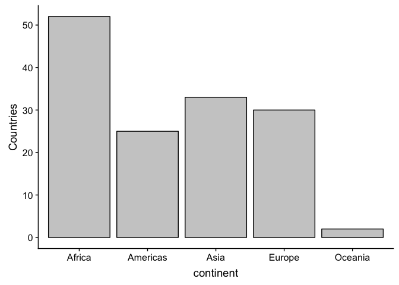
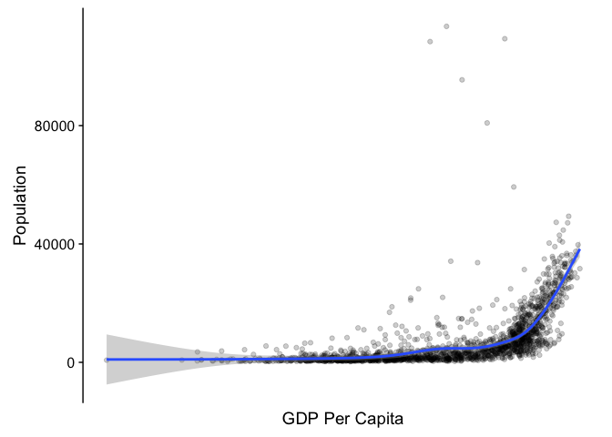
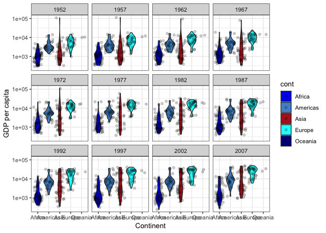
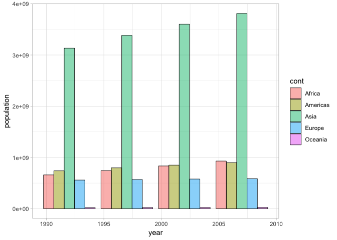

hw02.Rmd
================
Becky
2018-09-21

Data Exploration and Visualization using the **dplyr** and **ggplot2** R packages
=================================================================================

In this assignment, I will explore the Gapminder dataset. This dataset is distributed as an R package from CRAN. The exploratio of this dataset will involve the application of the dplyr package and its use in effective data wrangling. Among the data manaipulation tasks that dply handles includes: **select ()**, **mutate()**, **filter()**, **rename()**, **summarise()**, **arrange()**, and **group\_by()**. These and more will be exhibited in this assignment The output from these functions will then be used as input into the various visualizations that will be done using the ggplot2 package. The application of ggplot2 will involve the use ggplots, grammar of graphics, using features such as: **geoms**, **aesthetics**, **stats**, and **faceting**.

The work herein will also heavily use the pipe operator (%&gt;%) that tidyverse imports from the magrittr package. Piping makes code much easier to read and write as we don't need to use multi-operation commands by nesting them inside each other. Plus, its more fun using pipes!!!!

To kick off this assignment, I will begin by loading all required packages to support the required data analysis.

1.1 Loading the gapminder dataset and required packages for this assignment
---------------------------------------------------------------------------

``` r
# I use "message = FALSE"" to avoid having R package messages being thrown back as output expecially in my output files. Most of these messages are informative but not necessary for output. An example message that could be passed to markdown file is shown hereunder:
# package ‘dplyr’ was built under R version 3.5.1
library(tidyverse)
```

    ## Warning: package 'dplyr' was built under R version 3.5.1

``` r
library(dplyr)
library(ggplot2)
library(gapminder) # this call also loads the gapmidner dataset
library(cowplot)
library(ggridges)
df <- gapminder# Assigning and renaming the dataset to a shorter and more convenient name
```

Data Inspection - Part 1: Overview of Dataset
---------------------------------------------

### Applying the pipe operator

This section involves the use of the pipe operator in accomplishing the data inspection task.

##### 1. What type of object is the gapminder dataset?

``` r
df %>% class # in base R, this would be "class(df)"
```

    ## [1] "tbl_df"     "tbl"        "data.frame"

In R, datasets are regarded as objects. To work with most objects, it is ideal to know the class (type of object) to be able to work with it effectively and to avoid programming hitches. For example, the way we work with dataframes is different from the way matrixes are handled. From the output of the above snipped, the gapminder dataset is of type tbl\_df, inherited from both the tbl and data.frame data types. Data frames such as the gapminder dataset that are converted into tbl objects make it much easier to work with large datasets.

##### 2. Viewing the top (n) rows of the dataset

``` r
df %>% head(10) # I have specified the number of rows to view (10 rows). The default is 6. In base R this would be "head(df, n=10)"
```

    ## # A tibble: 10 x 6
    ##    country     continent  year lifeExp      pop gdpPercap
    ##    <fct>       <fct>     <int>   <dbl>    <int>     <dbl>
    ##  1 Afghanistan Asia       1952    28.8  8425333      779.
    ##  2 Afghanistan Asia       1957    30.3  9240934      821.
    ##  3 Afghanistan Asia       1962    32.0 10267083      853.
    ##  4 Afghanistan Asia       1967    34.0 11537966      836.
    ##  5 Afghanistan Asia       1972    36.1 13079460      740.
    ##  6 Afghanistan Asia       1977    38.4 14880372      786.
    ##  7 Afghanistan Asia       1982    39.9 12881816      978.
    ##  8 Afghanistan Asia       1987    40.8 13867957      852.
    ##  9 Afghanistan Asia       1992    41.7 16317921      649.
    ## 10 Afghanistan Asia       1997    41.8 22227415      635.

##### 3. Viewing bottom (n) rows of dataframe

``` r
df %>% tail(5)
```

    ## # A tibble: 5 x 6
    ##   country  continent  year lifeExp      pop gdpPercap
    ##   <fct>    <fct>     <int>   <dbl>    <int>     <dbl>
    ## 1 Zimbabwe Africa     1987    62.4  9216418      706.
    ## 2 Zimbabwe Africa     1992    60.4 10704340      693.
    ## 3 Zimbabwe Africa     1997    46.8 11404948      792.
    ## 4 Zimbabwe Africa     2002    40.0 11926563      672.
    ## 5 Zimbabwe Africa     2007    43.5 12311143      470.

##### 4. Extracting the summarized view of the dataset

``` r
df %>% summary
```

    ##         country        continent        year         lifeExp     
    ##  Afghanistan:  12   Africa  :624   Min.   :1952   Min.   :23.60  
    ##  Albania    :  12   Americas:300   1st Qu.:1966   1st Qu.:48.20  
    ##  Algeria    :  12   Asia    :396   Median :1980   Median :60.71  
    ##  Angola     :  12   Europe  :360   Mean   :1980   Mean   :59.47  
    ##  Argentina  :  12   Oceania : 24   3rd Qu.:1993   3rd Qu.:70.85  
    ##  Australia  :  12                  Max.   :2007   Max.   :82.60  
    ##  (Other)    :1632                                                
    ##       pop              gdpPercap       
    ##  Min.   :6.001e+04   Min.   :   241.2  
    ##  1st Qu.:2.794e+06   1st Qu.:  1202.1  
    ##  Median :7.024e+06   Median :  3531.8  
    ##  Mean   :2.960e+07   Mean   :  7215.3  
    ##  3rd Qu.:1.959e+07   3rd Qu.:  9325.5  
    ##  Max.   :1.319e+09   Max.   :113523.1  
    ## 

The summary function is used to produce summary statistics from the dataset. Some of these results can be obtained using alternative methods. For example, if we want to extract the minimum and maximum populations, we can apply the range(), we can also get the maximum gdpPercap using df*g**d**p**P**e**r**c**a**p*continent %&gt;% summary summary(df$continent=="Africa")\`

These and more examples that validate the results from the summary function above, will be shown below.

##### 5. Viewing the structure of the dataset

``` r
df %>% str
```

    ## Classes 'tbl_df', 'tbl' and 'data.frame':    1704 obs. of  6 variables:
    ##  $ country  : Factor w/ 142 levels "Afghanistan",..: 1 1 1 1 1 1 1 1 1 1 ...
    ##  $ continent: Factor w/ 5 levels "Africa","Americas",..: 3 3 3 3 3 3 3 3 3 3 ...
    ##  $ year     : int  1952 1957 1962 1967 1972 1977 1982 1987 1992 1997 ...
    ##  $ lifeExp  : num  28.8 30.3 32 34 36.1 ...
    ##  $ pop      : int  8425333 9240934 10267083 11537966 13079460 14880372 12881816 13867957 16317921 22227415 ...
    ##  $ gdpPercap: num  779 821 853 836 740 ...

From output of the above code snippet, we can see and further confirm that the dataset is a tbl\_df with 1704 observations (countries) and 6 variables as described below: 1. **country** is a **factor** with **142 levels** (we could say that there are 142 unique countries) 2. **continent** is **factor** with **5 levels** (5 unique continents) 3. **year** is an **integer** ranging from 1952 to 2007 as seen by (df$year %&gt;% max) 4. **lifeExp** is as **numeric** variable denoting life expectancy 5. **pop** is an **integer** variable denoting population 6. **gdpPercap** is a **numeric** variable denoting GDP per capita

##### 6. Checking the dimensions of the dataframe (nrows x ncols)

Apart from using the str() function to view the dimensions of a dataset, we can also use the below:

``` r
df %>% dim 
```

    ## [1] 1704    6

The dataframe has 1704 rows and 6 columns (1704 x 6)

##### 7. Alternative call for number of rows

``` r
df %>% nrow 
```

    ## [1] 1704

##### 8. Alternative call for number of columns

``` r
df %>% ncol
```

    ## [1] 6

##### 9. Extracting column names

``` r
df %>% names
```

    ## [1] "country"   "continent" "year"      "lifeExp"   "pop"       "gdpPercap"

### Quality Control (QC)

``` r
sum(is.na(df)) 
```

    ## [1] 0

``` r
df %>% is.na %>% sum
```

    ## [1] 0

The output of the above code snippet is 0. This implies that we do not have any missing data in the dataset. In case we had some rows with missing data, we would then apply `df <- na.omit(df)` to remove NAs that would hinder data analysis.

------------------------------------------------------------------------

Data Inspection - Part 2: Variable Specific Exploration
-------------------------------------------------------

### Exploring a categorical variable from the data set (continent)

##### 1. Which continents exist in the gapminder dataset?

``` r
df %>% distinct(continent) %>% arrange(continent)  # we have 5 continents
```

    ## # A tibble: 5 x 1
    ##   continent
    ##   <fct>    
    ## 1 Africa   
    ## 2 Americas 
    ## 3 Asia     
    ## 4 Europe   
    ## 5 Oceania

``` r
# Alternatively:
df$continent %>%unique
```

    ## [1] Asia     Europe   Africa   Americas Oceania 
    ## Levels: Africa Americas Asia Europe Oceania

We have 5 distinct continents in the gapminder dataset: Asia, Europe, Africa, Americas and Oceania

##### 2. How many continents are there?

``` r
df$continent %>% nlevels
```

    ## [1] 5

1.  How many countries are in each continent?

``` r
df %>% 
  group_by(continent) %>%
  summarise(count = n())
```

    ## # A tibble: 5 x 2
    ##   continent count
    ##   <fct>     <int>
    ## 1 Africa      624
    ## 2 Americas    300
    ## 3 Asia        396
    ## 4 Europe      360
    ## 5 Oceania      24

``` r
# We can alternatively use:
df$continent %>% summary
```

    ##   Africa Americas     Asia   Europe  Oceania 
    ##      624      300      396      360       24

To see how many countries belong to Europe and how many do not, we can use the following

``` r
summary(df$continent=="Africa") 
```

    ##    Mode   FALSE    TRUE 
    ## logical    1080     624

### Exploring a quantitative variable from the dataset (population)

In my first assignmeent I explored the gdpPercap variable and I saw that an increase in gdp per capita increased life expectancy. Here I will also probe into the pop (population) variable to see whether it has a bearing on gdp per capita.

##### 1. What is the highest population in the entire dataset?

``` r
df$population %>% max
```

    ## Warning: Unknown or uninitialised column: 'population'.

    ## Warning in max(.): no non-missing arguments to max; returning -Inf

    ## [1] -Inf

##### 2. What is the lowest population in the entire dataset?

``` r
df$population %>% min
```

    ## Warning: Unknown or uninitialised column: 'population'.

    ## Warning in min(.): no non-missing arguments to min; returning Inf

    ## [1] Inf

##### 3. To achieve the above output, we can alterantively use the range() function to extract the lowest and highest population values. To do this, I will use the following:

``` r
range(df$population)
```

    ## Warning: Unknown or uninitialised column: 'population'.

    ## Warning in min(x, na.rm = na.rm): no non-missing arguments to min;
    ## returning Inf

    ## Warning in max(x, na.rm = na.rm): no non-missing arguments to max;
    ## returning -Inf

    ## [1]  Inf -Inf

As we can sees, 60011 is the lowest population reported in the entire dataset and 1318683096 is the highest. However, I woould like to know more!

##### 3. Which country reports the highest population?

``` r
high <- df$population %>% max
```

    ## Warning: Unknown or uninitialised column: 'population'.

    ## Warning in max(.): no non-missing arguments to max; returning -Inf

``` r
df[df$pop == high,] # I would like to extract the entire tuple in which the highest population was recorded
```

    ## # A tibble: 0 x 6
    ## # ... with 6 variables: country <fct>, continent <fct>, year <int>,
    ## #   lifeExp <dbl>, pop <int>, gdpPercap <dbl>

China, in Asia has the highest recorded population and this was in 2007.

##### 3. Which country reports the lowest population?

``` r
low <- df$population %>% min
```

    ## Warning: Unknown or uninitialised column: 'population'.

    ## Warning in min(.): no non-missing arguments to min; returning Inf

``` r
df[df$population == low,]
```

    ## Warning: Unknown or uninitialised column: 'population'.

    ## Warning: Length of logical index must be 1 or 1704, not 0

    ## # A tibble: 0 x 6
    ## # ... with 6 variables: country <fct>, continent <fct>, year <int>,
    ## #   lifeExp <dbl>, pop <int>, gdpPercap <dbl>

Sao Tome and Principe, in Africa has the lowest population reported for the year 1952.

------------------------------------------------------------------------

The application of dplyr for data wrangling and manipulation
------------------------------------------------------------

At this point, I would like to introduce dplyr's awesome functions. I will be exhibiting the usage of the following functions to answer questions I have on the gapminder dataset: 1. **rename()** 2. **filter()** 3. **select ()** 4. **arrange()** 5. **mutate()** 6. **summarise()** and 7. **group\_by()**

### The rename function: rename()

To start with, and to ease my work, I will rename some variables that have been giving me a bit of trouble (those with long names :smile: ). To do this, I will use the rename() function that is mainly used to rename variables in a dataset.

``` r
df <- df %>%
      rename(lex = lifeExp,
         gdppc = gdpPercap,
         cont = continent)
# to see the new names, I will run:
names(df)
```

    ## [1] "country" "cont"    "year"    "lex"     "pop"     "gdppc"

Some of my variable names have changed: lifeExp has been renamed to lex, gdpPercap has been renamed to gdppc and continent has been renamed to cont. The rest of the assignment will refer to these new names.

### The filter function: filter()

This function is used to select a desired set of rows, better said - to subset data row-wise. The filter() takes logical expressions and returns the rows for which all are TRUE. A few examples of the usage of filter have been given above and a few more will be given below.

Example 1. Filtering the dataset based on single and multiple criteria

``` r
df %>% filter(cont=="Asia") # extract statistics from rows where the continent is Asia 
```

    ## # A tibble: 396 x 6
    ##    country     cont   year   lex      pop gdppc
    ##    <fct>       <fct> <int> <dbl>    <int> <dbl>
    ##  1 Afghanistan Asia   1952  28.8  8425333  779.
    ##  2 Afghanistan Asia   1957  30.3  9240934  821.
    ##  3 Afghanistan Asia   1962  32.0 10267083  853.
    ##  4 Afghanistan Asia   1967  34.0 11537966  836.
    ##  5 Afghanistan Asia   1972  36.1 13079460  740.
    ##  6 Afghanistan Asia   1977  38.4 14880372  786.
    ##  7 Afghanistan Asia   1982  39.9 12881816  978.
    ##  8 Afghanistan Asia   1987  40.8 13867957  852.
    ##  9 Afghanistan Asia   1992  41.7 16317921  649.
    ## 10 Afghanistan Asia   1997  41.8 22227415  635.
    ## # ... with 386 more rows

``` r
df %>% filter(year==1977)# extract statistics from rows where the year is 1977
```

    ## # A tibble: 142 x 6
    ##    country     cont      year   lex      pop  gdppc
    ##    <fct>       <fct>    <int> <dbl>    <int>  <dbl>
    ##  1 Afghanistan Asia      1977  38.4 14880372   786.
    ##  2 Albania     Europe    1977  68.9  2509048  3533.
    ##  3 Algeria     Africa    1977  58.0 17152804  4910.
    ##  4 Angola      Africa    1977  39.5  6162675  3009.
    ##  5 Argentina   Americas  1977  68.5 26983828 10079.
    ##  6 Australia   Oceania   1977  73.5 14074100 18334.
    ##  7 Austria     Europe    1977  72.2  7568430 19749.
    ##  8 Bahrain     Asia      1977  65.6   297410 19340.
    ##  9 Bangladesh  Asia      1977  46.9 80428306   660.
    ## 10 Belgium     Europe    1977  72.8  9821800 19118.
    ## # ... with 132 more rows

Example 2. Filtering a dataset based on multiple criteria (to achieve this we can implement logical operators such as: **&**(and), **&lt;**(less than), **&lt;=**(less than or equal to), **&gt;**(greater than), **&gt;=**(greater than or equal to), **==**(equal to), **!=**(not equal to), **|**(or)) e.t.c

``` r
filter(df, cont=="Oceania" & year==2002) # Show only stats for Oceania in 2002
```

    ## # A tibble: 2 x 6
    ##   country     cont     year   lex      pop  gdppc
    ##   <fct>       <fct>   <int> <dbl>    <int>  <dbl>
    ## 1 Australia   Oceania  2002  80.4 19546792 30688.
    ## 2 New Zealand Oceania  2002  79.1  3908037 23190.

``` r
filter(df, gdppc<400 & lex>40 & year==2007 ) # filter for only stats for countries with gdp per capita less than 400 and life expecancy greater than 40 where the year is 2007  
```

    ## # A tibble: 1 x 6
    ##   country          cont    year   lex      pop gdppc
    ##   <fct>            <fct>  <int> <dbl>    <int> <dbl>
    ## 1 Congo, Dem. Rep. Africa  2007  46.5 64606759  278.

``` r
filter(df, country=="Angola", year >=1995) # filtering for all rows where the country is Angola and the year less than 1995
```

    ## # A tibble: 3 x 6
    ##   country cont    year   lex      pop gdppc
    ##   <fct>   <fct>  <int> <dbl>    <int> <dbl>
    ## 1 Angola  Africa  1997  41.0  9875024 2277.
    ## 2 Angola  Africa  2002  41.0 10866106 2773.
    ## 3 Angola  Africa  2007  42.7 12420476 4797.

``` r
filter(df, cont!="Americas", year <= 1995 | year ==2007) # filtering for rows where the continent is not Americas and the year is less than or equal to 1995 or  year is 2007
```

    ## # A tibble: 1,170 x 6
    ##    country     cont   year   lex      pop gdppc
    ##    <fct>       <fct> <int> <dbl>    <int> <dbl>
    ##  1 Afghanistan Asia   1952  28.8  8425333  779.
    ##  2 Afghanistan Asia   1957  30.3  9240934  821.
    ##  3 Afghanistan Asia   1962  32.0 10267083  853.
    ##  4 Afghanistan Asia   1967  34.0 11537966  836.
    ##  5 Afghanistan Asia   1972  36.1 13079460  740.
    ##  6 Afghanistan Asia   1977  38.4 14880372  786.
    ##  7 Afghanistan Asia   1982  39.9 12881816  978.
    ##  8 Afghanistan Asia   1987  40.8 13867957  852.
    ##  9 Afghanistan Asia   1992  41.7 16317921  649.
    ## 10 Afghanistan Asia   2007  43.8 31889923  975.
    ## # ... with 1,160 more rows

``` r
df %>% filter(country=="China" | country=="Sao Tome and Principe")#filter for rows where the country is either Chaina or Sao Tome and Principe
```

    ## # A tibble: 24 x 6
    ##    country cont   year   lex        pop gdppc
    ##    <fct>   <fct> <int> <dbl>      <int> <dbl>
    ##  1 China   Asia   1952  44    556263527  400.
    ##  2 China   Asia   1957  50.5  637408000  576.
    ##  3 China   Asia   1962  44.5  665770000  488.
    ##  4 China   Asia   1967  58.4  754550000  613.
    ##  5 China   Asia   1972  63.1  862030000  677.
    ##  6 China   Asia   1977  64.0  943455000  741.
    ##  7 China   Asia   1982  65.5 1000281000  962.
    ##  8 China   Asia   1987  67.3 1084035000 1379.
    ##  9 China   Asia   1992  68.7 1164970000 1656.
    ## 10 China   Asia   1997  70.4 1230075000 2289.
    ## # ... with 14 more rows

``` r
#Alternative for the above:
#filter(df, country %in% c("China", "Sao Tome and Principe")) 
```

### The select function: select()

The filter() function is applied when we want to return only certain rows that match a given condition. However, the select() function allows us to subset the data and restrict our selection to a number of columns. Below are some examples on how to use the select function.

``` r
# Example 1:
df %>% 
  select(country, year, pop) %>%
  head(8) # here, I am using the select() function to subset the data by selecting only the country, year and population. I have also piped my output through head to extrac the top 8 rows.
```

    ## # A tibble: 8 x 3
    ##   country      year      pop
    ##   <fct>       <int>    <int>
    ## 1 Afghanistan  1952  8425333
    ## 2 Afghanistan  1957  9240934
    ## 3 Afghanistan  1962 10267083
    ## 4 Afghanistan  1967 11537966
    ## 5 Afghanistan  1972 13079460
    ## 6 Afghanistan  1977 14880372
    ## 7 Afghanistan  1982 12881816
    ## 8 Afghanistan  1987 13867957

``` r
# Example 2:
df %>%
  filter(country == "Tanzania") %>%
  select(year, pop) # combining filter and select functions to select the year and population for the country Tanzania.
```

    ## # A tibble: 12 x 2
    ##     year      pop
    ##    <int>    <int>
    ##  1  1952  8322925
    ##  2  1957  9452826
    ##  3  1962 10863958
    ##  4  1967 12607312
    ##  5  1972 14706593
    ##  6  1977 17129565
    ##  7  1982 19844382
    ##  8  1987 23040630
    ##  9  1992 26605473
    ## 10  1997 30686889
    ## 11  2002 34593779
    ## 12  2007 38139640

### The arrange function: arrange()

The arrange function sorts a dataset by columns of interest. This can be done either in ascending or descending order, however, by default, the order is ascending.

``` r
# Example 1:
df %>% arrange(pop)
```

    ## # A tibble: 1,704 x 6
    ##    country               cont    year   lex   pop gdppc
    ##    <fct>                 <fct>  <int> <dbl> <int> <dbl>
    ##  1 Sao Tome and Principe Africa  1952  46.5 60011  880.
    ##  2 Sao Tome and Principe Africa  1957  48.9 61325  861.
    ##  3 Djibouti              Africa  1952  34.8 63149 2670.
    ##  4 Sao Tome and Principe Africa  1962  51.9 65345 1072.
    ##  5 Sao Tome and Principe Africa  1967  54.4 70787 1385.
    ##  6 Djibouti              Africa  1957  37.3 71851 2865.
    ##  7 Sao Tome and Principe Africa  1972  56.5 76595 1533.
    ##  8 Sao Tome and Principe Africa  1977  58.6 86796 1738.
    ##  9 Djibouti              Africa  1962  39.7 89898 3021.
    ## 10 Sao Tome and Principe Africa  1982  60.4 98593 1890.
    ## # ... with 1,694 more rows

``` r
# Example 2:
df %>% 
  select(pop, lex) %>% 
  arrange
```

    ## # A tibble: 1,704 x 2
    ##         pop   lex
    ##       <int> <dbl>
    ##  1  8425333  28.8
    ##  2  9240934  30.3
    ##  3 10267083  32.0
    ##  4 11537966  34.0
    ##  5 13079460  36.1
    ##  6 14880372  38.4
    ##  7 12881816  39.9
    ##  8 13867957  40.8
    ##  9 16317921  41.7
    ## 10 22227415  41.8
    ## # ... with 1,694 more rows

``` r
# Example 3:
df %>% 
  select(pop, lex) %>% 
  arrange(desc(pop))
```

    ## # A tibble: 1,704 x 2
    ##           pop   lex
    ##         <int> <dbl>
    ##  1 1318683096  73.0
    ##  2 1280400000  72.0
    ##  3 1230075000  70.4
    ##  4 1164970000  68.7
    ##  5 1110396331  64.7
    ##  6 1084035000  67.3
    ##  7 1034172547  62.9
    ##  8 1000281000  65.5
    ##  9  959000000  61.8
    ## 10  943455000  64.0
    ## # ... with 1,694 more rows

### The mutate function: mutate()

The mutate() function helps us to add new variables to a dataset. Let me add a new variable called gdp2, here I will multiply the initial gdp per capita by 100, just to test the functionality of mutate!

``` r
mutated <- mutate(df, gdp2=gdppc*100) # this creates a new variable called gdp
mutated %>% head
```

    ## # A tibble: 6 x 7
    ##   country     cont   year   lex      pop gdppc   gdp2
    ##   <fct>       <fct> <int> <dbl>    <int> <dbl>  <dbl>
    ## 1 Afghanistan Asia   1952  28.8  8425333  779. 77945.
    ## 2 Afghanistan Asia   1957  30.3  9240934  821. 82085.
    ## 3 Afghanistan Asia   1962  32.0 10267083  853. 85310.
    ## 4 Afghanistan Asia   1967  34.0 11537966  836. 83620.
    ## 5 Afghanistan Asia   1972  36.1 13079460  740. 73998.
    ## 6 Afghanistan Asia   1977  38.4 14880372  786. 78611.

Here we can see that a new variable gdp2 has been added to the mutated dataset computed from the gdp per capita variable

### The summarise function: summarize()

The summarize() function summarizes multiple values to a single value.

``` r
# Example 1:
df %>% 
  summarize(mean(pop))
```

    ## # A tibble: 1 x 1
    ##   `mean(pop)`
    ##         <dbl>
    ## 1   29601212.

``` r
# Example 2:
summarize(df, n())
```

    ## # A tibble: 1 x 1
    ##   `n()`
    ##   <int>
    ## 1  1704

``` r
# Example 3:
summarize(df, n_distinct(country))
```

    ## # A tibble: 1 x 1
    ##   `n_distinct(country)`
    ##                   <int>
    ## 1                   142

``` r
# Example 4:
df %>% 
  summarize(numrows = n(), numcountries = n_distinct(country), meanlex = mean(lex), meanpop = mean(pop), meangdppc = mean(gdppc))
```

    ## # A tibble: 1 x 5
    ##   numrows numcountries meanlex   meanpop meangdppc
    ##     <int>        <int>   <dbl>     <dbl>     <dbl>
    ## 1    1704          142    59.5 29601212.     7215.

From the above code snippets, we see the valuable utility of the summarise function in providing summary statistics of a dataset. In here, I also called for computed variables like the mean life expectancy and mean population.

### The group\_by function: group\_by()

The group\_by function converts a dataset into a grouped dataset to support grouped operations. This can also work hand in hand with the summarize() function.

``` r
gp <- df %>% 
  group_by(cont)

gp %>% 
  class
```

    ## [1] "grouped_df" "tbl_df"     "tbl"        "data.frame"

We can now see, the grouped extact from dataframe "df" is now also being defined as a "grouped\_df"

Using group\_by() with summarise()

``` r
# Example 1:
df %>% 
  group_by(cont) %>%
  summarise(mean(pop))
```

    ## # A tibble: 5 x 2
    ##   cont     `mean(pop)`
    ##   <fct>          <dbl>
    ## 1 Africa      9916003.
    ## 2 Americas   24504795.
    ## 3 Asia       77038722.
    ## 4 Europe     17169765.
    ## 5 Oceania     8874672.

``` r
# Example 2:
df %>% 
  group_by(year) %>%  
  summarise(mean(lex), mean(pop), mean(gdppc))
```

    ## # A tibble: 12 x 4
    ##     year `mean(lex)` `mean(pop)` `mean(gdppc)`
    ##    <int>       <dbl>       <dbl>         <dbl>
    ##  1  1952        49.1   16950402.         3725.
    ##  2  1957        51.5   18763413.         4299.
    ##  3  1962        53.6   20421007.         4726.
    ##  4  1967        55.7   22658298.         5484.
    ##  5  1972        57.6   25189980.         6770.
    ##  6  1977        59.6   27676379.         7313.
    ##  7  1982        61.5   30207302.         7519.
    ##  8  1987        63.2   33038573.         7901.
    ##  9  1992        64.2   35990917.         8159.
    ## 10  1997        65.0   38839468.         9090.
    ## 11  2002        65.7   41457589.         9918.
    ## 12  2007        67.0   44021220.        11680.

``` r
# Example 3:
df %>% 
  group_by(cont,year) %>%  
  summarise(mean(lex), mean(pop), mean(gdppc))
```

    ## # A tibble: 60 x 5
    ## # Groups:   cont [?]
    ##    cont    year `mean(lex)` `mean(pop)` `mean(gdppc)`
    ##    <fct>  <int>       <dbl>       <dbl>         <dbl>
    ##  1 Africa  1952        39.1    4570010.         1253.
    ##  2 Africa  1957        41.3    5093033.         1385.
    ##  3 Africa  1962        43.3    5702247.         1598.
    ##  4 Africa  1967        45.3    6447875.         2050.
    ##  5 Africa  1972        47.5    7305376.         2340.
    ##  6 Africa  1977        49.6    8328097.         2586.
    ##  7 Africa  1982        51.6    9602857.         2482.
    ##  8 Africa  1987        53.3   11054502.         2283.
    ##  9 Africa  1992        53.6   12674645.         2282.
    ## 10 Africa  1997        53.6   14304480.         2379.
    ## # ... with 50 more rows

``` r
# Example 4:
df %>% filter(year==1992)%>% 
  group_by(cont) %>% 
  summarize(sum(gdppc))
```

    ## # A tibble: 5 x 2
    ##   cont     `sum(gdppc)`
    ##   <fct>           <dbl>
    ## 1 Africa        118654.
    ## 2 Americas      201123.
    ## 3 Asia          285110.
    ## 4 Europe        511847.
    ## 5 Oceania        41788.

``` r
# Example 5:
df %>% 
  group_by(cont) %>%
  summarise(num_countries = n())
```

    ## # A tibble: 5 x 2
    ##   cont     num_countries
    ##   <fct>            <int>
    ## 1 Africa             624
    ## 2 Americas           300
    ## 3 Asia               396
    ## 4 Europe             360
    ## 5 Oceania             24

We can see that the output from these functions aligns with the summary() function that we saw in previous sections. For example, we can see the number of coutries in each continent. We can also compute the mean values of the life expectancy, population and gdp per capita variables and present them in a summarised way.

Combining filter(), select(), mutate(), group\_by() and summarize()

``` r
# Example 1:
df %>%
  filter(country == "Bulgaria") %>%
  select(-cont, -lex) %>%
  mutate(gdp2 = pop * 100) %>%
  group_by(country) %>%
  summarize(meangdp = mean(gdp2))
```

    ## # A tibble: 1 x 2
    ##   country     meangdp
    ##   <fct>         <dbl>
    ## 1 Bulgaria 818298533.

We can also combine all functions to help us wrangle and manipulate the data more!

Given the valuable knowledge from the above functions, I am interested creating a dataframe that contains computed values from the initial variables that we have in the gapminder dataset. This dataset will also be used in subsequet sections.

``` r
newdf<- df %>%
  group_by(cont,year) %>%
  summarise(mean(lex), mean(pop), mean(gdppc))

newdf <- newdf %>%
      rename(avg_lex = "mean(lex)",
          avg_pop ="mean(pop)",
          avg_gdppc = "mean(gdppc)")
```

Here, I have created a new dataframe called "newdf", that has continent summary statistics based on year, average life expectacy, average population and average or mean gdp per capita.

The application of ggplot2 for the visualization of the gapminder dataset
-------------------------------------------------------------------------

Putting it all together using visualisations based on the ggplot2 package; this section explores the use of ggplot's features that enalble analysts build awesome plots layer by layer. Here, I will use ggplots, grammar of graphics: **geoms**, **aesthetics**, **stats**, and **faceting**.

To provide a brief description: 1. A geom specifies how the data are represented on the plot (points, lines, bars, etc.) 2. Aesthetics map the variables in the dataset to the axes on the plot or to plotting size, shape, color 3. A stat is a statistical transformation or summary of the data applied prior to plotting and finally 4. Facets allow the data to be divided into chunks on the basis of other categorical or continuous variables and the same plot drawn for each chunk.

This section also presents different kinds of plots enabled by ggplot2 as a visual aid to provide a further review of some of the analyses done in preceding secitons. \* To note is that the gapminder dataset comes with country colors and country codes as specified in the [gapminder documentation](https://cran.r-project.org/web/packages/gapminder/gapminder.pdf). I will be applying the same colors herein.

### Working with histograms

``` r
df %>% 
  filter(year == 2007) %>% 
  ggplot(aes(lex)) +
  geom_histogram(binwidth = 1, fill = "orange", colour = "black", alpha = 0.5) +
  scale_y_continuous(breaks = scales::pretty_breaks()) +
  theme_gray() +
  labs(x="Life Expectancy")
```


``` r
  theme(panel.grid.major.x = element_blank())
```

    ## List of 1
    ##  $ panel.grid.major.x: list()
    ##   ..- attr(*, "class")= chr [1:2] "element_blank" "element"
    ##  - attr(*, "class")= chr [1:2] "theme" "gg"
    ##  - attr(*, "complete")= logi FALSE
    ##  - attr(*, "validate")= logi TRUE

In the example below, I introduce the cowplot library that helps us view plots side by side

``` r
library(cowplot)

p0 <- df %>% filter(cont=="Asia") %>% 
  ggplot(aes(gdppc))+ geom_histogram(bins=40)+theme_light()+ ggtitle("GDP per capita of Asia for all years")+theme(plot.title = element_text(hjust = 0.5))+ labs(x = "GDP Per Capita - Asia")

p01 <- df %>% filter(cont=="Africa") %>% 
  ggplot(aes(gdppc))+ geom_histogram(bins=40)+theme_light() + ggtitle("GDP per capita of Africa for all year")+theme(plot.title = element_text(hjust = 0.5))+ labs(x = "GDP Per Capita - Africa")

plot_grid(p0, p01, labels = "AUTO")
```


### Working with geom\_bar

``` r
df %>% 
  filter(year==2007) %>% 
  ggplot(aes(cont))+ 
  geom_bar(fill = "gray80", color="black")
```



From the above plot, we can see that Africa has the largest number of countries while Oceania has the fewest

### Working with geom\_col

``` r
d2<- df %>%
  filter(year == 2007) %>%
  group_by(cont) %>%
  summarise(mean = mean(lex))

d2 %>% 
  ggplot(aes(cont, mean, fill = cont)) + 
  geom_col(alpha = 0.8) +
  scale_y_continuous(labels = scales::dollar, expand = c(0, 0)) +
  theme_light()+
  labs(x="Continent", y="Mean life expectancy")
```


### Density plots

Comparing gdp per capita and life expectancy of all continets in 2002

``` r
gdp_2002<- df %>% 
filter(year == 2002) 
gdp_2002 %>% ggplot(aes(x = gdppc, fill = cont)) + facet_wrap(~year) + geom_density(alpha = 0.5) + ggtitle("Density plots of gdpPercap in 2002 for each continent and across all countries") + theme(legend.title = element_text(color = "gray", size = 14, face = "bold"), legend.background = element_rect(fill = "gray80",size = 0.2, linetype = "dashed")) + labs(x="gdpPercap", y="Density")+scale_fill_manual( values = c("orange","blue","maroon","darkgreen","midnightblue"))
```


``` r
lex_2002<- df %>% 
filter(year == 2002) 
lex_2002 %>% ggplot(aes(x = lex, fill = cont)) + facet_wrap(~year) + geom_density(alpha = 0.5) + ggtitle("Density plots of life expectancy in 2002 for each continent and across all countries") + theme(legend.title = element_text(color = "gray", size = 14, face = "bold"), legend.background = element_rect(fill = "gray80",size = 0.2, linetype = "dashed")) + labs(x="gdpPercap", y="Density")+scale_fill_manual( values = c("orange","blue","maroon","darkgreen","midnightblue"))
```


### Combining kernel density plots with histograms

``` r
df %>% 
  ggplot(aes(gdppc))+ 
  geom_histogram(aes(y=..density..), fill = "gray80", color="black")+
  geom_density()+
  labs(x="GDP Per Capita")
```

    ## `stat_bin()` using `bins = 30`. Pick better value with `binwidth`.


``` r
df %>% 
  ggplot(aes(lex))+ 
  geom_histogram(aes(y=..density..), fill = "gray80", color="black")+
  geom_density()+
  geom_density()+
  labs(x="Life Expectancy")
```

    ## `stat_bin()` using `bins = 30`. Pick better value with `binwidth`.


### Working with ggridges

``` r
df %>% 
  ggplot(aes(lex, fct_rev(cont), fill = cont)) +
  geom_density_ridges(colour = "gray50", size = 0.6, alpha = 0.5) +
  scale_x_continuous(expand = c(0,0)) +
  scale_y_discrete(expand = c(0,0)) +
  theme_light() 
```

    ## Picking joint bandwidth of 2.23


### Working with line plots

To view the progression of the gdp per capita and life expectancy of countries of interest over the years

``` r
#install.packages("cowplot")

countries <- c("Croatia", "China", "Brazil", "Bolivia", "Canada","Uganda","United States")
data <- droplevels(subset(df, country %in% countries))
data$country <- with(data, reorder(country, gdppc, max))
ggplot(data, aes(x = year, y = gdppc)) +
  geom_line(aes(color = country)) +
  scale_colour_manual(values = country_colors) +
  guides(color = guide_legend(reverse = TRUE))
```


``` r
data$country <- with(data, reorder(country, lex, max))
ggplot(data, aes(x = year, y = lex)) +
  geom_line(aes(color = country)) +
  scale_colour_manual(values = country_colors) +
  guides(color = guide_legend(reverse = TRUE))
```


``` r
p1 <- ggplot(data, aes(x = year, y = gdppc)) +
  geom_line(aes(color = country)) +
  scale_colour_manual(values = country_colors) +
  guides(color = guide_legend(reverse = TRUE))

p2 <- ggplot(data, aes(x = year, y = lex)) +
  geom_line(aes(color = country)) +
  scale_colour_manual(values = country_colors) +
  guides(color = guide_legend(reverse = TRUE))

#par(mfrow=c(2,1))
plot_grid(p1, p2)
```


From the above plots, we can see that the United states has the highest gdp per capita across all years, while Uganda has the lowest. We also see that before 1980 Uganda and China had close to similar gdp per capitas, however after 1980, China rose above Uganda with a steady improvenemt in gdp per capita. Of interest in the life expectancy plot is China again that had a big drop in life expectancy after 1960 but rises above Brazil in ~ 1968. Here we see an almost direct correlation between gdp per capita and life expectancy.

### Working with Box Plots

``` r
df %>% 
  ggplot(aes(cont, gdppc)) +
  geom_boxplot(fill = "orange2") +
  ggtitle("GDP per capita Across all Continents (1952-2007)")+
  labs(x="Continent", y="GDP per capita")
```


From the above plot that compares the GDP per capita of all continents, we can see that Oceania has the highest GPD per capita followed by Europe. Africa has the lowest GPD per capita. We also see quite a number of outliers in Asia. A few plots below will explain this occurance.

### Working with Scatter Plots

``` r
df %>% 
  ggplot(aes(gdppc, pop))+
  scale_x_log10()+
  geom_point(aes(color=cont), alpha=0.2)+
  labs(x="GDP per capita", y="population")
```


### More examples of the usage of geom\_line, geom\_jitter and geom\_point

In the next code snippet, I introduce my new data frame that I created "newdf"

``` r
newdf %>% 
  ggplot(aes(cont, avg_lex))+
  geom_line()+
  geom_jitter()+
  geom_point()
```



### Ordering variables in a box plot

``` r
 newdf %>% 
  ggplot(aes(reorder(cont, avg_gdppc), avg_gdppc))+
  geom_boxplot(fill = "orange2") + 
  geom_jitter(alpha=1/2)+
  scale_y_log10()+
  labs(y="Mean GDP Per Capita", x="Ordered Continent")
```


### Including outliers in a box plot

``` r
 df %>% 
  ggplot(aes(reorder(cont, gdppc), gdppc)) +
  geom_boxplot(outlier.colour="firebrick",fill = "orange1") + 
  geom_jitter(alpha=0.2)+
  scale_y_log10()+
  labs(y="Mean GDP Per Capita", x="Ordered Continent")
```


### Working with Violin Plots

``` r
df %>% 
  filter(year==1997) %>% 
  ggplot(aes(cont,lex, fill = cont)) +
  geom_violin(colour = "gray80", alpha = 0.8) +
  theme_light() +
  geom_point()+
  labs(x="Continent", y="Life Expectancy")
```


### Including more data in a violin plot

``` r
df %>% 
 ggplot(aes(reorder(cont, pop), pop)) + 
  scale_y_log10()+
  geom_violin(fill="gray80", color="black")+
  geom_jitter(alpha=0.2) #show as much of the data as you can
```


### Working with Facet Wraps combined with other ggplopt2 features

``` r
df %>% 
  ggplot(aes(cont, gdppc, fill = cont)) + 
  geom_violin() +
  facet_wrap(~ year) +
  scale_fill_manual(values = c("blue2", "steelblue3","firebrick","cyan", "darkblue")) +
  scale_y_log10() +
  labs(y="GDP per capita", x="Continent") +
  theme_bw() +
  geom_jitter(alpha=0.2)
```


### Working with geom\_segment

``` r
df %>% 
  filter(cont=="Americas") %>% 
  ggplot(aes(gdppc, country)) +
  geom_segment(aes(x = 0, xend = gdppc, y = country, yend = country), colour = "black") + 
  geom_point(colour = "midnightblue", size = 3, alpha = 0.5) +
  theme_light() +
  labs(y="country", x="GDP per capita")
```



### Working with grouped bar charts

``` r
d4 <- df %>% 
  filter(year > 1990) %>%
  group_by(year, cont) %>%
  summarise(population = sum(as.double(pop)))

d4 %>% 
  ggplot(aes(year, population, group = cont, fill = cont)) + 
  geom_col(position = "dodge", colour = "black", size = 0.3, alpha = 0.5) +
  theme_light() 
```


### Working with stacked bar charts, stacked to 100%

``` r
d5 <- df %>% 
  filter(year > 1952) %>%
  group_by(year, cont) %>%
  summarise(population = sum(as.double(pop)))

d5 %>% 
  ggplot(aes(year,population, fill = cont)) + 
  geom_col(position = "fill", colour = "black", size = 0.2, alpha = 0.5) +
  theme_light() 
```


